---
author:
- name: Агапова Анна Антоновна
  email: 1032251933@rudn.ru
  affiliation:
    - name: Российский университет дружбы народов
      country: Российская Федерация
      postal-code: 117198
      city: Москва
      address: ул. Миклухо-Маклая, д. 6
institute: Российский университет дружбы народов им. П. Лумумбы
title: "Отчёт по лабораторной работе №1"
subtitle: "Архитектура компьютера"
license: CC BY
date: 2026-02-24
slide_level: 2
aspectratio: 169
section-titles: true
theme: metropolis
---

# Докладчик

:::::::::::::: {.columns align=center}
::: {.column width="70%"}

  * Агапова Анна Антоновна
  * Российский университет дружбы народов им. П. Лумумбы

:::
::: {.column width="30%"}

:::
::::::::::::::

---

# Цель работы
Приобретение практических навыков установки операционной системы на виртуальную машину, настройки минимально необходимых для дальнейшей работы сервисов.

---

# Выполнение лабораторной работы
1.Создаю новую виртуальную машину.

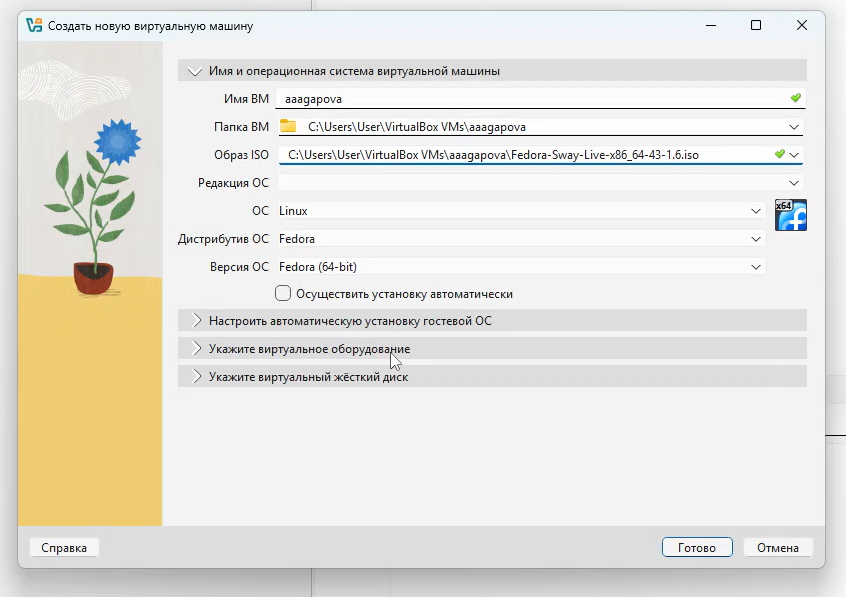

---

# Выполнение лабораторной работы
2.Указываю объем основной памяти виртуальной машины.

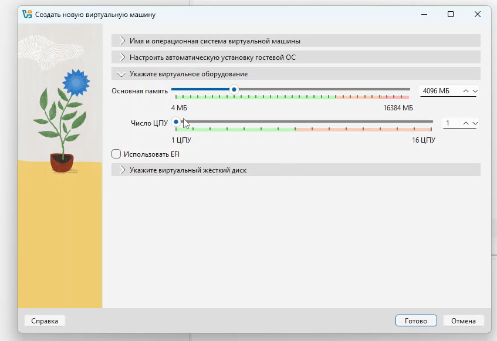

---

# Выполнение лабораторной работы
3.Создаю новый виртуальный диск.

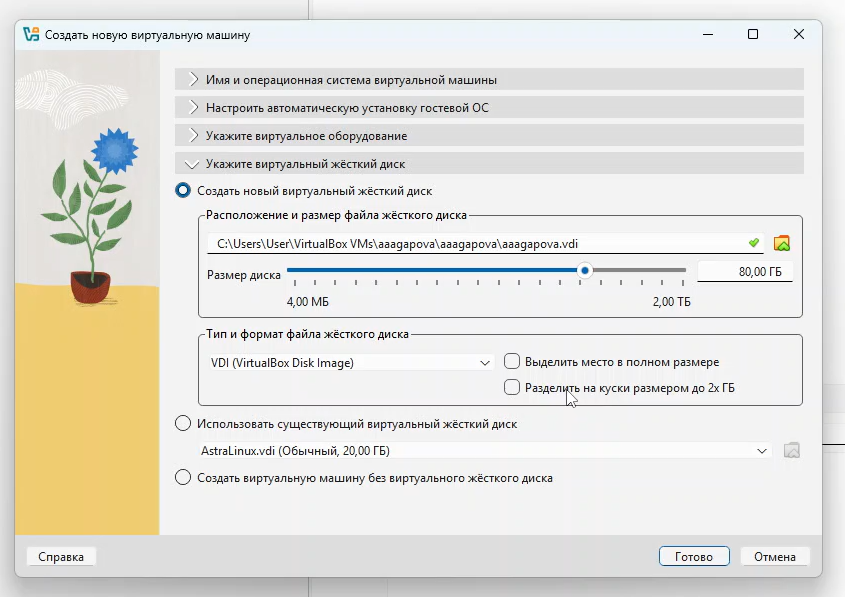

---

# Выполнение лабораторной работы
4.Выполняю команду liveinst.

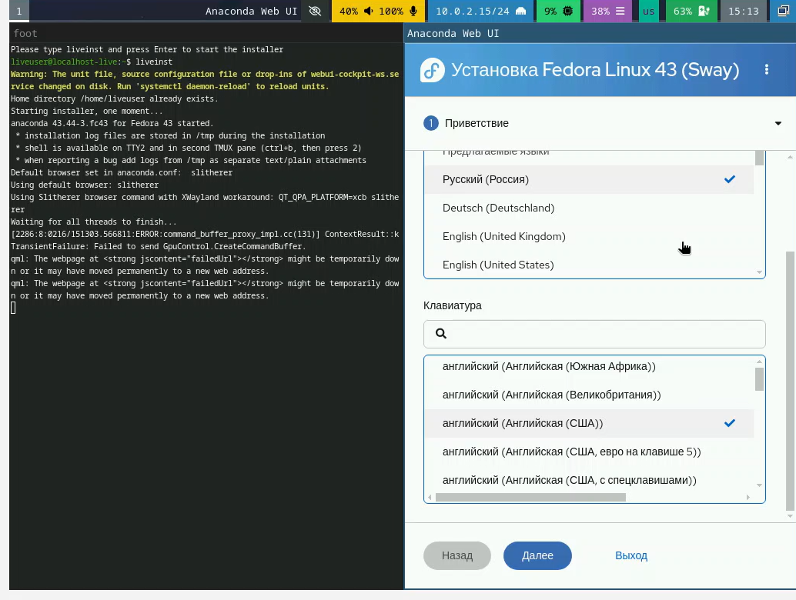

---

# Выполнение лабораторной работы
5.Устанавливаю язык.

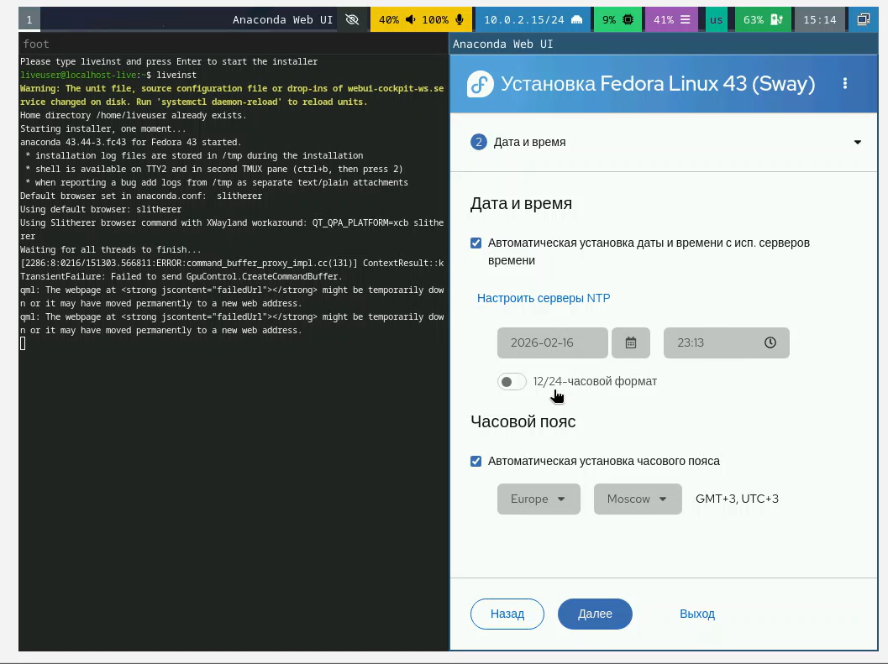

---

# Выполнение лабораторной работы
6.Устанавливаю часовой пояс и дату.

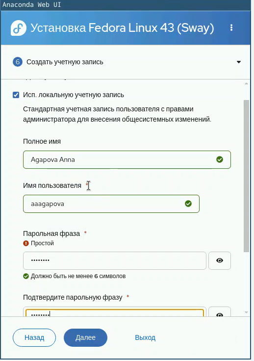

---

# Выполнение лабораторной работы
7.Создаю учетную запись.

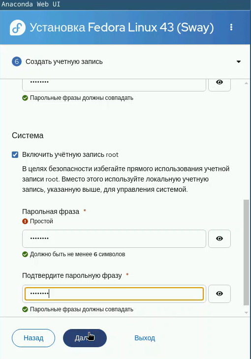

---

# Выполнение лабораторной работы
8.Создаю учетной записи root.

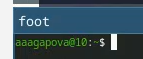

---

# Выполнение лабораторной работы
9.Создалась учетная запись.

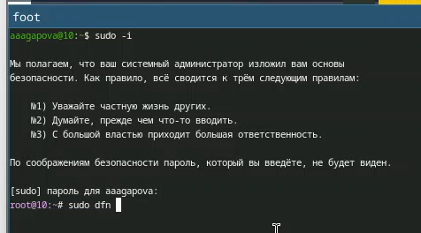

---

# Выполнение лабораторной работы
10.Перехожу на спецпользователя.

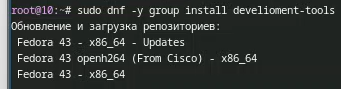

---

# Выполнение лабораторной работы
11.Устанавливаю срества разработки.

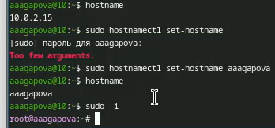

---

# Выполнение лабораторной работы
12.Меняю hostname.

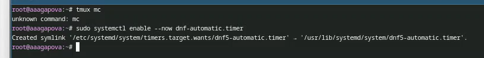

---

# Выполнение лабораторной работы
13.Запускаю таймер.

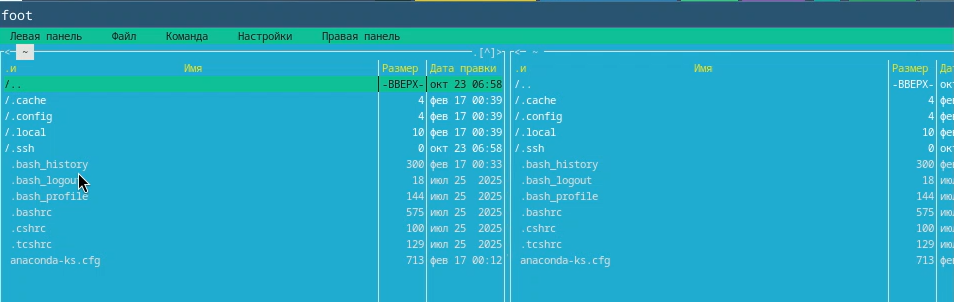

---

# Выполнение лабораторной работы
14.Открываю md.

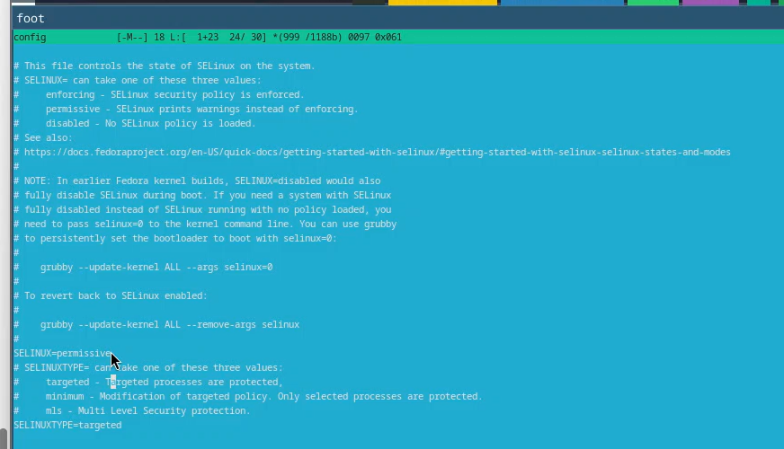

---

# Выполнение лабораторной работы
15.Меняю значение на SELINUX=permissive.

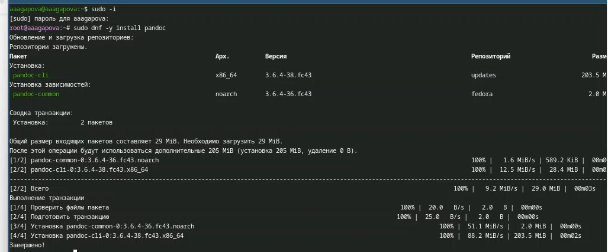

---

# Выполнение лабораторной работы
16.Устанавливаю pandoc.

---

# Выводы
При выполнении данной лабораторной работы я приобрела практические
навыки установки операционной системы на виртуальную машину, а так же
сделала настройки минимально необходимых для дальнейшей работы сервисов.

---

# Список литературы
1. Dash, P. Getting Started with Oracle VM VirtualBox / P. Dash. – Packt Publishing Ltd, 2013. – 86 сс.
2. Colvin, H. VirtualBox: An Ultimate Guide Book on Virtualization with VirtualBox. VirtualBox / H. Colvin. – CreateSpace Independent Publishing Platform, 2015. – 70 сс.
3. Vugt, S. van. Red Hat RHCSA/RHCE 7 cert guide : Red Hat Enterprise Linux 7 (EX200 and EX300) : Certification Guide. Red Hat RHCSA/RHCE 7 cert guide / S. van Vugt. – Pearson IT Certification, 2016. – 1008 сс.
4. Робачевский, А. Операционная система UNIX / А. Робачевский, С. Немнюгин, О. Стесик. – 2-е изд. – Санкт-Петербург : БХВ-Петербург, 2010. – 656 сс.
5. Немет, Э. Unix и Linux: руководство системного администратора. Unix и Linux / Э. Немет, Г. Снайдер, Т.Р. Хейн, Б. Уэйли. – 4-е изд. – Вильямс, 2014. – 1312 сс.
6. Колисниченко, Д.Н. Самоучитель системного администратора Linux : Системный администратор / Д.Н. Колисниченко. – Санкт-Петербург : БХВ-Петербург, 2011. – 544 сс.
7. Robbins, A. Bash Pocket Reference / A. Robbins. – O’Reilly Media, 2016. – 156 сс.

---

