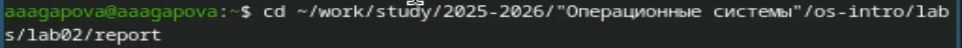
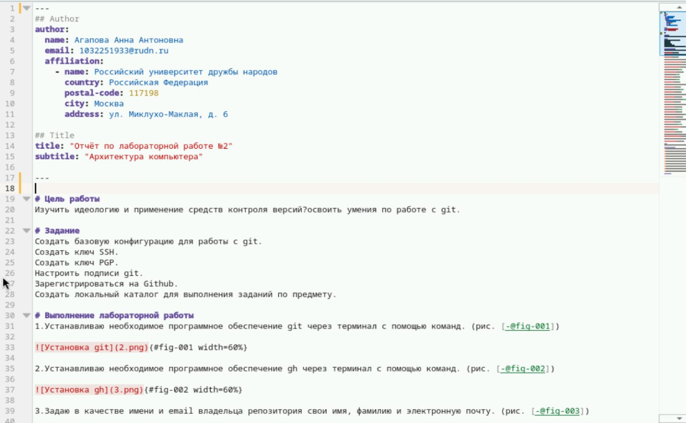
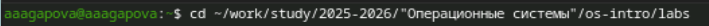
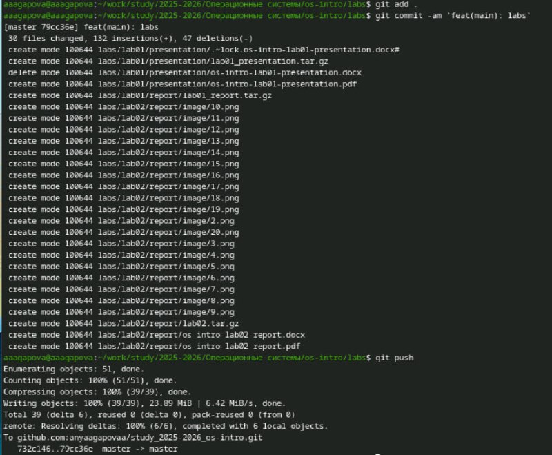

---
## Author
author:
  name: Агапова Анна Антоновна
  email: 1032251933@rudn.ru
  affiliation:
    - name: Российский университет дружбы народов
      country: Российская Федерация
      postal-code: 117198
      city: Москва
      address: ул. Миклухо-Маклая, д. 6

## Title
title: "Отчёт по лабораторной работе №3"
subtitle: "Архитектура компьютера"
license: CC BY
date: 2026-03-01
slide_level: 2
aspectratio: 169
section-titles: true
theme: metropolis
date-format: "YYYY-MM-DD" # Example: 2025-09-06
---

# Докладчик

:::::::::::::: {.columns align=center}
::: {.column width="70%"}

  * Агапова Анна Антоновна
  * Российский университет дружбы народов им. П. Лумумбы

:::
::: {.column width="30%"}

:::
::::::::::::::

---

# Цель работы
Научиться оформлять отчёты с помощью легковесного языка разметки Markdown.

---

# Задание
1. Сделайте отчёт по предыдущей лабораторной работе в формате Markdown.
2. В качестве отчёта просьба предоставить отчёты в 3 форматах: pdf, docx и md (в архиве, поскольку он должен содержать скриншоты, Makefile и т.д.)

---

# Выполнение лабораторной работы

1. Перехожу в папку.

---

2. Заполняю отчет.

---

3. Выполняю компиляцию в docx.

---

4. Выполняю компиляцию в pdf.

---

5. Перехожу в папку labs.

---

6. Обновляю репозиторий.

---

# Выводы
При выполнении данной лабораторной работы я научилась оформлять отчеты с помощью легковесного языка разметки Markdown.

