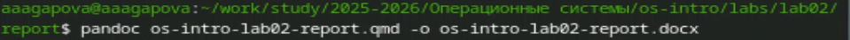
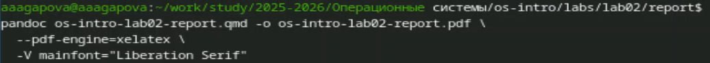

---
## Author
author:
  name: Агапова Анна Антоновна
  email: 1032251933@rudn.ru
  affiliation:
    - name: Российский университет дружбы народов
      country: Российская Федерация
      postal-code: 117198
      city: Москва
      address: ул. Миклухо-Маклая, д. 6

## Title
title: "Отчёт по лабораторной работе №3"
subtitle: "Архитектура компьютера"

---

# Цель работы
Научиться оформлять отчёты с помощью легковесного языка разметки Markdown.

# Задание
1. Сделайте отчёт по предыдущей лабораторной работе в формате Markdown.
2. В качестве отчёта просьба предоставить отчёты в 3 форматах: pdf, docx и md (в архиве,
поскольку он должен содержать скриншоты, Makefile и т.д.)

# Выполнение лабораторной работы
1.Перехожу в папку, где буду делать отчет. (рис. [-@fig-001])

{#fig-001 width=60%}

2.Открываю файл с помощью текстового редактора Kwrite, заполняю отчет. (рис. [-@fig-002])

{#fig-002 width=60%}

3.Выполняю компиляцию из формата qmd в формат docx. (рис. [-@fig-003])

{#fig-003 width=60%}

4.Выполняю компиляцию из формата qmd в формат pdf. (рис. [-@fig-004])

{#fig-004 width=60%}

5.Перехожу в папку labs для обновления репозитория. (рис. [-@fig-005])

{#fig-005 width=60%}

6.Обновляю репозиторий. (рис. [-@fig-006])

{#fig-006 width=60%}

# Выводы
При выполнении данной лабораторной работы я научилась оформлять отчеты с помощью легковесного языка разметки Markdown.

# Список литературы
