---
## Author
author:
  name: Агапова Анна Антоновна
  email: 1032251933@rudn.ru
  affiliation:
    - name: Российский университет дружбы народов
      country: Российская Федерация
      postal-code: 117198
      city: Москва
      address: ул. Миклухо-Маклая, д. 6

## Title
title: "Отчёт по лабораторной работе №4"
subtitle: "Архитектура компьютера"
license: CC BY
date: 2026-03-05
slide_level: 2
aspectratio: 169
section-titles: true
theme: metropolis
date-format: "YYYY-MM-DD" # Example: 2025-09-06
---

# Докладчик

:::::::::::::: {.columns align=center}
::: {.column width="70%"}

  * Агапова Анна Антоновна
  * Российский университет дружбы народов им. П. Лумумбы

:::
::: {.column width="30%"}

:::
::::::::::::::

---

# Цель работы
Получение навыков правильной работы с репозиториями git.

---

# Задание
1. Выполнить работу для тестового репозитория.
2. Преобразовать рабочий репозиторий в репозиторий с git-flow и conventional commits.

---

# Выполнение лабораторной работы

1. Устанавливаю gitflow.

---

2. Устанавливаю gitflow.

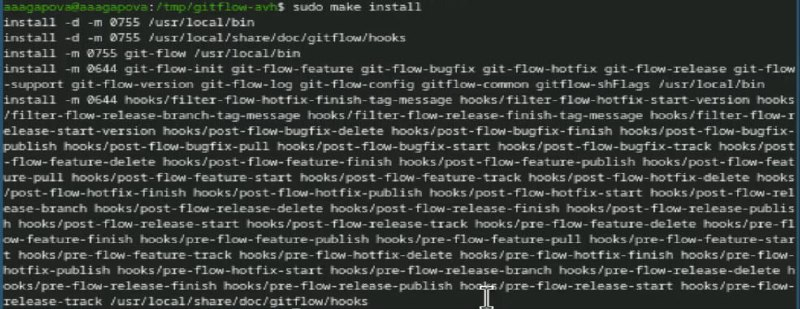

---

3. Проверяю версию gitflow.

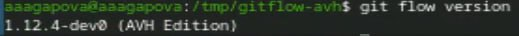

---

4. Устанавливаю node.js.

---

5. Устанавливаю pnpm.

---

6. Добавляю каталог с файлами в переменную PATH.

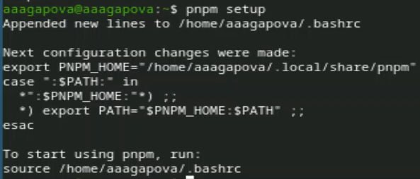

---

7. Устанавливаю программу для форматирования коммитов.

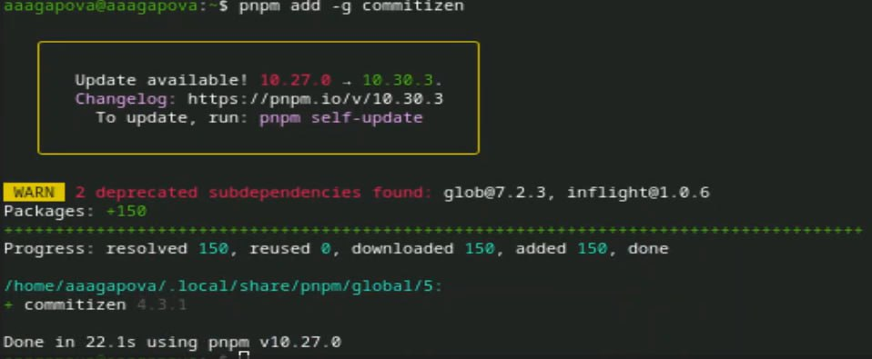

---

8. Устанавливаю программу для помощи в создании логов.

---

9. Создаю новый репозиторий.

---

10. Создаю папку и инициализирую.

---

11. Создаю первый файл и делаю коммит.

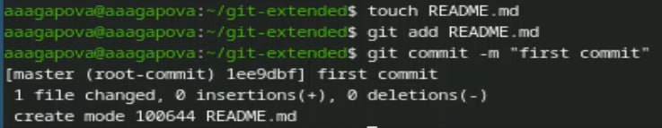

---

12. Переименовываю ветку в main, подключаю удаленные репозитории и отправляю на GitHub.

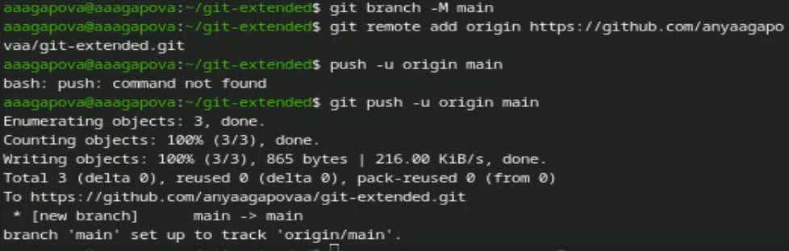

---

13. Редактирую файл package.json.

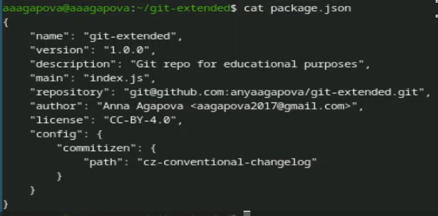

---

14. Добавляю новые файлы, выполняю коммит и отправляю на GitHub.

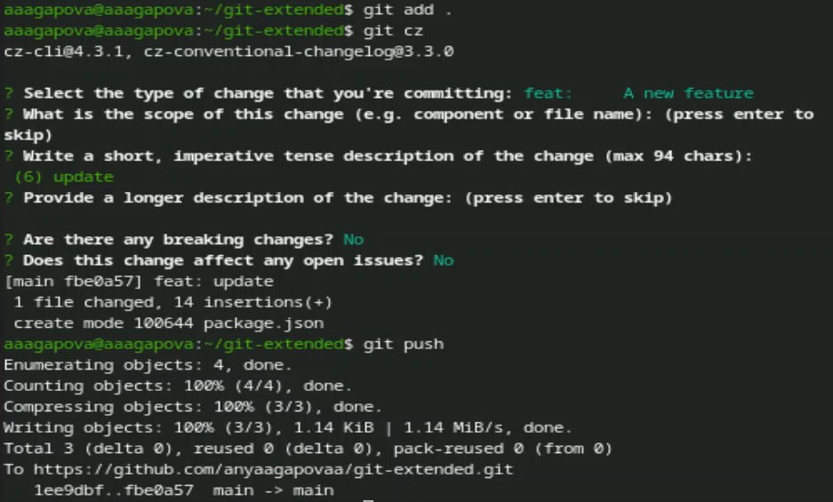

---

15. Инициализирую gitflow.

---

16. Проверяю, что я на ветке develop.

---

17. Загружаю весь репозиторий в хранилище.

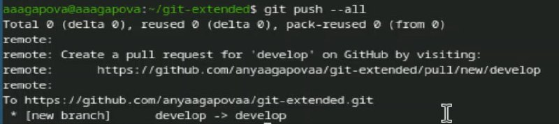

---

18. Устанавливаю внешнюю ветку как вышестоящую для этой ветки.

---

19. Создаю релиз с версией 1.0.0.

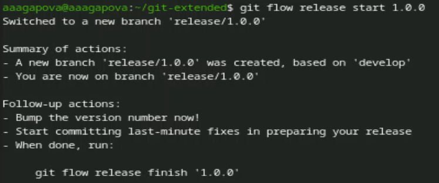

---

20. Создаю журнал изменений и добавляю журнал изменений в индекс.

---

21. Заливаю релизную ветку в основную ветку.

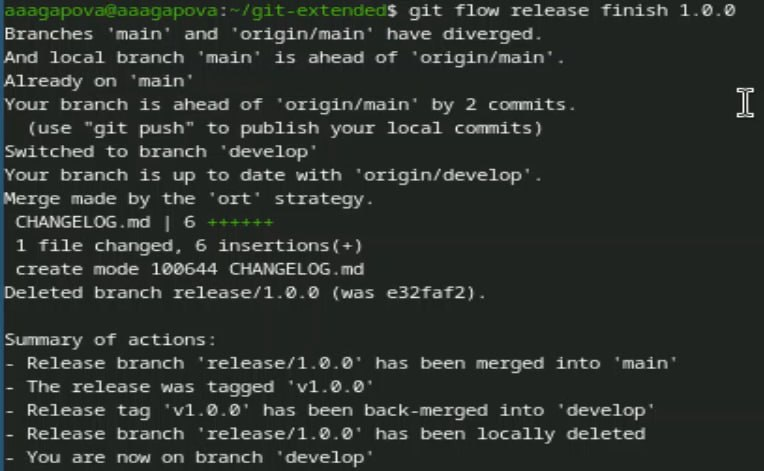

---

22. Отправляю данные на GitHub.

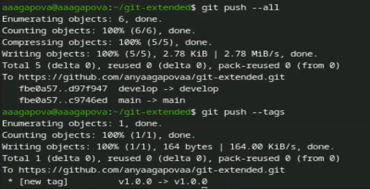

---

23. Создаю релиз на github.

---

24. Создаю ветку для новой функциональности.

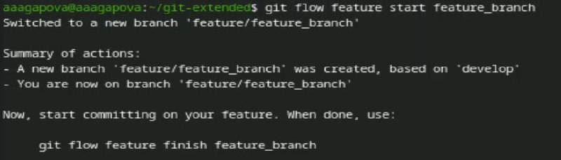

---

25. Объединяю ветку feature_branch c develop.

---

26. Создаю релиз с версией 1.2.3.

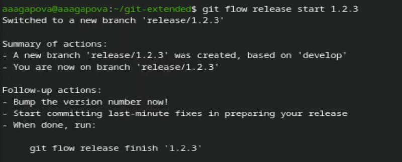

---

27. Обновляю номер версии в файле package.json.

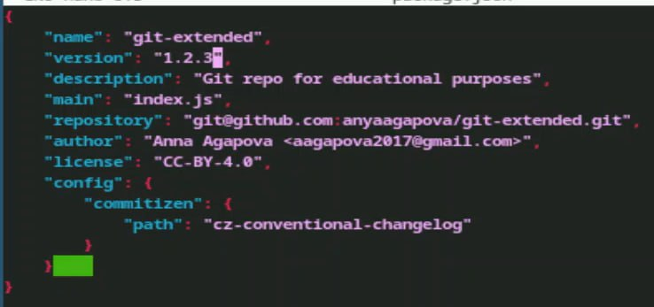

---

28. Создаю журнал изменений и добавляю журнал изменений в индекс.

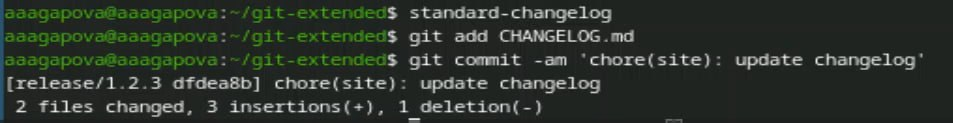

---

29. Заливаю релизную ветку в основную ветку.

---

30. Отправляю данные на GitHub.

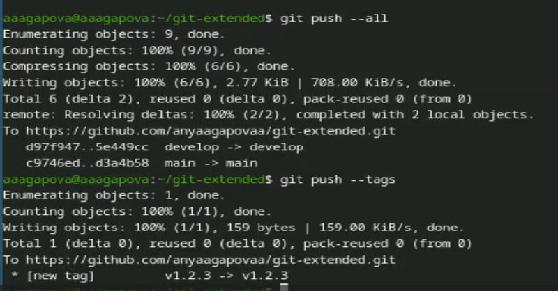

---

31. Создаю релиз на github с комментарием из журнала изменений.

---

32. Проверяю, что все файлы создались.

---

33. Проверяю, что релизы создались.

---

# Выводы
Я получила навыки правильной работы с репозиториями git.

