---
## Author
author:
  name: Агапова Анна Антоновна
  email: 1032251933@rudn.ru
  affiliation:
    - name: Российский университет дружбы народов
      country: Российская Федерация
      postal-code: 117198
      city: Москва
      address: ул. Миклухо-Маклая, д. 6

## Title
title: "Отчёт по лабораторной работе №4"
subtitle: "Архитектура компьютера"
license: "CC BY"
---

# Цель работы
Получение навыков правильной работы с репозиториями git.

# Задание
1. Выполнить работу для тестового репозитория.
2. Преобразовать рабочий репозиторий в репозиторий с git-flow и conventional commits.

# Выполнение лабораторной работы
1.Устанавливаю gitflow. (рис. [-@fig-001])

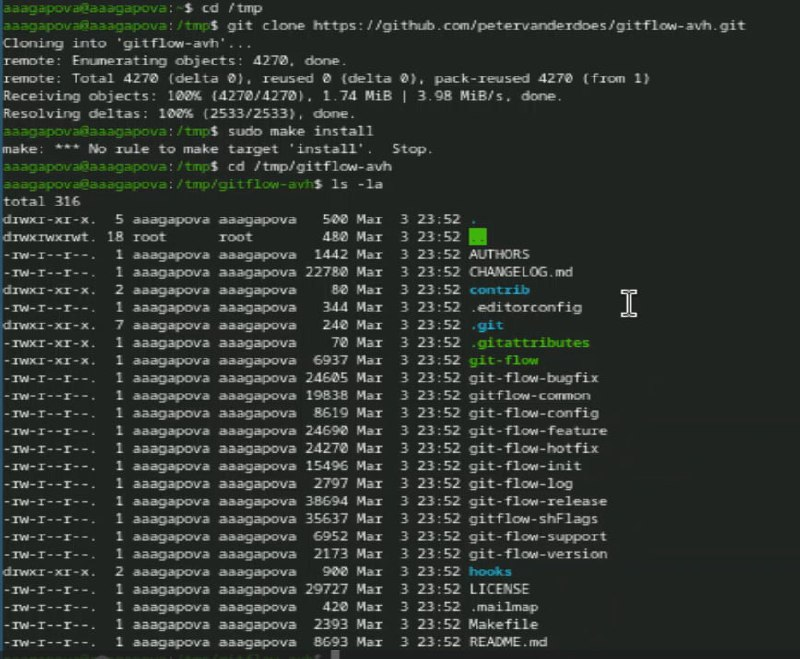{#fig-001 width=60%}

2.Устанавливаю gitflow. (рис. [-@fig-002])

{#fig-002 width=60%}

3.Проверяю версию gitflow. (рис. [-@fig-003])

{#fig-003 width=60%}

4.Устанавливаю node.js. (рис. [-@fig-004])

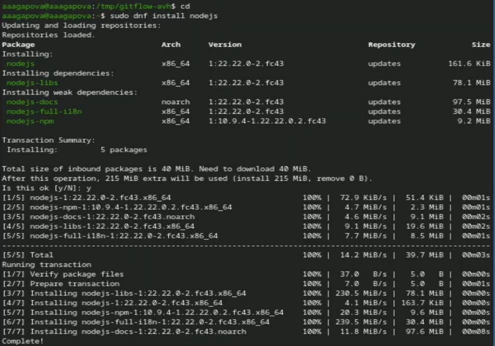{#fig-004 width=60%}

5.Устанавливаю pnpm. (рис. [-@fig-005])

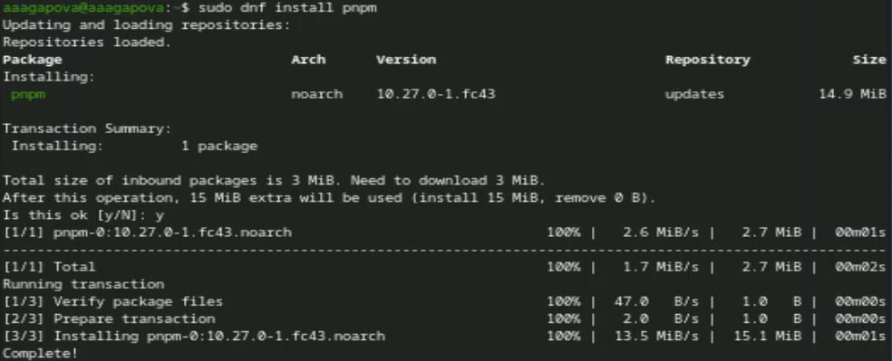{#fig-005 width=60%}

6.Добавляю каталог с исполняемыми файлами в переменную PATH. (рис. [-@fig-006])

{#fig-006 width=60%}

7.Устанавливаю программу для форматирования коммитов. (рис. [-@fig-007])

{#fig-007 width=60%}

8.Устанавливаю программу для помощи в создании логов. (рис. [-@fig-008])

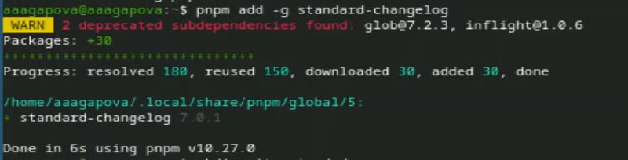{#fig-008 width=60%}

9.Создаю новый репозиторий. (рис. [-@fig-009])

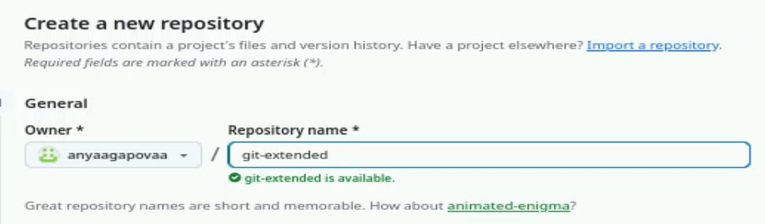{#fig-009 width=60%}

10.Создаю папку и инициализирую. (рис. [-@fig-0010])

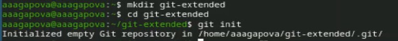{#fig-0010 width=60%}

11.Создаю первый файл и делаю коммит. (рис. [-@fig-0011])

{#fig-0011 width=60%}

12.Переименовываю ветку в main, подключаю удаленные репозитории и отправляю на GitHub. (рис. [-@fig-0012])

{#fig-0012 width=60%}

13.Редактирую файл package.json. (рис. [-@fig-0013])

{#fig-0013 width=60%}

14.Добавляю новые файлы, выполняю коммит и отправляю на GitHub. (рис. [-@fig-0014])

{#fig-0014 width=60%}

15.Инициализирую gitflow.  (рис. [-@fig-0015])

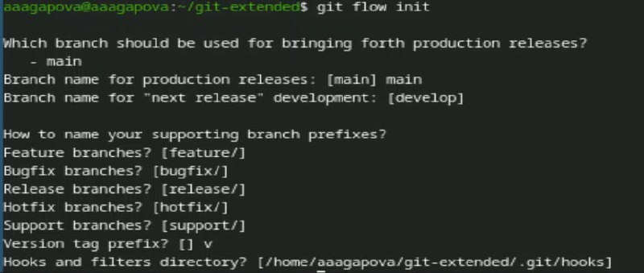{#fig-0015 width=60%}

16.Проверяю, что я на ветке develop. (рис. [-@fig-0016])

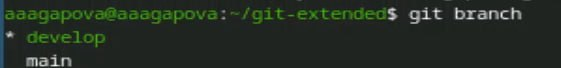{#fig-0016 width=60%}

17.Загружаю весь репозиторий в хранилище. (рис. [-@fig-0017])

{#fig-0017 width=60%}

18.Устанавливаю внешнюю ветку как вышестоящую для этой ветки. (рис. [-@fig-0018])

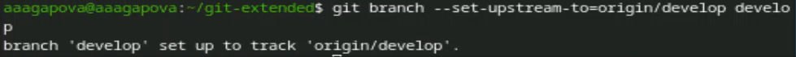{#fig-0018 width=60%}

19.Создаю релиз с версией 1.0.0. (рис. [-@fig-0019])

{#fig-0019 width=60%}

20.Создаю журнал изменений и добавляю журнал изменений в индекс. (рис. [-@fig-0020])

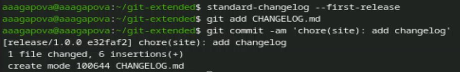{#fig-0020 width=60%}

21.Заливаю релизную ветку в основную ветку. (рис. [-@fig-0021])

{#fig-0021 width=60%}

22.Отправляю данные на GitHub. (рис. [-@fig-0022])

{#fig-0022 width=60%}

23.Создаю релиз на github. Для этого буду использовать утилиты работы с github. (рис. [-@fig-0023])

{#fig-0023 width=60%}

24.Создаю ветку для новой функциональности. (рис. [-@fig-0024])

{#fig-0024 width=60%}

25.Объединяю ветку feature_branch c develop. (рис. [-@fig-0025])

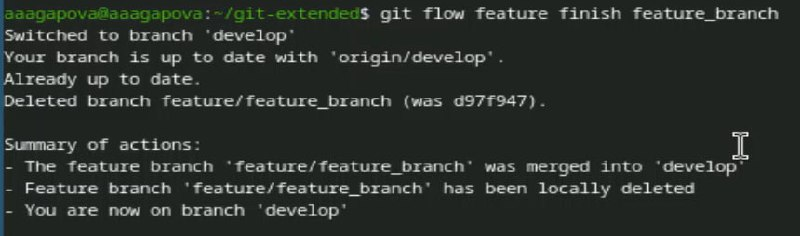{#fig-0025 width=60%}

26.Создаю релиз с версией 1.2.3. (рис. [-@fig-0026])

{#fig-0026 width=60%}

27.Обновляю номер версии в файле package.json. (рис. [-@fig-0027])

{#fig-0027 width=60%}

28.Создаю журнал изменений и добавляю журнал изменений в индекс (рис. [-@fig-0028])

{#fig-0028 width=60%}

29.Заливаю релизную ветку в основную ветку. (рис. [-@fig-0029])

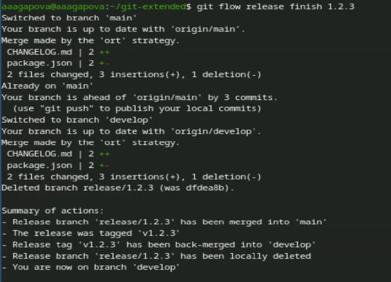{#fig-0029 width=60%}

30.Отправляю данные на GitHub. (рис. [-@fig-0030])

{#fig-0030 width=60%}

31.Создаю релиз на github с комментарием из журнала изменений. (рис. [-@fig-0031])

{#fig-0031 width=60%}

32.Проверяю, что все файлы создались. (рис. [-@fig-0032])

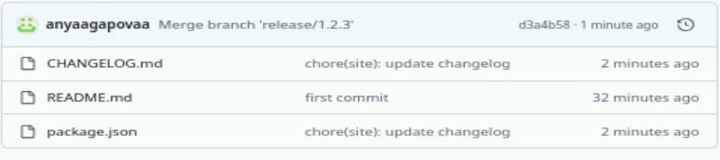{#fig-0032 width=60%}

33.Проверяю, что релизы создались. (рис. [-@fig-0033])

{#fig-0033 width=60%}

# Выводы
Я получила навыки правильной работы с репозиториями git.

# Список литературы
