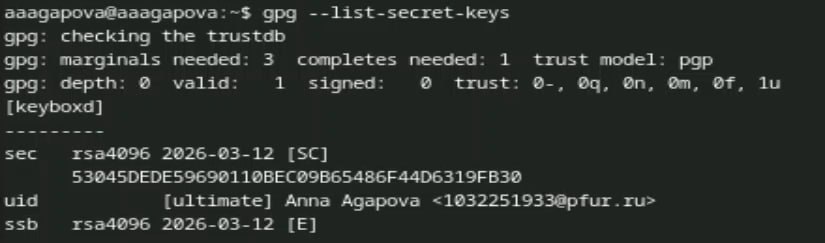
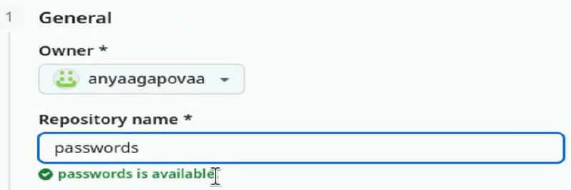
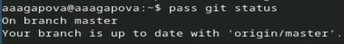
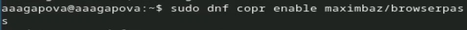
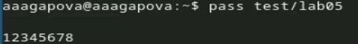
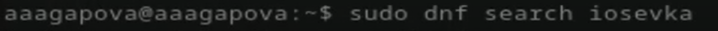
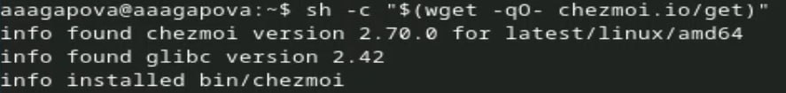
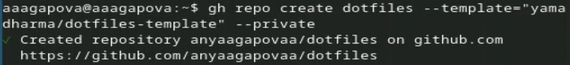

---
## Author
author:
  name: Агапова Анна Антоновна
  email: 1032251933@rudn.ru
  affiliation:
    - name: Российский университет дружбы народов
      country: Российская Федерация
      postal-code: 117198
      city: Москва
      address: ул. Миклухо-Маклая, д. 6

## Title
title: "Отчёт по лабораторной работе №5"
subtitle: "Архитектура компьютера"
license: CC BY
date: 2026-03-14
slide_level: 2
aspectratio: 169
section-titles: true
theme: metropolis
date-format: "YYYY-MM-DD" # Example: 2025-09-06
---

# Докладчик

:::::::::::::: {.columns align=center}
::: {.column width="70%"}

  * Агапова Анна Антоновна
  * Российский университет дружбы народов им. П. Лумумбы

:::
::: {.column width="30%"}

:::
::::::::::::::

---

# Цель работы
Освоить менеджер паролей pass и инструмент управления конфигурациями chezmoi.

---

# Задание
Установить и настроить pass с GPG-шифрованием, синхронизировать с GitHub, интегрировать с браузером, настроить chezmoi для управления dotfiles.

---

# Выполнение лабораторной работы

1. Устанавливаю pass и pass-otp.

---

2. Проверяю, что у меня есть GPG ключ.

---

3. Инициализирую хранилище.

---

4. Создаю новый репозиторий.

---

5. Синхронизирую.

---

6. Продолжение синхронизации.

---

7. Проверяю статус синхронизации.

---

8. Включаю репозиторий corp.

---

9. Устанавливаю browserpass.

---

10. Добавляю пароль.

---

11. Отображаю пароль для указанного имени файла.

---

12. Заменяю существующий пароль.

---

13. Устанавливаю дополнительное программное обеспечение.

---

14. Устанавливаю шрифты.

---

15. Устанавливаю chezmoi.

---

16. Создаю свой репозиторий.

---

17. Инициализирую chezmoi с моим репозиторием dotfiles.

---

18. Проверяю, какие изменения внесёт chezmoi в домашний каталог.

---

19. Меня устраивают изменения, внесённые chezmoi, поэтому запускаю.

---

20. Извлекаю последние изменения из репозитория.

---

21. Применяю изменения.

---

22. Включаю автоматическое фиксирование и отправление изменений в исходный каталог в репозиторий. Подключаю эту функцию. Добавляю в файл конфигурации следующее.

---

# Выводы
Я научилась настраивать безопасное хранилище паролей с синхронизацией через Git, освоила chezmoi.
