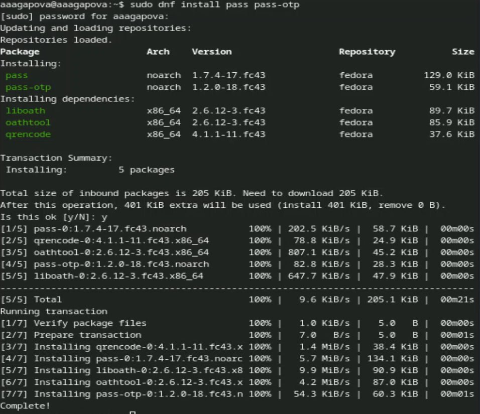
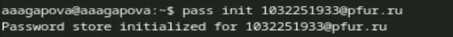
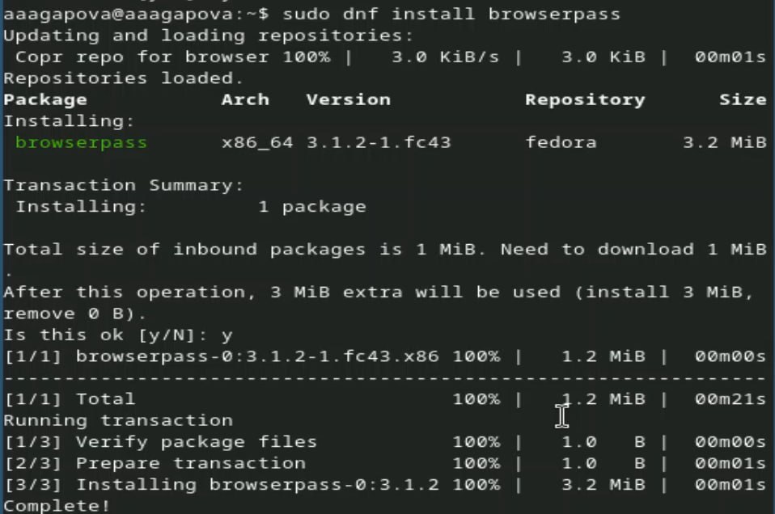
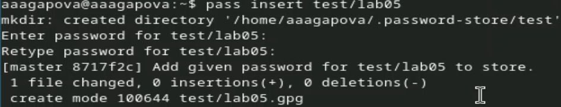
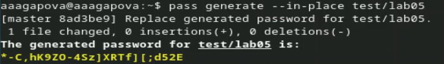
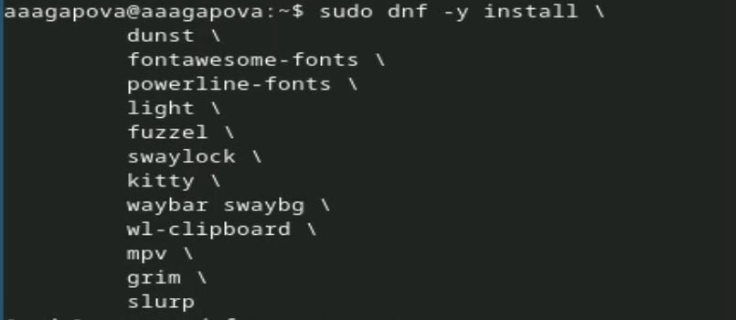
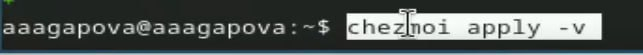
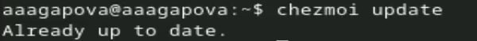
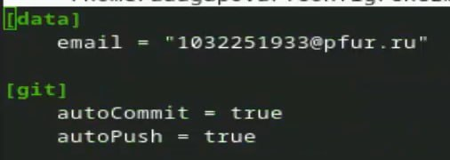

---
## Author
author:
  name: Агапова Анна Антоновна
  email: 1032251933@rudn.ru
  affiliation:
    - name: Российский университет дружбы народов
      country: Российская Федерация
      postal-code: 117198
      city: Москва
      address: ул. Миклухо-Маклая, д. 6

## Title
title: "Отчёт по лабораторной работе №5"
subtitle: "Архитектура компьютера"

---

# Цель работы
Освоить менеджер паролей pass и инструмент управления конфигурациями chezmoi.

# Задание
Установить и настроить pass с GPG-шифрованием, синхронизировать с GitHub, интегрировать с браузером, настроить chezmoi для управления dotfiles.

# Выполнение лабораторной работы
1.Устанавливаю pass и pass-otp. (рис. [-@fig-001])

{#fig-001 width=60%}

2.Проверяю, что у меня есть GPG ключ. (рис. [-@fig-002])

{#fig-002 width=60%}

3.Инициализирую хранилище. (рис. [-@fig-003])

{#fig-003 width=60%}

4.Создаю новый репозиторий. (рис. [-@fig-004])

{#fig-004 width=60%}

5.Синхронизирую. (рис. [-@fig-005])

{#fig-005 width=60%}

6.Продолжение синхронизации. (рис. [-@fig-006])

{#fig-006 width=60%}

7.Проверяю статус синхронизации. (рис. [-@fig-007])

{#fig-007 width=60%}

8.Включаю репозиторий corp. (рис. [-@fig-008])

{#fig-008 width=60%}

9.Устанавливаю browserpass. (рис. [-@fig-009])

{#fig-009 width=60%}

10.Добавляю пароль. (рис. [-@fig-0010])

{#fig-0010 width=60%}

11.Отображаю пароль для указанного имени файла. (рис. [-@fig-0011])

{#fig-0011 width=60%}

12.Заменяю существующий пароль. (рис. [-@fig-0012])

{#fig-0012 width=60%}

13.Устанавливаю дополнительное программное обеспечение. (рис. [-@fig-0013])

{#fig-0013 width=60%}

14.Устанавливаю шрифты. (рис. [-@fig-0014])

{#fig-0014 width=60%}

15.Устанавливаю chezmoi. (рис. [-@fig-0015])

{#fig-0015 width=60%}

16.Создаю свой репозиторий для конфигурационных файлов на основе шаблона. (рис. [-@fig-0016])

{#fig-0016 width=60%}

17.Инициализирую chezmoi с моим репозиторием dotfiles. (рис. [-@fig-0017])

{#fig-0017 width=60%}

18.Проверяю, какие изменения внесёт chezmoi в домашний каталог. (рис. [-@fig-0018])

{#fig-0018 width=60%}

19.Меня устраивают изменения, внесённые chezmoi, поэтому запускаю. (рис. [-@fig-0019])

{#fig-0019 width=60%}

20.Извлекаю последние изменения из репозитория. (рис. [-@fig-0020])

{#fig-0020 width=60%}

21.Применяю изменения. (рис. [-@fig-0021])

{#fig-0021 width=60%}

22.Включаю автоматическое фиксирование и отправление изменений в исходный каталог в репозиторий. Подключаю эту функцию. Добавляю в файл конфигурации следующее. (рис. [-@fig-0022])

{#fig-0022 width=60%}

# Выводы
Я научилась настраивать безопасное хранилище паролей с синхронизацией через Git, освоила chezmoi.

# Список литературы
