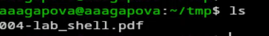
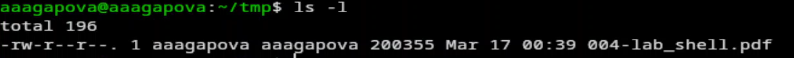
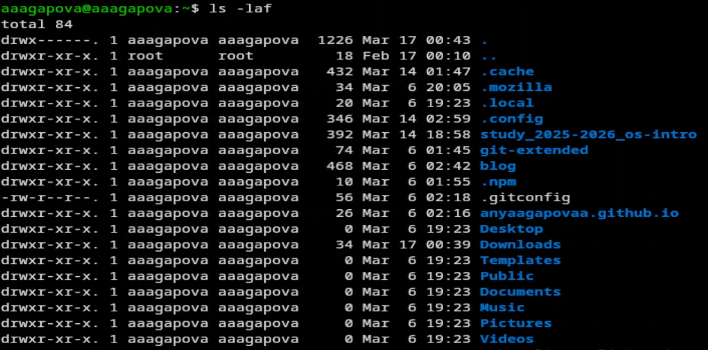
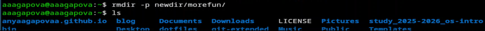
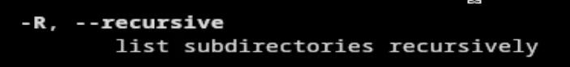
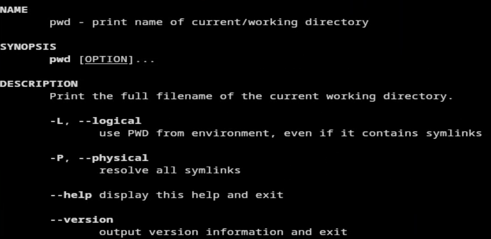
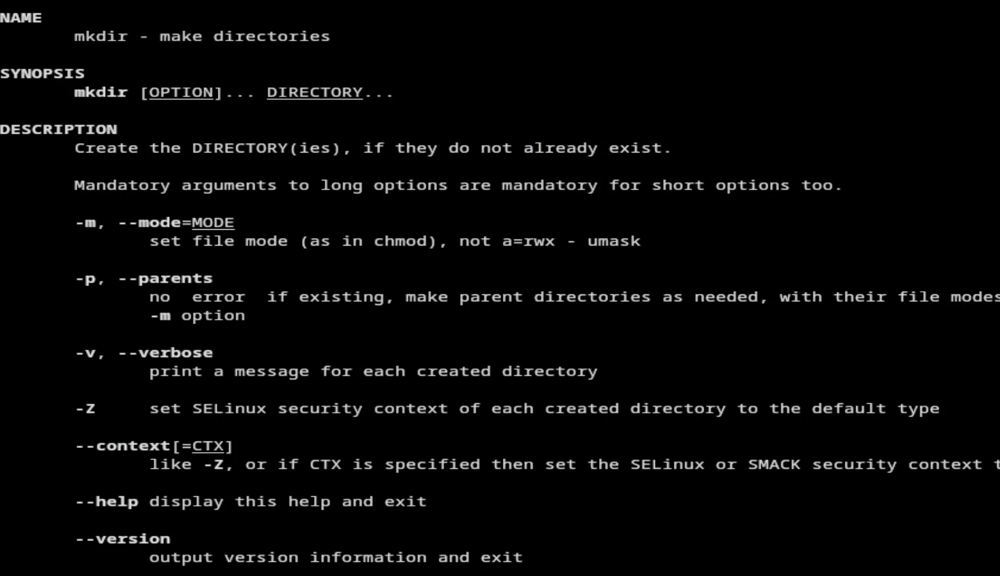
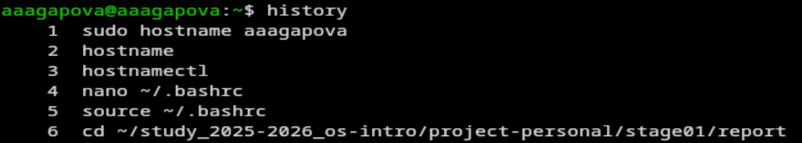
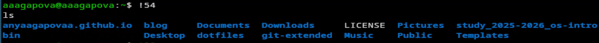

---
## Author
author:
  name: Агапова Анна Антоновна
  email: 1032251933@rudn.ru
  affiliation:
    - name: Российский университет дружбы народов
      country: Российская Федерация
      postal-code: 117198
      city: Москва
      address: ул. Миклухо-Маклая, д. 6

## Title
title: "Отчёт по лабораторной работе №6"
subtitle: "Архитектура компьютера"
license: CC BY
date: 2026-03-18
slide_level: 2
aspectratio: 169
section-titles: true
theme: metropolis
date-format: "YYYY-MM-DD" # Example: 2025-09-06
---

# Докладчик

:::::::::::::: {.columns align=center}
::: {.column width="70%"}

  * Агапова Анна Антоновна
  * Российский университет дружбы народов им. П. Лумумбы

:::
::: {.column width="30%"}

:::
::::::::::::::

---

# Цель работы
Приобретение практических навыков взаимодействия пользователя с системой посредством командной строки.

---

# Задание
1. Определите полное имя вашего домашнего каталога. Далее относительно этого ката-
лога будут выполняться последующие упражнения.
2. Выполните следующие действия:
2.1. Перейдите в каталог /tmp.
2.2. Выведите на экран содержимое каталога /tmp. Для этого используйте команду ls
с различными опциями. Поясните разницу в выводимой на экран информации.
2.3. Определите, есть ли в каталоге /var/spool подкаталог с именем cron?

---

2.4. Перейдите в Ваш домашний каталог и выведите на экран его содержимое. Опре-
делите, кто является владельцем файлов и подкаталогов?
3. Выполните следующие действия:
3.1. В домашнем каталоге создайте новый каталог с именем newdir.
3.2. В каталоге ~/newdir создайте новый каталог с именем morefun.
3.3. В домашнем каталоге создайте одной командой три новых каталога с именами
letters, memos, misk. Затем удалите эти каталоги одной командой.
3.4. Попробуйте удалить ранее созданный каталог ~/newdir командой rm. Проверьте,
был ли каталог удалён.

---

3.5. Удалите каталог ~/newdir/morefun из домашнего каталога. Проверьте, был ли
каталог удалён.
4. С помощью команды man определите, какую опцию команды ls нужно использо-
вать для просмотра содержимое не только указанного каталога, но и подкаталогов,
входящих в него.
5. С помощью команды man определите набор опций команды ls, позволяющий отсорти-
ровать по времени последнего изменения выводимый список содержимого каталога
с развёрнутым описанием файлов.

---

6. Используйте команду man для просмотра описания следующих команд: cd, pwd, mkdir,
rmdir, rm. Поясните основные опции этих команд.
7. Используя информацию, полученную при помощи команды history, выполните мо-
дификацию и исполнение нескольких команд из буфера команд.

---

# Выполнение лабораторной работы

1. Узнаю полное имя домашнего каталога.

---

2. Перехожу в подкаталог tmp.

---

3. Просматриваю содержимое каталога tmp.

---

4. Использую команду ls с разными опциями.

---

5. Данная опция покажет скрытые файлы в каталоге.

---

6. Перехожу в каталог /var/spool. Ввожу необходимую команду, вижу что подкаталог с именем cron есть.

---

7. Перехожу в домашний каталог и вывожу на экран его содержимое.

---

8. В домашнем каталоге создаю новый каталог с именем newdir. Проверяю, что каталог создался.

---

9. В каталоге ~/newdir создаю новый каталог с именем morefun. Проверяю, что каталог создался.

---

10. В домашнем каталоге создаю одной командой три новых каталога с именами letters, memos, misk.

---

11. Удаляю эти каталоги одной командой. Проверяю, что они удалились.

---

12. Пробую удалить ранее созданный каталог ~/newdir командой rm.

---

13. Удаляю каталог ~/newdir/morefun из домашнего каталога. Проверяю, что каталог был удалён.

---

14. С помощью команды man определяю, какую опцию команды ls нужно использовать для просмотра содержимое не только указанного каталога, но и подкаталогов, входящих в него.

---

15. С помощью команды man определяю набор опций команды ls, позволяющий отсортировать по времени последнего изменения выводимый список содержимого каталога с развёрнутым описанием файлов.

---

16. Использую команду man для просмотра описания cd.

---

17. Использую команду man для просмотра описания pwd.

---

18. Использую команду man для просмотра описания mkdir.

---

19. Использую команду man для просмотра описания rmdir.

---

20. Использую команду man для просмотра описания rm.

---

21. Используя информацию, полученную при помощи команды history, выполняю модификацию и исполнение нескольких команд из буфера команд.

---

22. Модифицирую команду.

---

23. Модифицирую команду.

---

24. Модифицирую команду.

---

# Выводы
Я приобрела практические навыки взаимодействия пользователя с системой посредством командной строки.
