---
## Author
author:
  name: Агапова Анна Антоновна
  email: 1032251933@rudn.ru
  affiliation:
    - name: Российский университет дружбы народов
      country: Российская Федерация
      postal-code: 117198
      city: Москва
      address: ул. Миклухо-Маклая, д. 6

## Title
title: "Отчёт по лабораторной работе №6"
subtitle: "Архитектура компьютера"

---

# Цель работы
Приобретение практических навыков взаимодействия пользователя с системой посредством командной строки.

# Задание
1. Определите полное имя вашего домашнего каталога. Далее относительно этого ката-
лога будут выполняться последующие упражнения.
2. Выполните следующие действия:
2.1. Перейдите в каталог /tmp.
2.2. Выведите на экран содержимое каталога /tmp. Для этого используйте команду ls
с различными опциями. Поясните разницу в выводимой на экран информации.
2.3. Определите, есть ли в каталоге /var/spool подкаталог с именем cron?
2.4. Перейдите в Ваш домашний каталог и выведите на экран его содержимое. Опре-
делите, кто является владельцем файлов и подкаталогов?
3. Выполните следующие действия:
3.1. В домашнем каталоге создайте новый каталог с именем newdir.
3.2. В каталоге ~/newdir создайте новый каталог с именем morefun.
3.3. В домашнем каталоге создайте одной командой три новых каталога с именами
letters, memos, misk. Затем удалите эти каталоги одной командой.
3.4. Попробуйте удалить ранее созданный каталог ~/newdir командой rm. Проверьте,
был ли каталог удалён.
3.5. Удалите каталог ~/newdir/morefun из домашнего каталога. Проверьте, был ли
каталог удалён.
4. С помощью команды man определите, какую опцию команды ls нужно использо-
вать для просмотра содержимое не только указанного каталога, но и подкаталогов,
входящих в него.
5. С помощью команды man определите набор опций команды ls, позволяющий отсорти-
ровать по времени последнего изменения выводимый список содержимого каталога
с развёрнутым описанием файлов.
6. Используйте команду man для просмотра описания следующих команд: cd, pwd, mkdir,
rmdir, rm. Поясните основные опции этих команд.
7. Используя информацию, полученную при помощи команды history, выполните мо-
дификацию и исполнение нескольких команд из буфера команд.

# Выполнение лабораторной работы
1.Узнаю полное имя домашнего каталога. (рис. [-@fig-001])

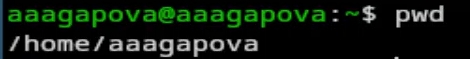{#fig-001 width=60%}

2.Перехожу в подкаталог tmp. (рис. [-@fig-002])

{#fig-002 width=60%}

3.Просматриваю содержимое каталога tmp. (рис. [-@fig-003])

{#fig-003 width=60%}

4.Использую команду ls с разными опциями. Данная опция помогает увидеть дополнительную информацию о файлах в каталоге. (рис. [-@fig-004])

{#fig-004 width=60%}

5.Данная опция покажет скрытые файлы в каталоге. (рис. [-@fig-005])

{#fig-005 width=60%}

6.Перехожу в каталог /var/spool. Ввожу необходимую команду, вижу что подкаталог с именем cron есть. (рис. [-@fig-006])

{#fig-006 width=60%}

7.Перехожу в домашний каталог и вывожу на экран его содержимое. Определяю, кто является владельцем файлов и подкаталогов. (рис. [-@fig-007])

{#fig-007 width=60%}

8.В домашнем каталоге создаю новый каталог с именем newdir. Проверяю, что каталог создался. (рис. [-@fig-008])

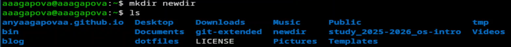{#fig-008 width=60%}

9.В каталоге ~/newdir создаю новый каталог с именем morefun. Проверяю, что каталог создался. (рис. [-@fig-009])

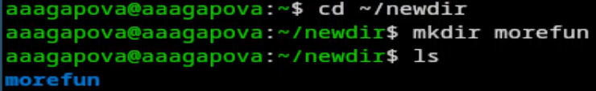{#fig-009 width=60%}

10.В домашнем каталоге создаю одной командой три новых каталога с именами letters, memos, misk. Проверяю, что каталоги создались. (рис. [-@fig-0010])

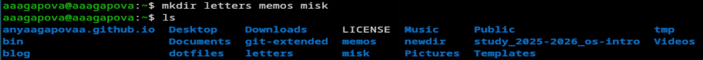{#fig-0010 width=60%}

11.Удаляю эти каталоги одной командой. Проверяю, что они удалились. (рис. [-@fig-0011])

{#fig-0011 width=60%}

12.Поробую удалить ранее созданный каталог ~/newdir командой rm. Не получается. (рис. [-@fig-0012])

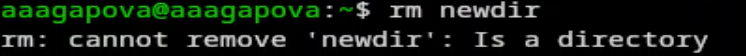{#fig-0012 width=60%}

13.Удаляю каталог ~/newdir/morefun из домашнего каталога. Проверяю, что каталог был удалён. (рис. [-@fig-0013])

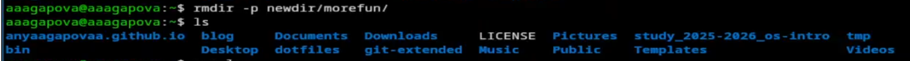{#fig-0013 width=60%}

14.С помощью команды man определяю, какую опцию команды ls нужно использовать для просмотра содержимое не только указанного каталога, но и подкаталогов, входящих в него. (рис. [-@fig-0014])

{#fig-0014 width=60%}

15.С помощью команды man определяю набор опций команды ls, позволяющий отсортировать по времени последнего изменения выводимый список содержимого каталога с развёрнутым описанием файлов. (рис. [-@fig-0015])

{#fig-0015 width=60%}

16.Использую команду man для просмотра описания cd. cd -P заставляет переходить по физическому пути, игнорируя символические ссылки. cd -L переходит по логическому пути, сохраняя символические ссылки. (рис. [-@fig-0016])

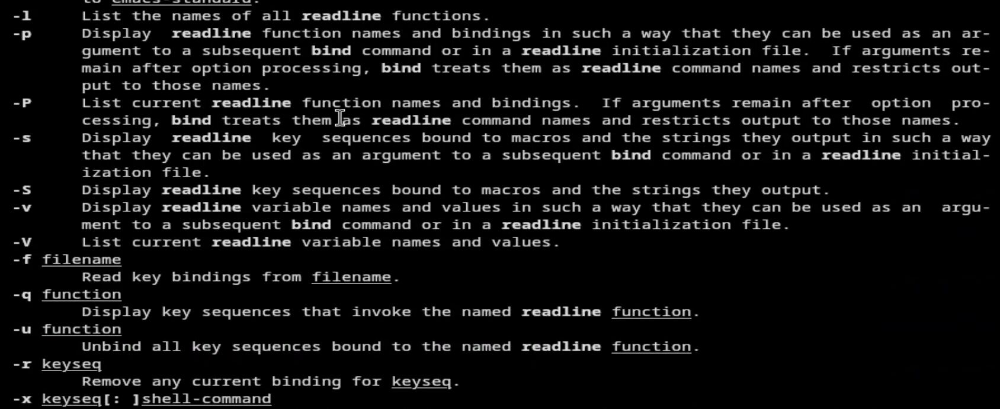{#fig-0016 width=60%}

17.Использую команду man для просмотра описания pwd. pwd -L показывает логический путь к текущему каталогу. pwd -P показывает физичсекий путь, раскрывая все символические ссылки. (рис. [-@fig-0017])

{#fig-0017 width=60%}

18.Использую команду man для просмотра описания mkdir. mkdir -m задаёт права доступа для создаваемого каталога в числовом или символическом формате. mkdir -p позволяет создать вложенную структуру каталогов за одну команду. (рис. [-@fig-0018])

{#fig-0018 width=60%}

19.Использую команду man для просмотра описания rmdir. rmdir -p удаляет каталог и его пустые каталоги. mkdir -v выводит сообщение о каждом удаленном каталоге. (рис. [-@fig-0019])

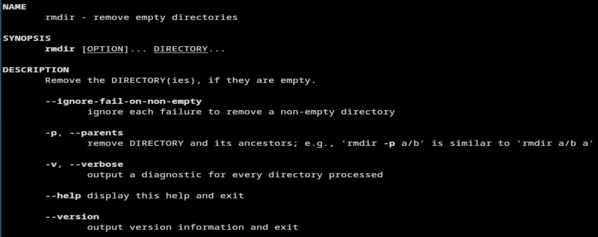{#fig-0019 width=60%}

20.Использую команду man для просмотра описания rm. rm -f игнорирует несуществующие файлы и не запрашивает подтверждение. rm -i запрашивает подтверждение перед удалением каждого файла. rm -I запрашивает подтверждение один раз перед удалением более трех файлов или при рекурсивном удалении. (рис. [-@fig-0020])

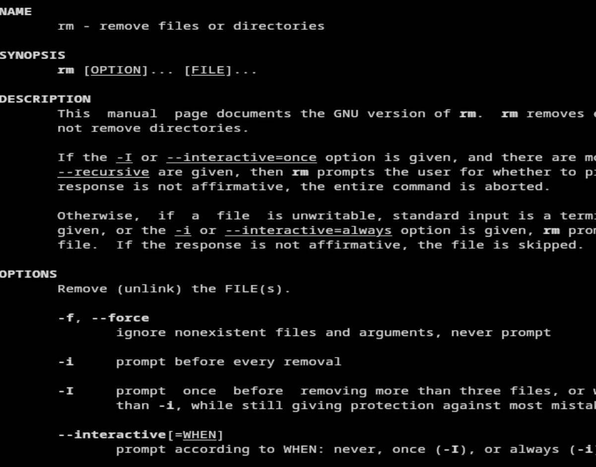{#fig-0020 width=60%}

21.Используя информацию, полученную при помощи команды history, выполняю модификацию и исполнение нескольких команд из буфера команд. (рис. [-@fig-0021])

{#fig-0021 width=60%}

22.Модифицирую команду. (рис. [-@fig-0022])

{#fig-0022 width=60%}

23.Модифицирую команду. (рис. [-@fig-0023])

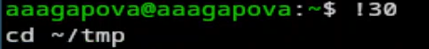{#fig-0023 width=60%}

24.Модифицирую команду. (рис. [-@fig-0024])

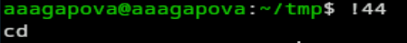{#fig-0024 width=60%}

# Выводы
Я приобрела практические навыки взаимодействия пользователя с системой посредством командной строки.

# Ответы на контрольные вопросы
1. Командная строка — это текстовая система, которая передает команды компьютеру и возвращает результаты пользователю. В ОС типа Linux взаимодействие пользователя с системой осуществляется с помощью командной строки посредством построчного ввода команд через командный интерпретатор (shell).

2. Для определения абсолютного пути к текущему каталогу используется команда pwd. Например: pwd в домашнем каталоге выведет /home/aaagapova

3. С помощью команды ls можно определить имена файлов, при помощи опции -F уже мы сможем определить тип файлов. Пример есть в лабораторной работе.

4. С помощью команды ls можно определить имена файлов, если нам необходимы скрытые файлы, добавим опцию -a. Пример есть в лабораторной работе.

5. rmdir по умолчанию удаляет пустые каталоги, не удаляет файлы. rm удаляет файлы, без дополнительных опций не будет удалять каталоги. Удалить в одной строчке одной командой можно файл и каталог. Если файл находится в каталоге, используем рекурсивное удаление, если файл и каталог не связаны подобным образом, то добавим опцию -d, введя имена через пробел после утилиты.

6. Вывести информацию о последних выполненных пользователем команд можно с помощью history. Пример есть в лабораторной работе.

7. Используем !номеркоманды из вывода history. Примеры есть в лабораторной работе.

8. Например, я нахожусь не в домашнем каталоге. Если я введу cd, ls, то окажусь в домашнем каталоге и получу вывод файлов внутри него.

9. Символ экранирования - (обратный слеш) добавление перед спецсимволом обратный слеш, чтобы использовать специальный символ как обычный. Также позволяет читать системе название директорий с пробелом. Пример: cd work/"Архитектура компьютера"/

10. Опция -l позволит увидеть дополнительную информацию о файлах в каталоге: время создания, владельца, права доступа.

11. Относительный путь к файлу начинается из той директории, где вы находитесь, он прописывается относительно данной директории. Абсолютный путь начинается с корневого каталога.

12. Использовать man

13. Клавиша Tab
