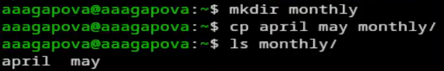
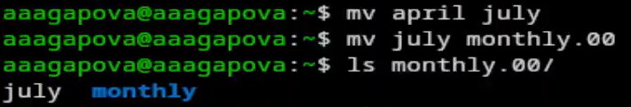
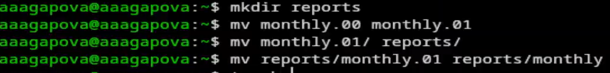
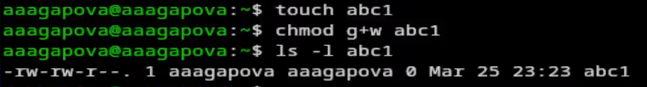
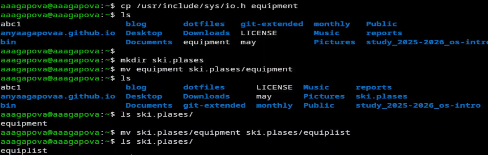
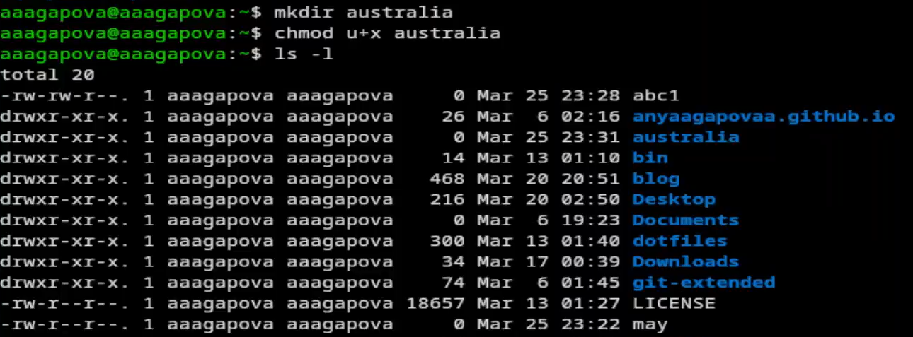
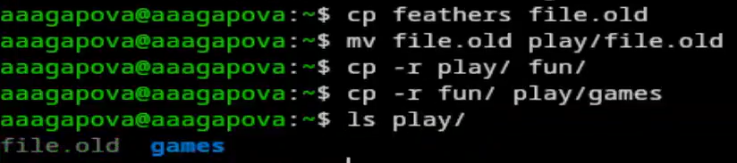
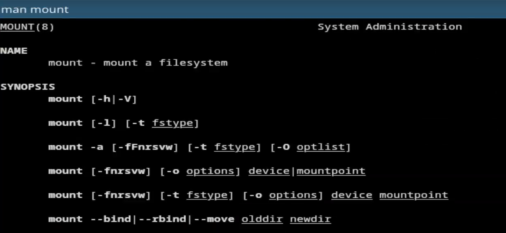
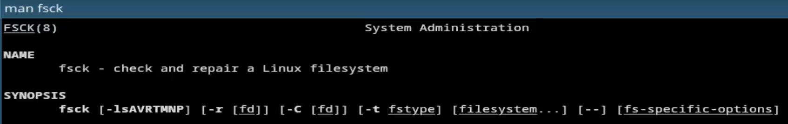

---
## Author
author:
  name: Агапова Анна Антоновна
  email: 1032251933@rudn.ru
  affiliation:
    - name: Российский университет дружбы народов
      country: Российская Федерация
      postal-code: 117198
      city: Москва
      address: ул. Миклухо-Маклая, д. 6

## Title
title: "Отчёт по лабораторной работе №7"
subtitle: "Архитектура компьютера"
license: CC BY
date: 2026-03-28
slide_level: 2
aspectratio: 169
section-titles: true
theme: metropolis
date-format: "YYYY-MM-DD" # Example: 2025-09-06
---

# Докладчик

:::::::::::::: {.columns align=center}
::: {.column width="70%"}

  * Агапова Анна Антоновна
  * Российский университет дружбы народов им. П. Лумумбы

:::
::: {.column width="30%"}

:::
::::::::::::::

---

# Цель работы
Ознакомление с файловой системой Linux, её структурой, именами и содержанием каталогов. Приобретение практических навыков по применению команд для работы с файлами и каталогами, по управлению процессами (и работами), по проверке использования диска и обслуживанию файловой системы.

---

# Задание
1. Выполните все примеры из лабораторной работы.
2. Выполнить команды по копированию, созданию и перемещению файлов и каталогов.
3. Определить опции chmod
4. Изменить права доступа к файлам
5. Прочитать документацию о командах mount, fsck, mkfs, kill

---

# Выполнение лабораторной работы

1. Создаю файл, дважды копирую его с новыми именами и проверяю, что все команды были выполнены верно.

---

2. Создаю директорию, копирую в нее два созданные файла, проверяю.

---

3. Копирую файл, находящийся не в текущей директории.

---

4. Создаю новую директорию. Копирую созданную директорию вместе с содержимым.

---

5. Переименовываю файл, перемещаю в каталог.

---

6. Создаю новую директорию, переименовываю , перемещаю директорию и переименовываю эту директорию.

---

7. Создаю пустой файл, проверяю права доступа, меняю их.

---

8. Меняю правадоступа у директории.

---

9. Меняю права доступа у директории. Создаю новый пустой файл, даю права доступа.

---

10. Проверяю файловую систему.

---

11. Копирую файл в домашний каталог с новым именем, создаю новую пустую директорию, перемещаю файл, переименовываю файл.

---

12. Создаю новый файл, копирую его в новую директорию с новым именем. Создаю внутри этого каталога подкаталог, перемещаю файлы.

---

13. Создаю новую директорию, перемещаю с новым именем в директорию, созданную в прошлый раз.

---

14. Проверяю, какие права нужно поменять, чтобы у новой директории были нужные по заданию права.

---

15. Проверяю, какие права нужно поменять, чтобы у новых файлов были нужные по заданию права.

---

16. Создаю файл, добавляю в правах доступа право на исполнение и убираю право на запись владельца, создаю другой файл.

---

17. Читаю содержимое файла.

---

18. Копирую файл с новым именем, перемещаю в директорию, рекурсивно копирую ее с новым именем, рекурсивно копирую папку.

---

19. Убираю право на чтение файла для создателя.

---

20. Убираю у директории право на исполнение для пользователя. Возвращаю все права.

---

21. Читаю документацию. Команда mount используется для подключения файловых систем к дереву каталогов операционной системы.

---

22. Читаю документацию. Команда fsck (File System Consistency Check) используется для проверки и восстановления целостности файловых систем. Она анализирует структуру файловой системы на наличие ошибок и при возможности исправляет их.

---

23. Читаю документацию. Команда mkfs (Make File System) используется для создания файловой системы на разделе диска или другом блочном устройстве.

---

24. Читаю документацию. Команда kill используется для отправки сигналов процессам в Linux/Unix. Чаще всего применяется для завершения (остановки) процессов, но может использоваться и для других целей — приостановки, продолжения работы, перечитывания конфигурации и т.д.

---

# Выводы
При выполнении данной лабораторной работы я ознакомилась с файловой системой Linux, её структурой, именами и содержанием каталогов. Приобрела практические навыки по применению команд для работы с файлами и каталогами, по управлению процессами (и работами), по проверке использования диска и обслуживанию файловой системы.

