---
## Author
author:
  name: Агапова Анна Антоновна
  email: 1032251933@rudn.ru
  affiliation:
    - name: Российский университет дружбы народов
      country: Российская Федерация
      postal-code: 117198
      city: Москва
      address: ул. Миклухо-Маклая, д. 6

## Title
title: "Отчёт по лабораторной работе №7"
subtitle: "Архитектура компьютера"

---

# Цель работы
Ознакомление с файловой системой Linux, её структурой, именами и содержанием каталогов. Приобретение практических навыков по применению команд для работы с файлами и каталогами, по управлению процессами (и работами), по проверке использования диска и обслуживанию файловой системы.

# Задание
1. Выполните все примеры из лабораторной работы.
2. Выполнить команды по копированию, созданию и перемещению файлов и каталогов.
3. Определить опции chmod
4. Изменить права доступа к файлам
5. Прочитать документацию о командах mount, fsck, mkfs, kill

# Выполнение лабораторной работы
1.Создаю файл, дважды копирую его с новыми именами и проверяю, что все команды были выполнены верно. (рис. [-@fig-001])

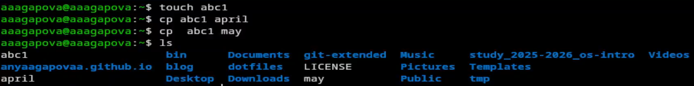{#fig-001 width=60%}

2.Создаю директорию, копирую в нее два созданные файла, проверяю. (рис. [-@fig-002])

{#fig-002 width=60%}

3.Копирую файл, находящийся не в текущей директории. (рис. [-@fig-003])

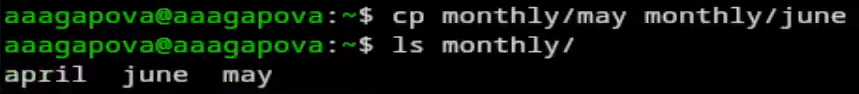{#fig-003 width=60%}

4.Создаю новую директорию. Копирую созданную директорию вместе с содержимым. (рис. [-@fig-004])

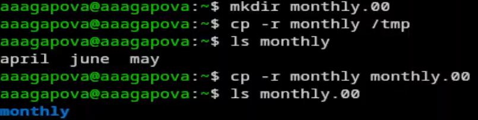{#fig-004 width=60%}

5.Переименовываю файл, перемещаю в каталог. (рис. [-@fig-005])

{#fig-005 width=60%}

6.Создаю новую директорию, переименовываю , перемещаю директорию и переименовываю эту директорию. (рис. [-@fig-006])

{#fig-006 width=60%}

7.Создаю пустой файл, проверяю права доступа, меняю их. (рис. [-@fig-007])

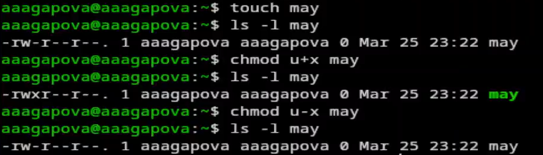{#fig-007 width=60%}

8.Меняю правадоступа у директории. (рис. [-@fig-008])

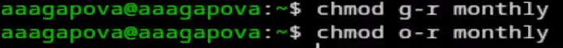{#fig-008 width=60%}

9.Меняю права доступа у директории. Создаю новый пустой файл, даю права доступа.  (рис. [-@fig-009])

{#fig-009 width=60%}

10.Проверяю файловую систему. (рис. [-@fig-0010])

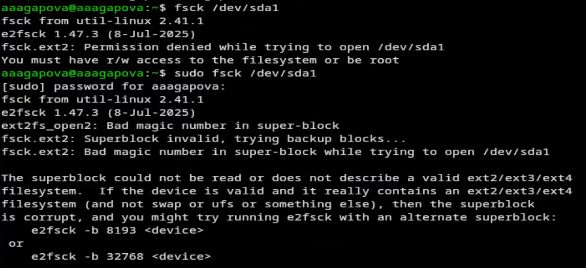{#fig-0010 width=60%}

11.Копирую файл в домашний каталог с новым именем, создаю новую пустую директорию, перемещаю файл, переименовываю файл. (рис. [-@fig-0011])

{#fig-0011 width=60%}

12.Создаю новый файл, копирую его в новую директорию с новым именем. Создаю внутри этого каталога подкаталог, перемещаю файлы. (рис. [-@fig-0012])

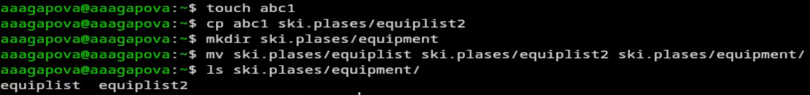{#fig-0012 width=60%}

13.Создаю новую директорию, перемещаю с новым именем в директорию, созданную в прошлый раз. (рис. [-@fig-0013])

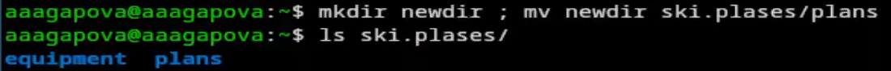{#fig-0013 width=60%}

14.Проверяю, какие права нужно поменять, чтобы у новой директории были нужные по заданию права. (рис. [-@fig-0014])

{#fig-0014 width=60%}

15.Проверяю, какие права нужно поменять, чтобы у новых файлов были нужные по заданию права. (рис. [-@fig-0015])

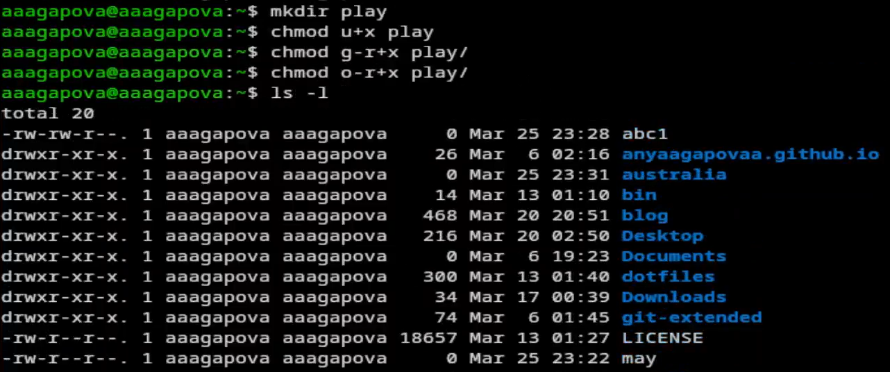{#fig-0015 width=60%}

16.Создаю файл, добавляю в правах доступа право на исполнение и убираю право на запись владельца, создаю другой файл. (рис. [-@fig-0016])

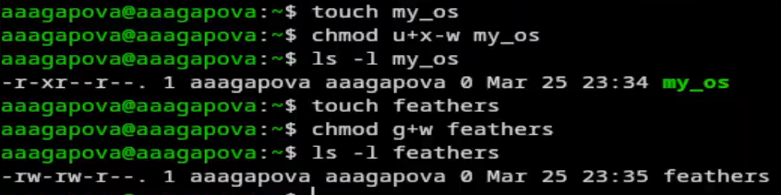{#fig-0016 width=60%}

17.Читаю содержимое файла. (рис. [-@fig-0017])

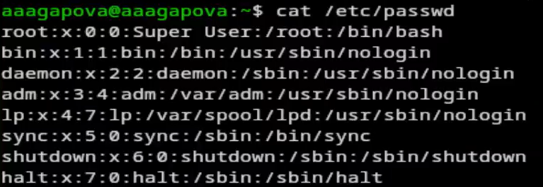{#fig-0017 width=60%}

18.Копирую файл с новым именем, перемещаю в директорию, рекурсивно копирую ее с новым именем, рекурсивно копирую папку. (рис. [-@fig-0018])

{#fig-0018 width=60%}

19.Убираю право на чтение файла для создателя. (рис. [-@fig-0019])

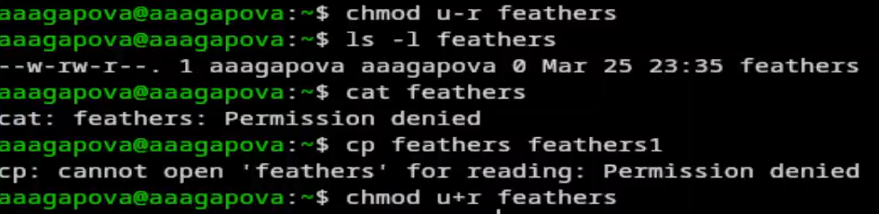{#fig-0019 width=60%}

20.Убираю у директории право на исполнение для пользователя. Возвращаю все права. (рис. [-@fig-0020])

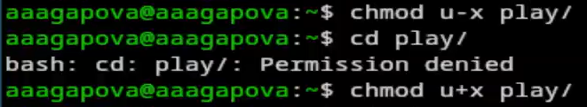{#fig-0020 width=60%}

21.Читаю документацию. Команда mount используется для подключения файловых систем к дереву каталогов операционной системы. (рис. [-@fig-0021])

{#fig-0021 width=60%}

22.Читаю документацию. Команда fsck (File System Consistency Check) используется для проверки и восстановления целостности файловых систем. Она анализирует структуру файловой системы на наличие ошибок и при возможности исправляет их.(рис. [-@fig-0022])

{#fig-0022 width=60%}

23.Читаю документацию. Команда mkfs (Make File System) используется для создания файловой системы на разделе диска или другом блочном устройстве. (рис. [-@fig-0023])

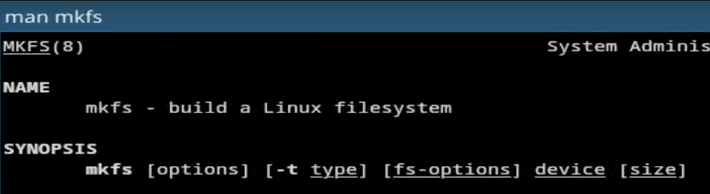{#fig-0023 width=60%}

24.Читаю документацию. Команда kill используется для отправки сигналов процессам в Linux/Unix. Чаще всего применяется для завершения (остановки) процессов, но может использоваться и для других целей — приостановки, продолжения работы, перечитывания конфигурации и т.д.(рис. [-@fig-0024])

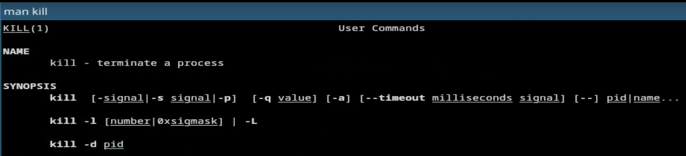{#fig-0024 width=60%}

# Выводы
При выполнении данной лабораторной работы я ознакомилась с файловой системой Linux, её структурой, именами и содержанием каталогов. Приобрела практические навыки по применению команд для работы с файлами и каталогами, по управлению процессами (и работами), по проверке использования диска и обслуживанию файловой системы.

# Ответы на контрольные вопросы
1. ext2 — базовая файловая система Linux без журналирования, надёжная, но медленно восстанавливается после сбоев.
ext3 — ext2 с журналированием, выше надёжность, быстрее восстанавливается.
ext4 — стандартная ФС для большинства дистрибутивов Linux. Поддерживает большие разделы (до 1 экзабайта), улучшенная производительность, журналирование.
tmpfs — временная ФС в оперативной памяти, данные не сохраняются после перезагрузки.
devtmpfs — ФС для управления устройствами в каталоге /dev.
2. Корневой каталог, вершина иерархии
/bin Базовые исполняемые файлы (ls, cat, cp)
/boot Файлы загрузчика и ядро системы
/dev Файлы устройств (диски, терминалы)
/etc Конфигурационные файлы программ
/home Домашние каталоги пользователей
/lib Системные библиотеки
/media Точки монтирования съёмных носителей
/mnt Временные точки монтирования
/opt Дополнительное программное обеспечение
/proc Виртуальная ФС с информацией о процессах
/root Домашний каталог суперпользователя
/run Данные о запущенных процессах
/sbin Системные утилиты для администрирования
/srv Данные сервисов (FTP, HTTP)
/sys Информация о ядре и устройствах
/tmp Временные файлы (очищается при перезагрузке)
/usr Пользовательские программы и утилиты
/var Переменные файлы (логи, кэш, очереди)
3. Монтирование — подключение файловой системы устройства к определённой точке в дереве каталогов. Выполняется командой mount.
4. Причины: аварийное отключение питания, сбой ядра системы, ошибки при записи данных, физические повреждения диска
Устранение: Команда fsck (file system check) — проверяет и восстанавливает целостность файловой системы.
5. mkfs - позволяет создать файловую систему Linux.
6. Cat - выводит содержимое файла на стандартное устройство вывода.Выполнение команды head выведет первые 10 строк текстового файла. Выполнение команды tail выведет последние 10 строк текстового файла. Команда tac - это тоже самое, что и cat,только отображает строки в обратном порядке.Для того, чтобы просмотреть огромный текстовый файл применяются команды для постраничного просмотра. Такие как more и less.
7. Cp – копирует или перемещает директорию, файлы.
8. Mv - переименовать или переместить файл или директорию
9. Права доступа — это набор правил, определяющих, кто и какие действия может выполнять с файлом или каталогом. Права доступа к файлу или каталогу можно изменить, воспользовавшись командой chmod. Сделать это может владелец файла (или каталога) или пользователь с правами администратора.
