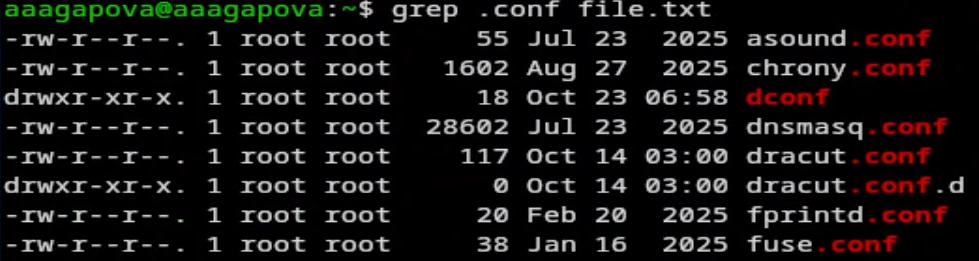
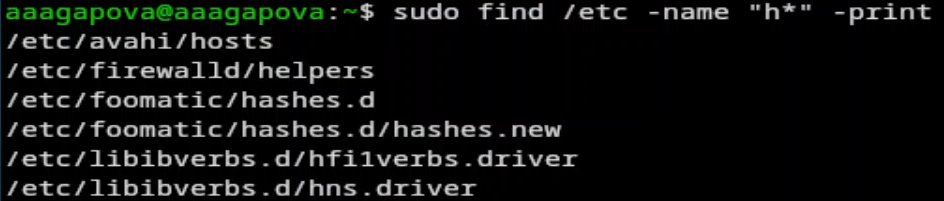
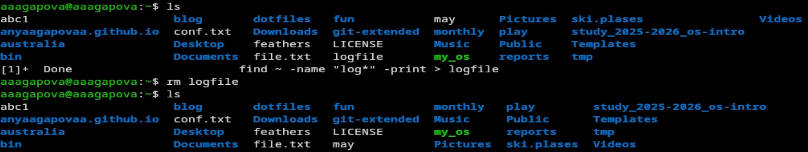
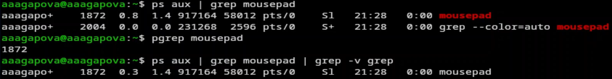
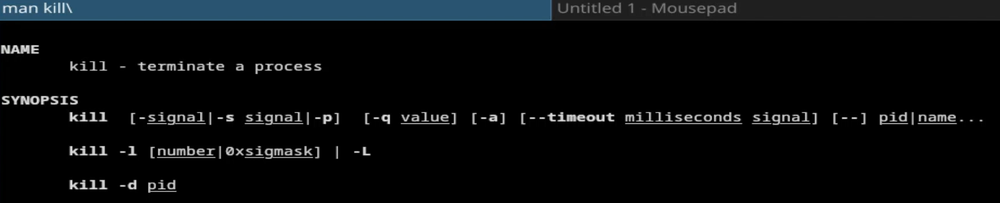
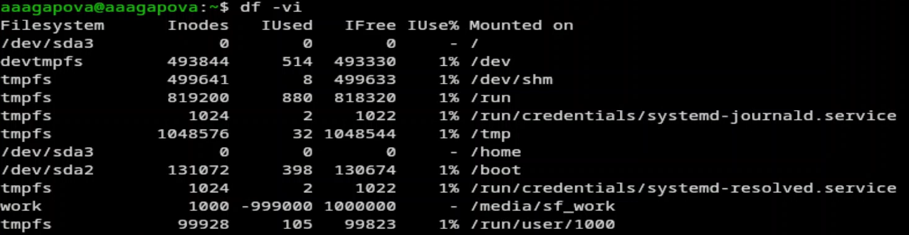
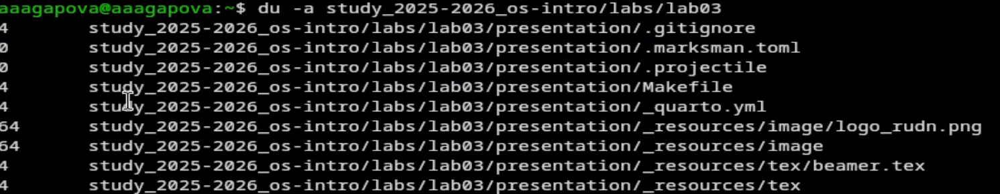

---
## Author
author:
  name: Агапова Анна Антоновна
  email: 1032251933@rudn.ru
  affiliation:
    - name: Российский университет дружбы народов
      country: Российская Федерация
      postal-code: 117198
      city: Москва
      address: ул. Миклухо-Маклая, д. 6

## Title
title: "Отчёт по лабораторной работе №8"
subtitle: "Архитектура компьютера"
license: CC BY
date: 2026-04-02
slide_level: 2
aspectratio: 169
section-titles: true
theme: metropolis
date-format: "YYYY-MM-DD" # Example: 2025-09-06
---

# Докладчик

:::::::::::::: {.columns align=center}
::: {.column width="70%"}

  * Агапова Анна Антоновна
  * Российский университет дружбы народов им. П. Лумумбы

:::
::: {.column width="30%"}

:::
::::::::::::::

---

# Цель работы
Ознакомление с инструментами поиска файлов и фильтрации текстовых данных. Приобретение практических навыков: по управлению процессами (и заданиями), по проверке использования диска и обслуживанию файловых систем.

---

# Задание
1. Осуществите вход в систему, используя соответствующее имя пользователя.
2. Запишите в файл file.txt названия файлов, содержащихся в каталоге /etc. Допишите в этот же файл названия файлов, содержащихся в вашем домашнем каталоге.
3. Выведите имена всех файлов из file.txt, имеющих расширение .conf, после чего запишите их в новый текстовой файл conf.txt.

---

4. Определите, какие файлы в вашем домашнем каталоге имеют имена, начинавшиеся с символа c? Предложите несколько вариантов, как это сделать.
5. Выведите на экран (по странично) имена файлов из каталога /etc, начинающиеся с символа h.
6. Запустите в фоновом режиме процесс, который будет записывать в файл ~/logfile файлы, имена которых начинаются с log.
7. Удалите файл ~/logfile.

---

8. Запустите из консоли в фоновом режиме редактор gedit.
9. Определите идентификатор процесса gedit, используя команду ps, конвейер и фильтр grep. Как ещё можно определить идентификатор процесса?

---

10. Прочтите справку (man) команды kill, после чего используйте её для завершения процесса gedit.
11. Выполните команды df и du, предварительно получив более подробную информацию об этих командах, с помощью команды man.
12. Воспользовавшись справкой команды find, выведите имена всех директорий, имеющихся в вашем домашнем каталоге.

---

# Выполнение лабораторной работы

1. Записала в файл file.txt названия файлов из каталога /etc с помощью перенаправления. В файл я добавила также все файлы из подкаталогов.

---

2. Проверила, что в файл записались нужные значения.

---

3. Добавила в созданный файл имена файлов из домашнего каталога.

---

4. Вывела на экран имена всех файлов, имеющих расширение .conf.

---

5. Добавила вывод прошой команды в новый файл conf.txt.

---

6. Определяю какаие файлы начинаются с символа С.

---

7. Ищу все файлы, начинающиеся с h.

---

8. Запускаю в фоновом режиме процесс, который будет записывать в файл logfile файлы, которые начинаются с log.

---

9. Проверяю, что файл создан, удаляю его и проверяю.

---

10. Запускаю в консоли в фоновом режиме редактор mousepad. Он идентичен с gedit.

---

11. Определяю индентификатор процесса mousepad.

---

12. Читаю документацию команды kill.

---

13. Использую команду kill и индентификатор процесса, чтобы его удалить.

---

14. Читаю документацию о командах df и du.

---

15. Смотрю сколько свободного места есть у нашей системы.

---

16. Смотрю сколько места занимают файлы в определенной директории и нахожу самое большое из них.

---

17. Читаю документацию о команде find.

---

18. Вывожу имена всех директорий из домашнего каталога.

---

# Выводы
Я ознакомилась с инструментами поиска файлов и фильтрации текстовых данных, а также приобрела практические навыки по управлению процессами, по проверке использования диска и по обслуживанию файловых систем.
