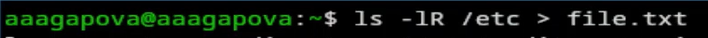
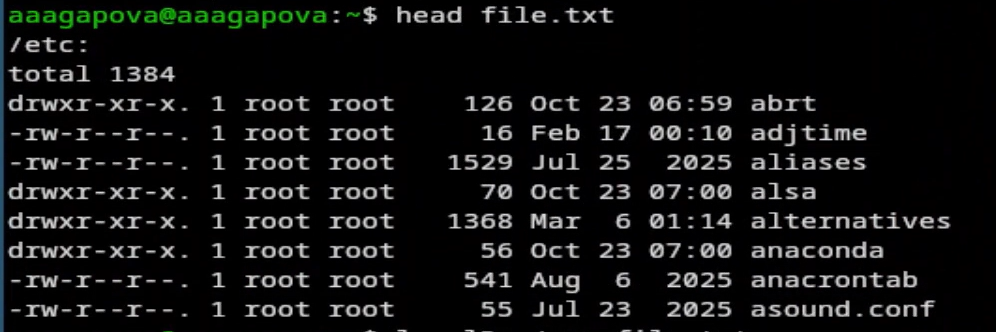
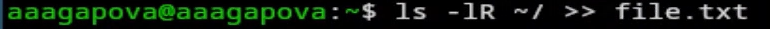
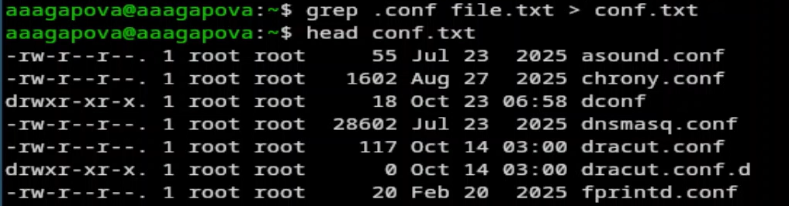
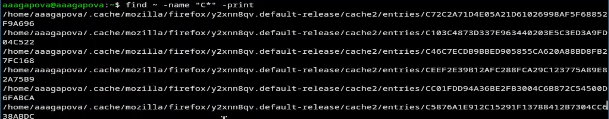
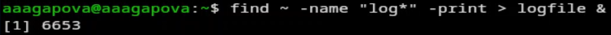
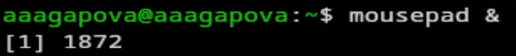
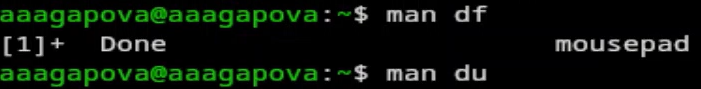
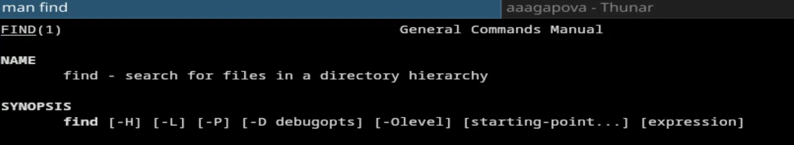

---
## Author
author:
  name: Агапова Анна Антоновна
  email: 1032251933@rudn.ru
  affiliation:
    - name: Российский университет дружбы народов
      country: Российская Федерация
      postal-code: 117198
      city: Москва
      address: ул. Миклухо-Маклая, д. 6

## Title
title: "Отчёт по лабораторной работе №8"
subtitle: "Архитектура компьютера"

---

# Цель работы
Ознакомление с инструментами поиска файлов и фильтрации текстовых данных. Приобретение практических навыков: по управлению процессами (и заданиями), по проверке использования диска и обслуживанию файловых систем.

# Задание
1. Осуществите вход в систему, используя соответствующее имя пользователя.
2. Запишите в файл file.txt названия файлов, содержащихся в каталоге /etc. Допишите в этот же файл названия файлов, содержащихся в вашем домашнем каталоге.
3. Выведите имена всех файлов из file.txt, имеющих расширение .conf, после чего запишите их в новый текстовой файл conf.txt.
4. Определите, какие файлы в вашем домашнем каталоге имеют имена, начинавшиеся с символа c? Предложите несколько вариантов, как это сделать.
5. Выведите на экран (по странично) имена файлов из каталога /etc, начинающиеся с символа h.
6. Запустите в фоновом режиме процесс, который будет записывать в файл ~/logfile файлы, имена которых начинаются с log.
7. Удалите файл ~/logfile.
8. Запустите из консоли в фоновом режиме редактор gedit.
9. Определите идентификатор процесса gedit, используя команду ps, конвейер и фильтр grep. Как ещё можно определить идентификатор процесса?
10. Прочтите справку (man) команды kill, после чего используйте её для завершения процесса gedit.
11. Выполните команды df и du, предварительно получив более подробную информацию об этих командах, с помощью команды man.
12. Воспользовавшись справкой команды find, выведите имена всех директорий, имеющихся в вашем домашнем каталоге.

# Выполнение лабораторной работы
1.Записала в файл file.txt названия файлов из каталога /etc с помощью перенаправления. В файл я добавила также все файлы из подкаталогов.  (рис. [-@fig-001])

{#fig-001 width=60%}

2.Проверила, что в файл записались нужные значения. (рис. [-@fig-002])

{#fig-002 width=60%}

3.Добавила в созданный файл имена файлов из домашнего каталога. (рис. [-@fig-003])

{#fig-003 width=60%}

4.Вывела на экран имена всех файлов, имеющих расширение .conf. (рис. [-@fig-004])

{#fig-004 width=60%}

5.Добавила вывод прошой команды в новый файл conf.txt. (рис. [-@fig-005])

{#fig-005 width=60%}

6.Определяю какаие файлы начинаются с символа С. (рис. [-@fig-006])

{#fig-006 width=60%}

7.Ищу все файлы, начинающиеся с h. (рис. [-@fig-007])

{#fig-007 width=60%}

8.Запускаю в фоновом режиме процесс, который будет записывать в файл logfile файлы, которые начинаются с log. (рис. [-@fig-008])

{#fig-008 width=60%}

9.Проверяю, что файл создан, удаляю его и проверяю.  (рис. [-@fig-009])

{#fig-009 width=60%}

10.Запускаю в консоли в фоновом режиме редактор mousepad. Он идентичен с gedit. (рис. [-@fig-0010])

{#fig-0010 width=60%}

11.Определяю индентификатор процесса mousepad. (рис. [-@fig-0011])

{#fig-0011 width=60%}

12.Читаю документацию команды kill. (рис. [-@fig-0012])

{#fig-0012 width=60%}

13.Использую команду kill и индентификатор процесса, чтобы его удалить. (рис. [-@fig-0013])

{#fig-0013 width=60%}

14.Читаю документацию о командах df и du. (рис. [-@fig-0014])

{#fig-0014 width=60%}

15.Смотрю сколько свободного места есть у нашей системы. (рис. [-@fig-0015])

{#fig-0015 width=60%}

16.Смотрю сколько места занимают файлы в определенной директории и нахожу самое большое из них. (рис. [-@fig-0016])

{#fig-0016 width=60%}

17.Читаю документацию о команде find. (рис. [-@fig-0017])

{#fig-0017 width=60%}

18.Вывожу имена всех директорий из домашнего каталога. (рис. [-@fig-0018])

{#fig-0018 width=60%}

# Выводы
Я ознакомилась с инструментами поиска файлов и фильтрации текстовых данных, а также приобрела практические навыки по управлению процессами, по проверке использования диска и по обслуживанию файловых систем.

# Ответы на контрольные вопросы
1. stdin (0) — стандартный ввод (клавиатура), stdout (1) — стандартный вывод (экран), stderr (2) — стандартный вывод ошибок (экран)

2. > — перенаправляет вывод в файл, перезаписывая его, >> — перенаправляет вывод в файл, добавляя в конец

3. Конвейер (|) передаёт вывод одной команды на ввод другой, объединяя их в цепочку.

4. Программа — пассивный набор инструкций, хранящийся на диске. Процесс — активный экземпляр программы, выполняющийся в памяти

5. PID — идентификатор процесса, GID — идентификатор группы пользователя

6. Задачи (jobs) — процессы, запущенные в текущей сессии терминала. Управление: jobs, fg, bg, kill %номер

7. top — отображает работающие процессы и потребление ресурсов в реальном времени, htop — улучшенная версия top с цветным интерфейсом, прокруткой и управлением мышью

8. Команда find — поиск файлов и каталогов по имени, типу, размеру, времени и др. find ~ -name "*.txt", find /etc -type f -size +1M

9. grep -r "текст" ~/, find ~ -type f -exec grep -l "текст" {} \;

10. df -h

11. du -sh ~

12. kill %номер_задачи
