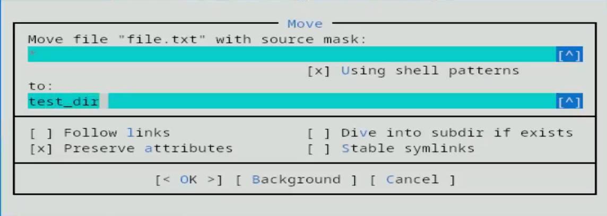
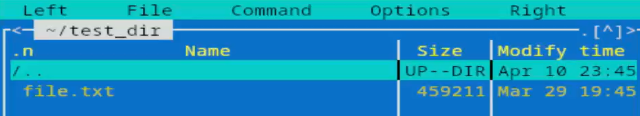
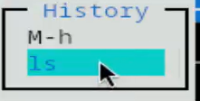
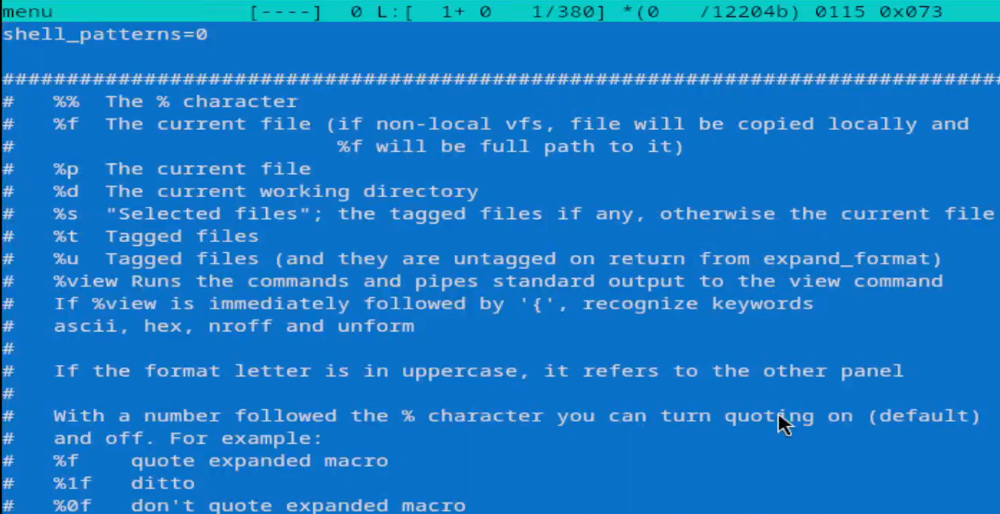
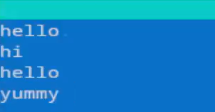
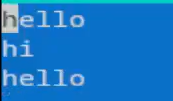

---
## Author
author:
  name: Агапова Анна Антоновна
  email: 1032251933@rudn.ru
  affiliation:
    - name: Российский университет дружбы народов
      country: Российская Федерация
      postal-code: 117198
      city: Москва
      address: ул. Миклухо-Маклая, д. 6

## Title
title: "Отчёт по лабораторной работе №9"
subtitle: "Архитектура компьютера"
license: CC BY
date: 2026-04-11
slide_level: 2
aspectratio: 169
section-titles: true
theme: metropolis
date-format: "YYYY-MM-DD" # Example: 2025-09-06
---

# Докладчик

:::::::::::::: {.columns align=center}
::: {.column width="70%"}

  * Агапова Анна Антоновна
  * Российский университет дружбы народов им. П. Лумумбы

:::
::: {.column width="30%"}

:::
::::::::::::::

---

# Цель работы
Освоение основных возможностей командной оболочки Midnight Commander. Приобретение навыков практической работы по просмотру каталогов и файлов; манипуляций с ними.

---

# Задание
1. Изучите информацию о mc, вызвав в командной строке man mc.
2. Запустите из командной строки mc, изучите его структуру и меню.
3. Выполните несколько операций в mc, используя управляющие клавиши (операции с панелями; выделение/отмена выделения файлов, копирование/перемещение файлов, получение информации о размере и правах доступа на файлы и/или каталоги и т.п.)

---

4. Выполните основные команды меню левой (или правой) панели. Оцените степень подробности вывода информации о файлах.
5. Используя возможности подменю Файл , выполните манипуляции.
6. С помощью соответствующих средств подменю Команда осуществите манипуляции.
7. Вызовите подменю Настройки . Освойте операции, определяющие структуру экрана mc (Full screen, Double Width, Show Hidden Files и т.д.)

---

1. Создайте текстовой файл text.txt.
2. Откройте этот файл с помощью встроенного в mc редактора.
3. Вставьте в открытый файл небольшой фрагмент текста, скопированный из любого
другого файла или Интернета.

---

4. Проделайте с текстом манипуляции, используя горячие клавиши.
5. Откройте файл с исходным текстом на некотором языке программирования (например C или Java)
6. Используя меню редактора, включите подсветку синтаксиса, если она не включена, или выключите, если она включена.

---

# Выполнение лабораторной работы
1. Изучаю информацию о mc, вызвав в командной строке man mc.

---

2. Запускаю из командной строки mc, изучаю его структуру и меню.

---

3. Используя управляющие клавиши выделяю файл.

---

4. Используя управляющие клавиши отменяю выделение файла.

---

5. Смотрю содержимое текстового файла.

---

6. Создаю новый каталог

---

7. Копирую файл в созданный каталог.

---

8. Проверяю, что файл скопировался.

---

9. Поиск в файловой системе файла с расширением .cpp, содержащего строку main.

---

10. Смотрю историю команд и повторяю одну из них.

---

11. Анализирую файл расшиения.

---

12. Анализирую файл меню.

---

13. Вызываю подменю Настройки . Осваиваю операции, определяющие структуру экрана mc.

---

14. Создаю текстовой файл.Открываю этот файл с помощью встроенного в mc редактора. Пишу в нем текст.

---

15. Удаляю строку текста.

---

16. Перехожу в начало файла.

---

17. Перехожу в конец файла.

---

18. Сохраняю файл.

---

19. Открываю файл с исходным текстом на языке программировани.

---

20. Используя меню редактора, выключаю подсветку синтаксиса.

---

# Выводы
Я освоила основные возможности командной оболочки Midnight Commander. Приобрела навыки практической работы по просмотру каталогов, файлов и манипуляций с ними.
