---
## Author
author:
  name: Агапова Анна Антоновна
  email: 1032251933@rudn.ru
  affiliation:
    - name: Российский университет дружбы народов
      country: Российская Федерация
      postal-code: 117198
      city: Москва
      address: ул. Миклухо-Маклая, д. 6

## Title
title: "Отчёт по лабораторной работе №9"
subtitle: "Архитектура компьютера"

---

# Цель работы
Освоение основных возможностей командной оболочки Midnight Commander. Приобретение навыков практической работы по просмотру каталогов и файлов; манипуляций с ними.

# Задание
1. Изучите информацию о mc, вызвав в командной строке man mc.
2. Запустите из командной строки mc, изучите его структуру и меню.
3. Выполните несколько операций в mc, используя управляющие клавиши (операции с панелями; выделение/отмена выделения файлов, копирование/перемещение файлов, получение информации о размере и правах доступа на файлы и/или каталоги и т.п.)
4. Выполните основные команды меню левой (или правой) панели. Оцените степень подробности вывода информации о файлах.
5. Используя возможности подменю Файл , выполните манипуляции.
6. С помощью соответствующих средств подменю Команда осуществите манипуляции.
7. Вызовите подменю Настройки . Освойте операции, определяющие структуру экрана mc (Full screen, Double Width, Show Hidden Files и т.д.)

1. Создайте текстовой файл text.txt.
2. Откройте этот файл с помощью встроенного в mc редактора.
3. Вставьте в открытый файл небольшой фрагмент текста, скопированный из любого
другого файла или Интернета.
4. Проделайте с текстом манипуляции, используя горячие клавиши.
5. Откройте файл с исходным текстом на некотором языке программирования (например C или Java)
6. Используя меню редактора, включите подсветку синтаксиса, если она не включена, или выключите, если она включена.

# Выполнение лабораторной работы
1.Изучаю информацию о mc, вызвав в командной строке man mc. (рис. [-@fig-001])

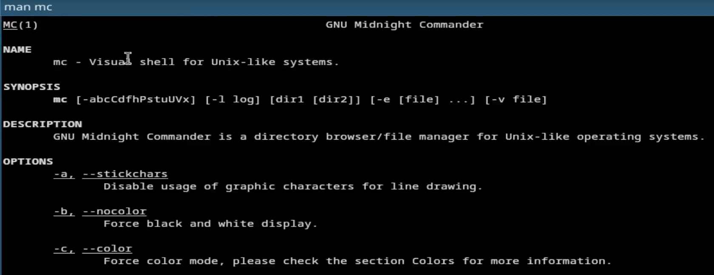{#fig-001 width=60%}

2.Запускаю из командной строки mc, изучаю его структуру и меню. (рис. [-@fig-002])

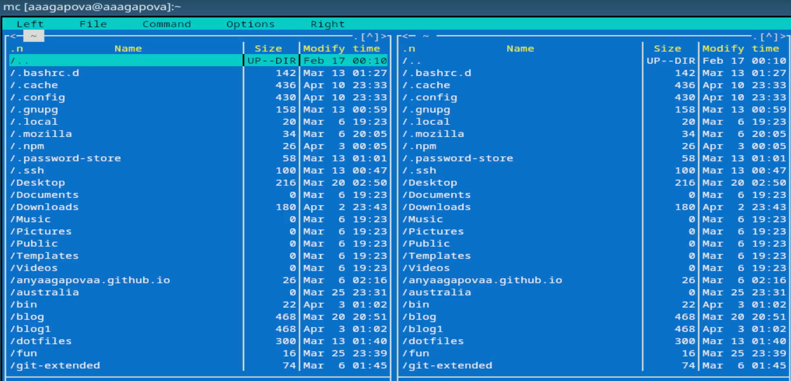{#fig-002 width=60%}

3.Используя управляющие клавиши выделяю файл. (рис. [-@fig-003])

{#fig-003 width=60%}

4.Используя управляющие клавиши отменяю выделение файла. (рис. [-@fig-004])

{#fig-004 width=60%}

5.Смотрю содержимое текстового файла. (рис. [-@fig-005])

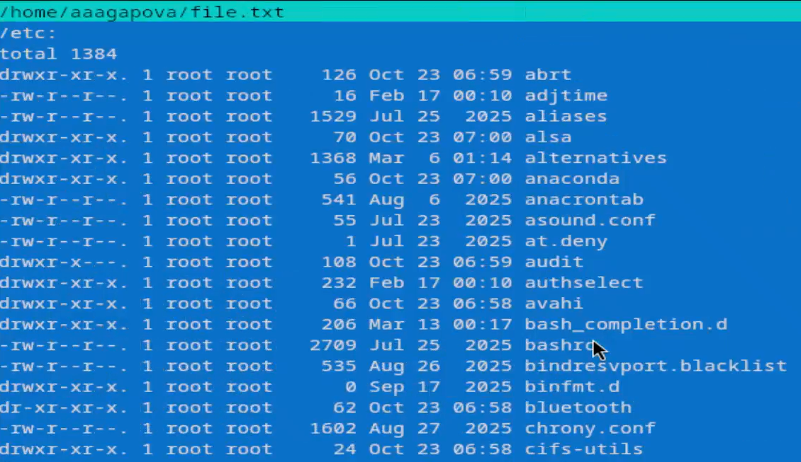{#fig-005 width=60%}

6.Создаю новый каталог (рис. [-@fig-006])

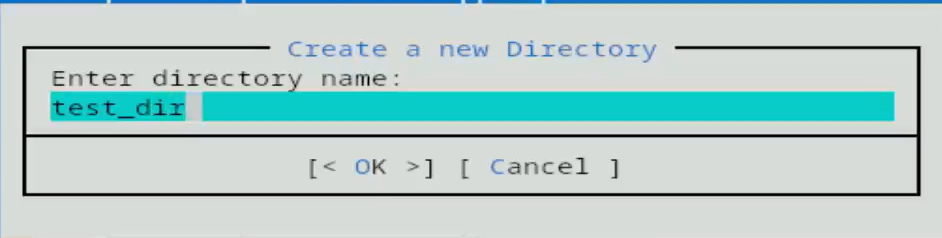{#fig-006 width=60%}

7.Копирую файл в созданный каталог. (рис. [-@fig-007])

{#fig-007 width=60%}

8.Проверяю, что файл скопировался. (рис. [-@fig-008])

{#fig-008 width=60%}

9.Поиск в файловой системе файла с расширением .cpp, содержащего строку main. (рис. [-@fig-009])

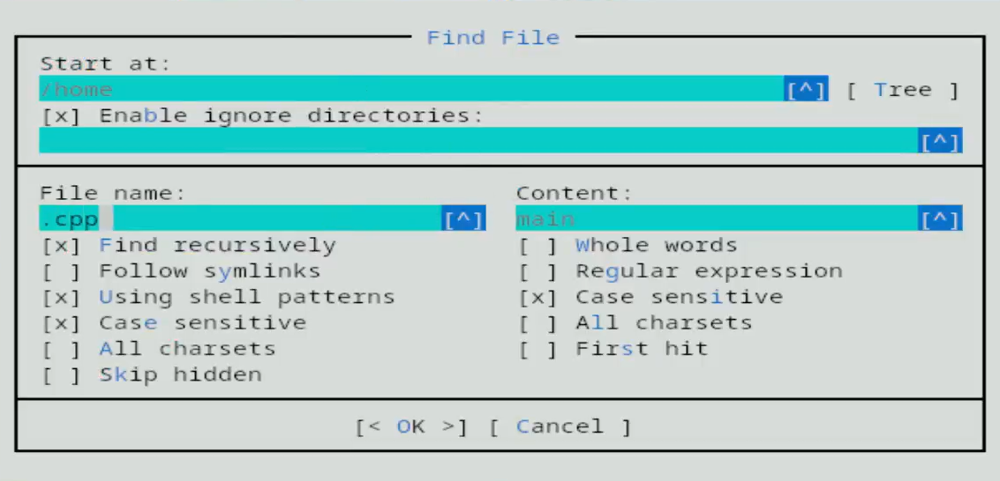{#fig-009 width=60%}

10.Смотрю историю команд и повторяю одну из них. (рис. [-@fig-0010])

{#fig-0010 width=60%}

11.Анализирую файл расшиения. (рис. [-@fig-0011])

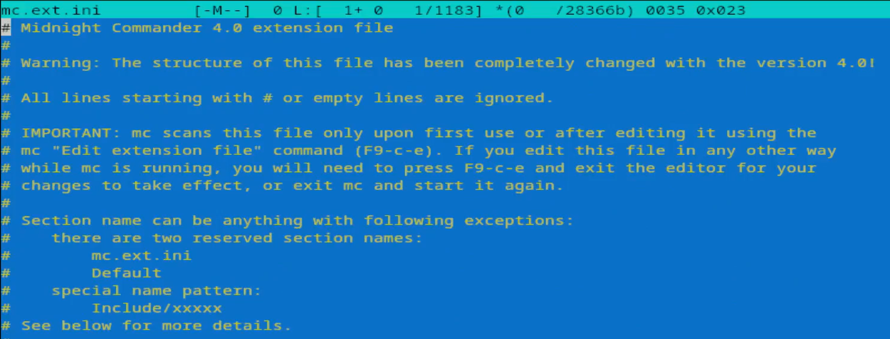{#fig-0011 width=60%}

12.Анализирую файл меню. (рис. [-@fig-0012])

{#fig-0012 width=60%}

13.Вызываю подменю Настройки . Осваиваю операции, определяющие структуру экрана mc. (рис. [-@fig-0013])

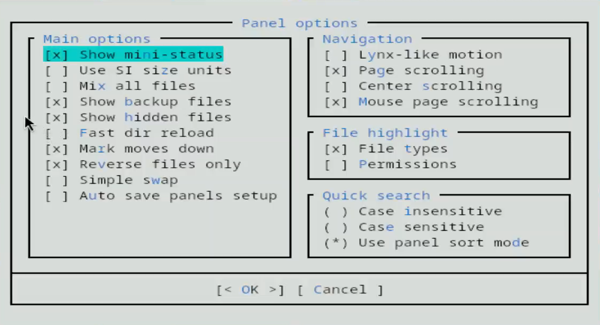{#fig-0013 width=60%}

14.Создаю текстовой файл.Открываю этот файл с помощью встроенного в mc редактора. Пишу в нем текст. (рис. [-@fig-0014])

{#fig-0014 width=60%}

15.Удаляю строку текста. (рис. [-@fig-0015])

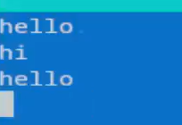{#fig-0015 width=60%}

16.Перехожу в начало файла. (рис. [-@fig-0016])

{#fig-0016 width=60%}

17.Перехожу в конец файла. (рис. [-@fig-0017])

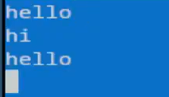{#fig-0017 width=60%}

18.Сохраняю файл. (рис. [-@fig-0018])

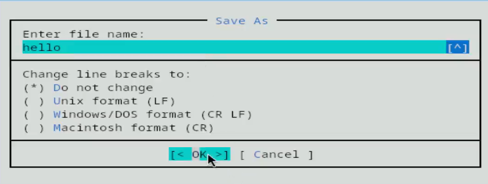{#fig-0018 width=60%}

19.Открываю файл с исходным текстом на языке программировани. (рис. [-@fig-0019])

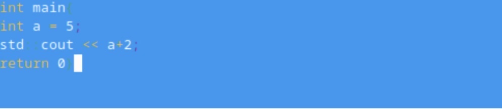{#fig-0019 width=60%}

20.Используя меню редактора, выключаю подсветку синтаксиса. (рис. [-@fig-0020])

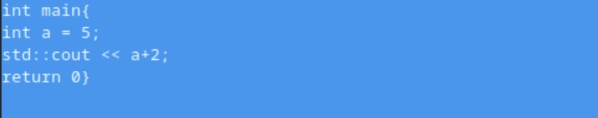{#fig-0020 width=60%}

# Выводы
Я освоила основные возможности командной оболочки Midnight Commander. Приобрела навыки практической работы по просмотру каталогов, файлов и манипуляций с ними.

# Ответы на контрольные вопросы
1. Вывод сведений о файле и файловой системе. Отображение структуры дерева каталогов на одной из панелей.
2. Копирование (cp в shell, F5 в mc), перемещение (mv в shell, F6 в mc), просмотр информации (ls -l в shell)
3. Стандартный: имя, размер, время правки
- Ускоренный: только имена, разбитые на столбцы
- Расширенный: права доступа, владелец, группа, размер, время
- Определенный пользователем: вывод сведений по выбору пользователя
4. Просмотр (F3) — просмотр содержимого
- Правка (F4) — редактирование
- Копировать (F5) — копирование
- Переместить (F6) — перемещение
- Создать каталог (F7) — создание папки
- Удалить (F8) — удаление
5. Дерево каталогов, поиск файла, переставить панели (Ctrl+u), сравнить каталоги (Ctrl+x d), размеры каталогов, история команд, каталоги быстрого доступа (Ctrl+\), восстановление файлов, редактирование файлов расширений/меню/расцветки.
6. Конфигурация, внешний вид, настройки панелей, биты символов, подтверждение, распознание клавиш, виртуальные ФС.
7. Клавиша Действие
- F1 Помощь
- F2 Пользовательское меню
- F3 Просмотр файла
- F4 Редактирование
- F5 Копирование
- F6 Перемещение
- F7 Создать каталог
- F8 Удалить
- F9 Вызов меню
- F10 Выход
8. Команды встроенного редактора mc
- Ctrl+y — удалить строку
- Ctrl+u — отмена последнего действия
- Ins — вставка/замена
- F7 — поиск
- F4 — замена
- F3 (дважды) — выделение фрагмента
- F5 — копировать выделенное
- F6 — переместить выделенное
- F8 — удалить выделенное
- F2 — сохранить
- F10 — выйти
9. Можно сохранять часто используемые команды под информативными именами. Для этого нужно набрать команду в строке "Команда", нажать Добавить, затем ввести имя для вызова. В следующий раз достаточно выбрать имя из списка.
10. Панель mc отображает список файлов текущего каталога. Абсолютный путь отображается в заголовке панели. У активной панели заголовок и одна из строк подсвечиваются. Управление панелями — через комбинации клавиш или пункты меню.
