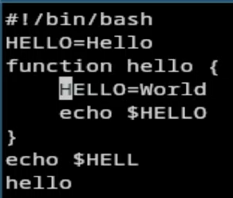
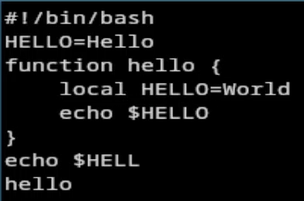
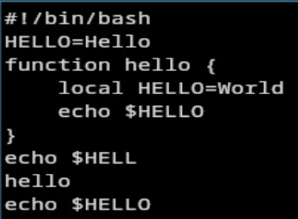

---
## Author
author:
  name: Агапова Анна Антоновна
  email: 1032251933@rudn.ru
  affiliation:
    - name: Российский университет дружбы народов
      country: Российская Федерация
      postal-code: 117198
      city: Москва
      address: ул. Миклухо-Маклая, д. 6

## Title
title: "Отчёт по лабораторной работе №10"
subtitle: "Архитектура компьютера"
license: CC BY
date: 2026-04-17
slide_level: 2
aspectratio: 169
section-titles: true
theme: metropolis
date-format: "YYYY-MM-DD" # Example: 2025-09-06
---

# Докладчик

:::::::::::::: {.columns align=center}
::: {.column width="70%"}

  * Агапова Анна Антоновна
  * Российский университет дружбы народов им. П. Лумумбы

:::
::: {.column width="30%"}

:::
::::::::::::::

---

# Цель работы
Познакомиться с операционной системой Linux. Получить практические навыки работы с редактором vi, установленным по умолчанию практически во всех дистрибутивах.

---

# Задание
1. Ознакомиться с теоретическим материалом.
2. Ознакомиться с редактором vi.
3. Выполнить упражнения, используя команды vi.

---

# Выполнение лабораторной работы
1. Создаю каталог с именем ~/work/os/lab06.

---

2. Перехожу во вновь созданный каталог.

---

3. Вызываю vi и создаю файл hello.sh

---

4. Нажимаю клавишу i и ввожу текст. Нажимаю клавишу Esc.

---

5. Нажимаю : и wq. Далее нажимаю Enter.

---

6. Делаю файл исполняемым.

---

7. Вызываю vi на редактирование файла.

---

8. Устанавливаю курсор в конец слова HELL второй строки. Перехожу в режим вставки и меняю на HELLO. Нажимаю Esc.

---

9. Устанавливаю курсор на четвертую строку и стираю слово LOCAL.

---

10. Перехожу в режим вставки и набираю local, нажимаю Esc.

---

11. Устанавливаю курсор на последней строке файла. Вставляю после неё строку, содержащую echo HELLO. Нажимаю Esc.

---

12. Удаляю последнюю строку.

---

13. Ввожу команду отмены изменений u для отмены последней команды.

---

14. Нажимаю : и wq. Далее нажимаю Enter.

---

# Выводы
Я познакомилась с операционной системой Linux, получила практические навыки работы с редактором vi, установленным по умолчанию практически во всех дистрибутивах.
