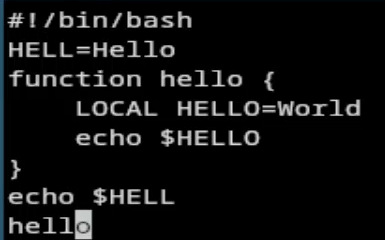
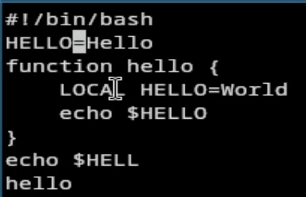
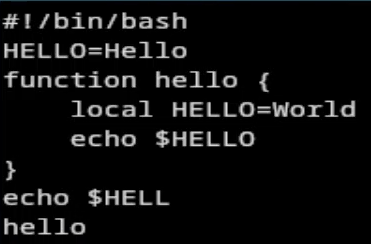
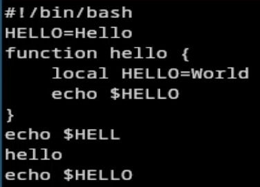

---
## Author
author:
  name: Агапова Анна Антоновна
  email: 1032251933@rudn.ru
  affiliation:
    - name: Российский университет дружбы народов
      country: Российская Федерация
      postal-code: 117198
      city: Москва
      address: ул. Миклухо-Маклая, д. 6

## Title
title: "Отчёт по лабораторной работе №10"
subtitle: "Архитектура компьютера"

---

# Цель работы
Познакомиться с операционной системой Linux. Получить практические навыки работы с редактором vi, установленным по умолчанию практически во всех дистрибутивах.

# Задание
1. Ознакомиться с теоретическим материалом.
2. Ознакомиться с редактором vi.
3. Выполнить упражнения, используя команды vi.

# Выполнение лабораторной работы
1.Создаю каталог с именем ~/work/os/lab06. (рис. [-@fig-001])

{#fig-001 width=60%}

2.Перехожу во вновь созданный каталог. (рис. [-@fig-002])

{#fig-002 width=60%}

3.Вызываю vi и создаю файл hello.sh (рис. [-@fig-003])

{#fig-003 width=60%}

4.Нажимаю клавишу i и ввожу текст. Нажимаю клавишу Esc. (рис. [-@fig-004])

{#fig-004 width=60%}

5.Нажимаю : и wq. Далее нажимаю Enter. (рис. [-@fig-005])

{#fig-005 width=60%}

6.Делаю файл исполняемым. (рис. [-@fig-006])

{#fig-006 width=60%}

7.Вызываю vi на редактирование файла. (рис. [-@fig-007])

{#fig-007 width=60%}

8.Устанавливаю курсор в конец слова HELL второй строки. Перехожу в режим вставки и меняю на HELLO. Нажимаю Esc. (рис. [-@fig-008])

{#fig-008 width=60%}

9.Устанавливаю курсор на четвертую строку и стираю слово LOCAL. (рис. [-@fig-009])

{#fig-009 width=60%}

10.Перехожу в режим вставки и набираю local, нажимаю Esc. (рис. [-@fig-0010])

{#fig-0010 width=60%}

11.Устанавливаю курсор на последней строке файла. Вставляю после неё строку, содержащую echo HELLO. Нажимаю Esc.  (рис. [-@fig-0011])

{#fig-0011 width=60%}

12.Удаляю последнюю строку. (рис. [-@fig-0012])

{#fig-0012 width=60%}

13.Ввожу команду отмены изменений u для отмены последней команды. (рис. [-@fig-0013])

{#fig-0013 width=60%}

14.Нажимаю : и wq. Далее нажимаю Enter. (рис. [-@fig-0014])

{#fig-0014 width=60%}

# Выводы
Я познакомилась с операционной системой Linux, получила практические навыки работы с редактором vi, установленным по умолчанию практически во всех дистрибутивах.

# Ответы на контрольные вопросы
1. Командный режим — для ввода команд редактирования и навигации по файлу. Режим вставки — для ввода текста. Режим последней строки — для сохранения изменений и выхода из редактора.
2. Нажать Esc, затем :q! и Enter.
3. 0 — переход в начало строки, доллар — переход в конец строки, G — переход в конец файла, n G — переход на строку с номером n.
4. Строка символов, включающая буквы, цифры и символы подчёркивания.
5. G — в конец файла, gg или 1G — в начало файла.
6. - Вставка текста: i (перед курсором), a (после курсора), o (строка ниже)
- Удаление текста: x (символ), dw (слово), dd (строка)
- Отмена: u — отменить последнее действие
- Копирование: y (копировать), p (вставить)
- Замена: r (заменить символ), cw (заменить слово)
- Поиск: /текст (вперёд), ?текст (назад)
7. Перейти в режим вставки (i) и вводить символы доллар.
8. Нажать u в командном режиме.
9. :w — сохранить файл, :q — выйти, :wq — сохранить и выйти, :q! — выйти без сохранения, :set nu — показать номера строк, :set all — показать все настройки
10. Команда доллар — переход в конец строки.
11. Опции настраиваются командой set в режиме последней строки: :set all — список всех опций, :set nu — номера строк, :set list — показать невидимые символы, :set ic — игнорировать регистр при поиске
12. Внизу экрана: если есть -- INSERT -- — режим вставки. Если нет — командный режим. Режим последней строки — после нажатия :
13. Командный режим - Режим вставки (через i/Esc). Командный режим - Режим последней строки (через :). Режим последней строки - Командный режим (после выполнения команды)
