---
## Author
author:
  name: Агапова Анна Антоновна
  email: 1032251933@rudn.ru
  affiliation:
    - name: Российский университет дружбы народов
      country: Российская Федерация
      postal-code: 117198
      city: Москва
      address: ул. Миклухо-Маклая, д. 6

## Title
title: "Отчёт по лабораторной работе №11"
subtitle: "Архитектура компьютера"
license: CC BY
date: 2026-04-25
slide_level: 2
aspectratio: 169
section-titles: true
theme: metropolis
date-format: "YYYY-MM-DD" # Example: 2025-09-06
---

# Докладчик

:::::::::::::: {.columns align=center}
::: {.column width="70%"}

  * Агапова Анна Антоновна
  * Российский университет дружбы народов им. П. Лумумбы

:::
::: {.column width="30%"}

:::
::::::::::::::

---

# Цель работы
Познакомиться с операционной системой Linux. Получить практические навыки работы с редактором Emacs.

---

# Задание
1. Ознакомиться с теоретическим материалом.
2. Ознакомиться с редактором emacs.
3. Выполнить упражнения.
4. Ответить на контрольные вопросы.

---

# Выполнение лабораторной работы
1. Открываю emacs.

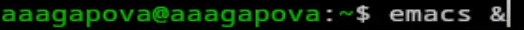

---

2. Создаю файл lab07.sh с помощью комбинации C-x C-f.

---

3. Набираю текст и сохраняю файл с помощью комбинации C-x C-s.

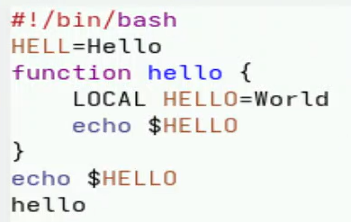

---

4. Вырезаю одной командой целую строку С-k.

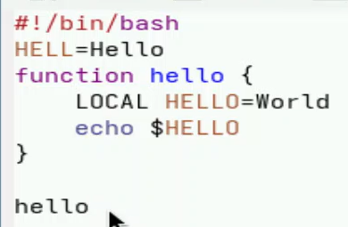

---

5. Вставляю эту строку в конец файла C-y.

---

6. Выделяю область текста C-space. Копирую область в буфер обмена M-w.

---

7. Вставляю область в конец файла.

---

8. Вновь выделяю эту область и на этот раз вырезаю её C-w.

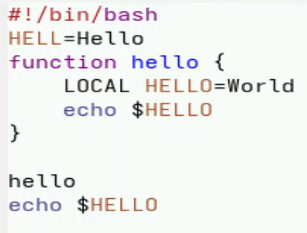

---

9. Отменяю последнее действие C-/.

---

10. Перемещаю курсор в начало строки C-a.

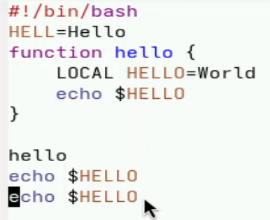

---

11. Перемещаю курсор в конец строки C-e.

---

12. Перемещаю курсор в начало буфера M-<.

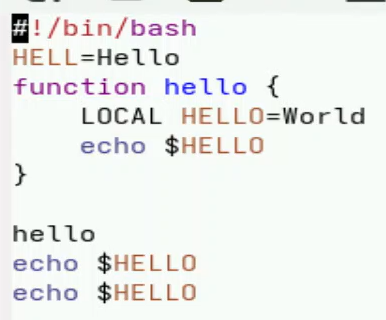

---

13. Перемещаю курсор в конец буфера M->.

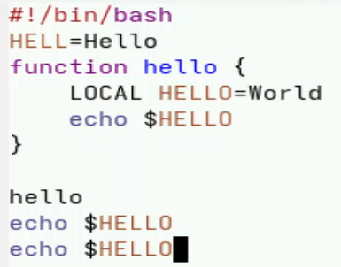

---

14. Вывожу список активных буферов на экран C-x C-b.

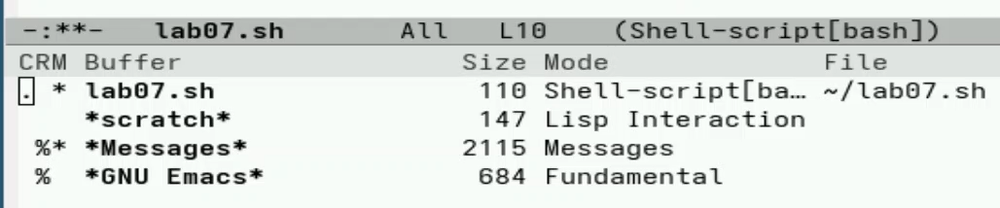

---

15. Перемещаюсь во вновь открытое окно C-x o со списком открытых буферов и переключаюсь на другой буфер. Закрываю это окно C-x 0.

---

16. Делю фрейм на 4 части: разделяю фрейм на два окна по вертикали C-x 3, а затем каждое из этих окон на две части по горизонтали C-x 2.

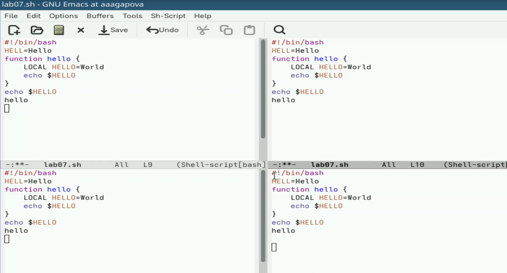

---

17. В каждом из четырёх созданных окон открываю буфер.

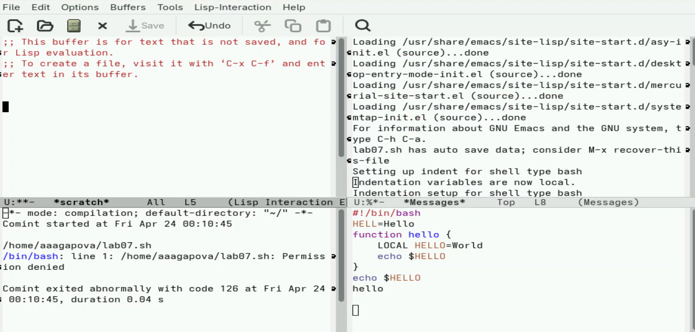

---

18. Переключаюсь в режим поиска C-s и нахожу несколько слов, присутствующих в тексте.

---

19. Переключаюсь между результатами поиска, нажимая C-s. Выхожу из режима поиска, нажав C-g.

---

20. Перехожу в режим поиска и замены M-%, ввожу текст, который следует найти и заменить, нажимаю Enter , затем ввожу текст для замены. После того как будут подсвечены результаты поиска, нажимаю ! для подтверждения замены.

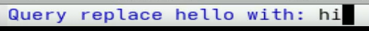

---

21. Пробую другой режим поиска, нажав M-s o. Выводит результат в отдельном окне от буфера.

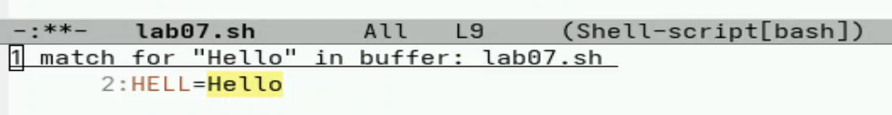

---

# Выводы
Я познакомилась с операционной системой Linux, получила прктические навыки работы с редактором Emacs.
