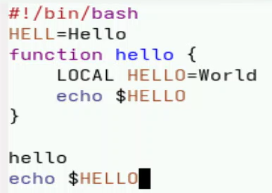
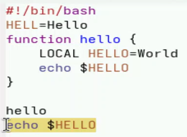
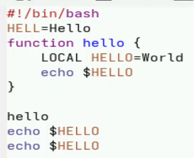
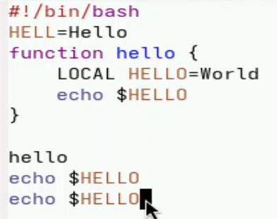
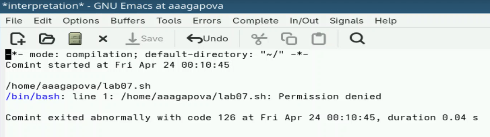
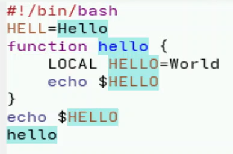
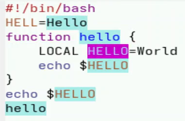

---
## Author
author:
  name: Агапова Анна Антоновна
  email: 1032251933@rudn.ru
  affiliation:
    - name: Российский университет дружбы народов
      country: Российская Федерация
      postal-code: 117198
      city: Москва
      address: ул. Миклухо-Маклая, д. 6

## Title
title: "Отчёт по лабораторной работе №11"
subtitle: "Архитектура компьютера"

---

# Цель работы
Познакомиться с операционной системой Linux. Получить практические навыки работы с редактором Emacs.

# Задание
1. Ознакомиться с теоретическим материалом.
2. Ознакомиться с редактором emacs.
3. Выполнить упражнения.
4. Ответить на контрольные вопросы.

# Выполнение лабораторной работы
1.Открываю emacs. (рис. [-@fig-001])

{#fig-001 width=60%}

2.Создаю файл lab07.sh с помощью комбинации C-x C-f.  (рис. [-@fig-002])

{#fig-002 width=60%}

3.Набираю текст и сохраняю файл с помощью комбинации C-x C-s. (рис. [-@fig-003])

{#fig-003 width=60%}

4.Вырезаю одной командой целую строку С-k. (рис. [-@fig-004])

{#fig-004 width=60%}

5.Вставляю эту строку в конец файла C-y. (рис. [-@fig-005])

{#fig-005 width=60%}

6.Выделяю область текста C-space. Копирую область в буфер обмена M-w. (рис. [-@fig-006])

{#fig-006 width=60%}

7.Вставляю область в конец файла. (рис. [-@fig-007])

{#fig-007 width=60%}

8.Вновь выделяю эту область и на этот раз вырезаю её C-w. (рис. [-@fig-008])

{#fig-008 width=60%}

9.Отменяю последнее действие C-/. (рис. [-@fig-009])

{#fig-009 width=60%}

10.Перемещаю курсор в начало строки C-a. (рис. [-@fig-0010])

{#fig-0010 width=60%}

11.Перемещаю курсор в конец строки C-e. (рис. [-@fig-0011])

{#fig-0011 width=60%}

12.Перемещаю курсор в начало буфера M-<. (рис. [-@fig-0012])

{#fig-0012 width=60%}

13.Перемещаю курсор в конец буфера M->. (рис. [-@fig-0013])

{#fig-0013 width=60%}

14.Вывожу список активных буферов на экран C-x C-b. (рис. [-@fig-0014])

{#fig-0014 width=60%}

15.Перемещаюсь во вновь открытое окно C-x o со списком открытых буферов и переключаюсь на другой буфер. Закрываю это окно C-x 0. (рис. [-@fig-0015])

{#fig-0015 width=60%}

16.Делю фрейм на 4 части: разделяю фрейм на два окна по вертикали C-x 3, а затем каждое из этих окон на две части по горизонтали C-x 2. (рис. [-@fig-0016])

{#fig-0016 width=60%}

17.В каждом из четырёх созданных окон открываю буфер. (рис. [-@fig-0017])

{#fig-0017 width=60%}

18.Переключаюсь в режим поиска C-s и нахожу несколько слов, присутствующих в тексте. (рис. [-@fig-0018])

{#fig-0018 width=60%}

19.Переключаюсь между результатами поиска, нажимая C-s. Выхожу из режима поиска, нажав C-g. (рис. [-@fig-0019])

{#fig-0019 width=60%}

20.Перехожу в режим поиска и замены M-%, ввожу текст, который следует найти и заменить, нажимаю Enter , затем ввожу текст для замены. После того как будут подсвечены результаты поиска, нажимаю ! для подтверждения замены. (рис. [-@fig-0020])

{#fig-0020 width=60%}

21.Пробую другой режим поиска, нажав M-s o. Выводит результат в отдельном окне от буфера. (рис. [-@fig-0021])

{#fig-0021 width=60%}

# Выводы
Я познакомилась с операционной системой Linux, получила прктические навыки работы с редактором Emacs.

# Ответы на контрольные вопросы
1. Emacs — один из наиболее мощных и широко распространённых редакторов, используемых в мире UNIX. Написан на языке высокого уровня Lisp.
2. Большое разнообразие сложных комбинаций клавиш, которые необходимы для редактирования файла и в принципе для работы с Emacs.
3. Буфер — это объект в виде текста. Окно — это прямоугольная область, в которой отображен буфер.
4. Да, можно.
5. Emacs использует буферы с именами, начинающимися с пробела, для внутренних целей. Отчасти он обращается с буферами с такими именами особенным образом — например, по умолчанию в них не записывается информация для отмены изменений.
6. Ctrl + c, а потом | и Ctrl + c Ctrl + |
7. С помощью команды Ctrl + x 3 (по вертикали) и Ctrl + x 2 (по горизонтали).
8. Настройки emacs хранятся в файле .emacs, который хранится в домашней директории пользователя. Кроме этого файла есть ещё папка .emacs.
9. Выполняет функцию стереть, думаю можно переназначить.
10. Для меня удобнее был редактор Emacs, так как у него есть командная оболочка. А vi открывается в терминале, и выглядит своеобразно.
