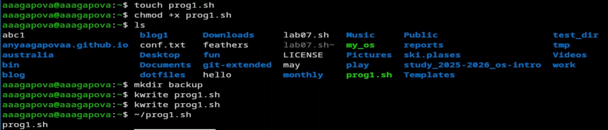
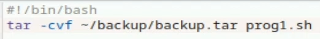
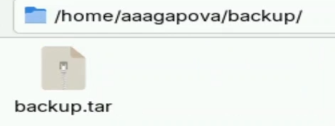
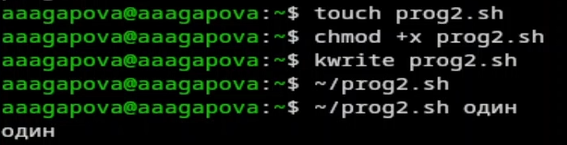
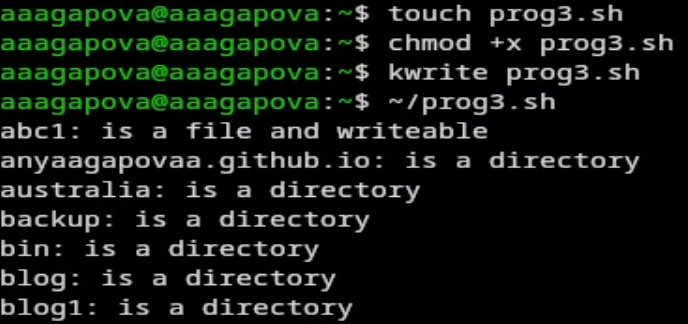
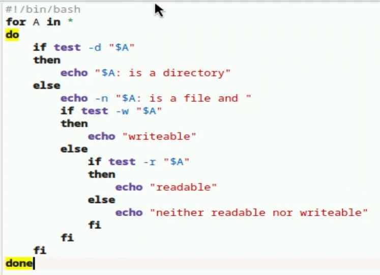
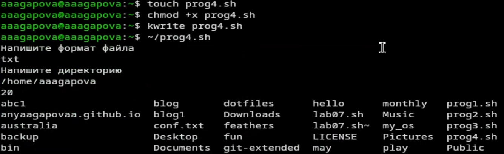
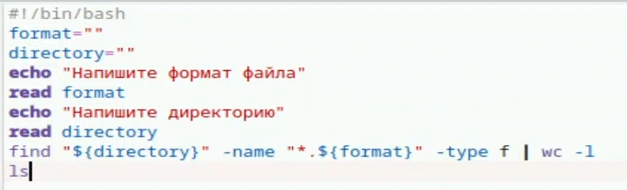

---
## Author
author:
  name: Агапова Анна Антоновна
  email: 1032251933@rudn.ru
  affiliation:
    - name: Российский университет дружбы народов
      country: Российская Федерация
      postal-code: 117198
      city: Москва
      address: ул. Миклухо-Маклая, д. 6

## Title
title: "Отчёт по лабораторной работе №12"
subtitle: "Архитектура компьютера"
license: CC BY
date: 2026-04-30
slide_level: 2
aspectratio: 169
section-titles: true
theme: metropolis
date-format: "YYYY-MM-DD" # Example: 2025-09-06
---

# Докладчик

:::::::::::::: {.columns align=center}
::: {.column width="70%"}

  * Агапова Анна Антоновна
  * Российский университет дружбы народов им. П. Лумумбы

:::
::: {.column width="30%"}

:::
::::::::::::::

---

# Цель работы
Изучить основы программирования в оболочке ОС UNIX/Linux. Научиться писать небольшие командные файлы.

---

# Задание
1. Написать скрипт, который при запуске будет делать резервную копию самого себя (то
есть файла, в котором содержится его исходный код) в другую директорию backup
в вашем домашнем каталоге. При этом файл должен архивироваться одним из ар-
хиваторов на выбор zip, bzip2 или tar. Способ использования команд архивации
необходимо узнать, изучив справку.

---

2. Написать пример командного файла, обрабатывающего любое произвольное число
аргументов командной строки, в том числе превышающее десять. Например, скрипт
может последовательно распечатывать значения всех переданных аргументов.

---

3. Написать командный файл — аналог команды ls (без использования самой этой ко-
манды и команды dir). Требуется, чтобы он выдавал информацию о нужном каталоге
и выводил информацию о возможностях доступа к файлам этого каталога.

---

4. Написать командный файл, который получает в качестве аргумента командной строки
формат файла (.txt, .doc, .jpg, .pdf и т.д.) и вычисляет количество таких файлов
в указанной директории. Путь к директории также передаётся в виде аргумента ко-
мандной строки.

---

# Выполнение лабораторной работы
1. Создаю файл, делаю его исполняемым, открываю файл в текстовом редакторе, пишу в нем код и запускаю его.

---

2. Код программы 1.

---

3. Результат программы 1.

---

4. Создаю файл, делаю его исполняемым, открываю файл в текстовом редакторе, пишу в нем код и запускаю его.

---

5. Код программы 2.

---

6. Создаю файл, делаю его исполняемым, открываю файл в текстовом редакторе, пишу в нем код и запускаю его.

---

7. Код программы 3.

---

8. Создаю файл, делаю его исполняемым, открываю файл в текстовом редакторе, пишу в нем код и запускаю его.

---

9. Код программы 3.

---

# Выводы
Я изучила основы программирования в оболочке OC UNIX/Linux, научилась писать небольшие командные файлы.
