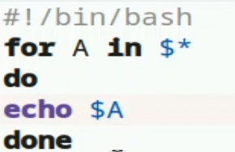

---
## Author
author:
  name: Агапова Анна Антоновна
  email: 1032251933@rudn.ru
  affiliation:
    - name: Российский университет дружбы народов
      country: Российская Федерация
      postal-code: 117198
      city: Москва
      address: ул. Миклухо-Маклая, д. 6

## Title
title: "Отчёт по лабораторной работе №12"
subtitle: "Архитектура компьютера"

---

# Цель работы
Изучить основы программирования в оболочке ОС UNIX/Linux. Научиться писать небольшие командные файлы.

# Задание
1. Написать скрипт, который при запуске будет делать резервную копию самого себя (то
есть файла, в котором содержится его исходный код) в другую директорию backup
в вашем домашнем каталоге. При этом файл должен архивироваться одним из ар-
хиваторов на выбор zip, bzip2 или tar. Способ использования команд архивации
необходимо узнать, изучив справку.
2. Написать пример командного файла, обрабатывающего любое произвольное число
аргументов командной строки, в том числе превышающее десять. Например, скрипт
может последовательно распечатывать значения всех переданных аргументов.
3. Написать командный файл — аналог команды ls (без использования самой этой ко-
манды и команды dir). Требуется, чтобы он выдавал информацию о нужном каталоге
и выводил информацию о возможностях доступа к файлам этого каталога.
4. Написать командный файл, который получает в качестве аргумента командной строки
формат файла (.txt, .doc, .jpg, .pdf и т.д.) и вычисляет количество таких файлов
в указанной директории. Путь к директории также передаётся в виде аргумента ко-
мандной строки.

# Выполнение лабораторной работы
1.Создаю файл, делаю его исполняемым, открываю файл в текстовом редакторе, пишу в нем код и запускаю его. (рис. [-@fig-001])

{#fig-001 width=60%}

2.Код программы 1.  (рис. [-@fig-002])

{#fig-002 width=60%}

3.Результат программы 1. (рис. [-@fig-003])

{#fig-003 width=60%}

4.Создаю файл, делаю его исполняемым, открываю файл в текстовом редакторе, пишу в нем код и запускаю его. (рис. [-@fig-004])

{#fig-004 width=60%}

5.Код программы 2. (рис. [-@fig-005])

{#fig-005 width=60%}

6.Создаю файл, делаю его исполняемым, открываю файл в текстовом редакторе, пишу в нем код и запускаю его. (рис. [-@fig-006])

{#fig-006 width=60%}

7.Код программы 3. (рис. [-@fig-007])

{#fig-007 width=60%}

8.Создаю файл, делаю его исполняемым, открываю файл в текстовом редакторе, пишу в нем код и запускаю его. (рис. [-@fig-008])

{#fig-008 width=60%}

9.Код программы 3.  (рис. [-@fig-009])

{#fig-009 width=60%}

# Выводы
Я изучила основы программирования в оболочке OC UNIX/Linux, научилась писать небольшие командные файлы.

# Ответы на контрольные вопросы
1. Командная оболочка — программа для взаимодействия пользователя с ОС через ввод команд. Примеры:
- sh — базовая оболочка UNIX
- csh — C-подобный синтаксис, история команд
- ksh — совместимость с sh + возможности csh
- bash — объединение csh и ksh
2. Набор стандартов IEEE для совместимости UNIX-систем и переносимости программ. POSIX-оболочки созданы на базе ksh.
3. Переменная: mark=/usr/andy/bin, вызов: Smark. Массив: set -A states a b c, элемент: S{states[0]}.
4. let — вычисление выражений: let sum=x+7, read — чтение с клавиатуры: read name
5. +, -, *, /, %, побитовые (&, |, ^), сравнения (==, !=, <, >), логические (&&, ||, !).
6. Конструкция для арифметических выражений, аналог let. 0 = ложь, не ноль = истина.
7. HOME, PATH, IFS, MAIL, TERM, LOGNAME, PS1, PS2.
8. Символы со специальным смыслом: *, ?, |, &, S, <, >, \, ", '.
9. Символ \ перед метасимволом, либо заключение в кавычки (одинарные — все, двойные — кроме S, \, ").
10. Записать команды в файл. Запуск: bash файл или chmod +x файл, потом ./файл.
11. function имя { команды; }. Удаление: unset -f имя.
12. test -d — проверка на каталог, test -f — проверка на файл.
13. set — создание массивов, просмотр переменных, typeset — объявление типов переменных, unset — удаление переменных и функций
14. Через S1, S2, ... S9. S0 — имя скрипта. shift сдвигает параметры.
15. S* — все аргументы, S? — код возврата, SS — PID процесса, S! — PID фонового процесса, S# — число аргументов, S{#var} — длина строки.
Примечание:
В ответах на контрольные вопросы S=$.
