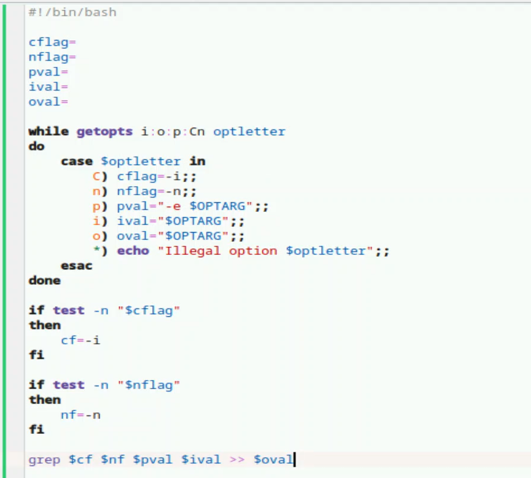
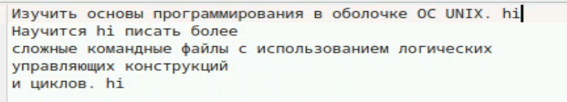
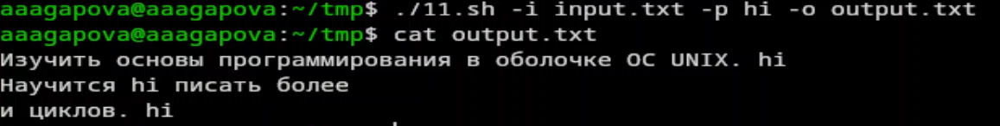
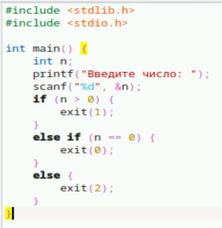
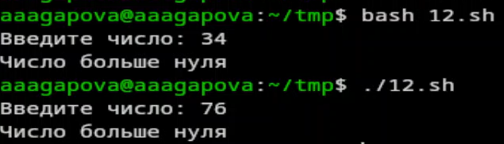
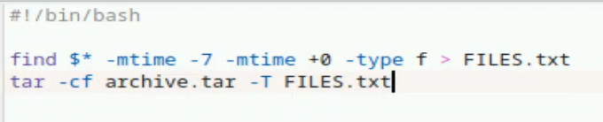

---
## Author
author:
  name: Агапова Анна Антоновна
  email: 1032251933@rudn.ru
  affiliation:
    - name: Российский университет дружбы народов
      country: Российская Федерация
      postal-code: 117198
      city: Москва
      address: ул. Миклухо-Маклая, д. 6

## Title
title: "Отчёт по лабораторной работе №13"
subtitle: "Архитектура компьютера"
license: CC BY
date: 2026-05-08
slide_level: 2
aspectratio: 169
section-titles: true
theme: metropolis
date-format: "YYYY-MM-DD" # Example: 2025-09-06
---

# Докладчик

:::::::::::::: {.columns align=center}
::: {.column width="70%"}

  * Агапова Анна Антоновна
  * Российский университет дружбы народов им. П. Лумумбы

:::
::: {.column width="30%"}

:::
::::::::::::::

---

# Цель работы
Изучить основы программирования в оболочке ОС UNIX. Научится писать более сложные командные файлы с использованием логических управляющих конструкций и циклов.

---

# Задание
1. Используя команды getopts grep, написать командный файл, который анализирует
командную строку с ключами:
– -iinputfile — прочитать данные из указанного файла;
– -ooutputfile — вывести данные в указанный файл;
– -pшаблон — указать шаблон для поиска;
– -C — различать большие и малые буквы;
– -n — выдавать номера строк.
а затем ищет в указанном файле нужные строки, определяемые ключом -p.

---

2. Написать на языке Си программу, которая вводит число и определяет, является ли оно больше нуля, меньше нуля или равно нулю. Затем программа завершается с помощью функции exit(n), передавая информацию в о коде завершения в оболочку. Командный файл должен вызывать эту программу и, проанализировав с помощью команды S?, выдать сообщение о том, какое число было введено.

---

3. Написать командный файл, создающий указанное число файлов, пронумерованных последовательно от 1 до 𝑁 (например 1.tmp, 2.tmp, 3.tmp,4.tmp и т.д.). Число файлов, которые необходимо создать, передаётся в аргументы командной строки. Этот же ко-
мандный файл должен уметь удалять все созданные им файлы (если они существуют).

---

4. Написать командный файл, который с помощью команды tar запаковывает в архив все файлы в указанной директории. Модифицировать его так, чтобы запаковывались только те файлы, которые были изменены менее недели тому назад (использовать
команду find).

---

# Выполнение лабораторной работы
1.Создаю исполняемый файл для первого задания.

---

2.Пишу программу.

---

3.Создаю файл input.txt.

---

4.Результат работы программы.

---

5.Создаю исполняемый файл для второго задания.

---

6.Пишу программу в файле 12.c.

---

7.Пишу программу в файле 12.sh.

---

8.Проверяю работу программы двумя способами.

---

9.Создаю исполняемый файл для третьего задания.

---

10.Пишу программу.

---

11.Проверяю работу программы.

---

12.Создаю исполняемый файл для четвертого задания.

---

13.Пишу программу.

---

14.Проверяю работу программы.

---

15.Архив создался.

---

# Выводы
Я изучила осоновы программирования в оболочке OC UNIX, научилась писать более сложные командные файлы с использованием логических управляющих конструкций и циклов.
