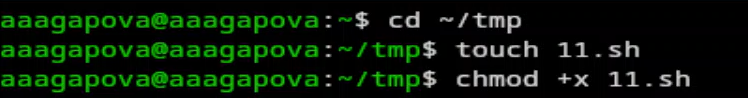
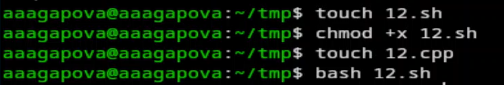
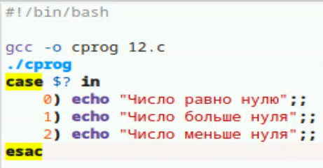
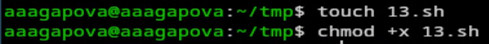
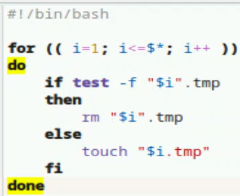
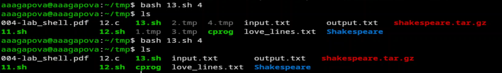
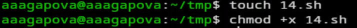
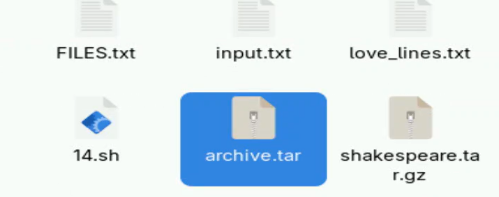

---
## Author
author:
  name: Агапова Анна Антоновна
  email: 1032251933@rudn.ru
  affiliation:
    - name: Российский университет дружбы народов
      country: Российская Федерация
      postal-code: 117198
      city: Москва
      address: ул. Миклухо-Маклая, д. 6

## Title
title: "Отчёт по лабораторной работе №13"
subtitle: "Архитектура компьютера"

---

# Цель работы
Изучить основы программирования в оболочке ОС UNIX. Научится писать более сложные командные файлы с использованием логических управляющих конструкций и циклов.

# Задание
1. Используя команды getopts grep, написать командный файл, который анализирует
командную строку с ключами:
– -iinputfile — прочитать данные из указанного файла;
– -ooutputfile — вывести данные в указанный файл;
– -pшаблон — указать шаблон для поиска;
– -C — различать большие и малые буквы;
– -n — выдавать номера строк.
а затем ищет в указанном файле нужные строки, определяемые ключом -p.
2. Написать на языке Си программу, которая вводит число и определяет, является ли оно больше нуля, меньше нуля или равно нулю. Затем программа завершается с помощью функции exit(n), передавая информацию в о коде завершения в оболочку. Командный файл должен вызывать эту программу и, проанализировав с помощью команды S?, выдать сообщение о том, какое число было введено.
3. Написать командный файл, создающий указанное число файлов, пронумерованных последовательно от 1 до 𝑁 (например 1.tmp, 2.tmp, 3.tmp,4.tmp и т.д.). Число файлов, которые необходимо создать, передаётся в аргументы командной строки. Этот же ко-
мандный файл должен уметь удалять все созданные им файлы (если они существуют).
4. Написать командный файл, который с помощью команды tar запаковывает в архив все файлы в указанной директории. Модифицировать его так, чтобы запаковывались только те файлы, которые были изменены менее недели тому назад (использовать
команду find).

# Выполнение лабораторной работы
1.Создаю исполняемый файл для первого задания. (рис. [-@fig-001])

{#fig-001 width=60%}

2.Пишу программу.  (рис. [-@fig-002])

{#fig-002 width=60%}

3.Создаю файл input.txt. (рис. [-@fig-003])

{#fig-003 width=60%}

4.Результат работы программы. (рис. [-@fig-004])

{#fig-004 width=60%}

5.Создаю исполняемый файл для второго задания. (рис. [-@fig-005])

{#fig-005 width=60%}

6.Пишу программу в файле 12.c. (рис. [-@fig-006])

{#fig-006 width=60%}

7.Пишу программу в файле 12.sh. (рис. [-@fig-007])

{#fig-007 width=60%}

8.Проверяю работу программы двумя способами. (рис. [-@fig-008])

{#fig-008 width=60%}

9.Создаю исполняемый файл для третьего задания. (рис. [-@fig-009])

{#fig-009 width=60%}

10.Пишу программу. (рис. [-@fig-0010])

{#fig-0010 width=60%}

11.Проверяю работу программы. (рис. [-@fig-0011])

{#fig-0011 width=60%}

12.Создаю исполняемый файл для четвертого задания. (рис. [-@fig-0012])

{#fig-0012 width=60%}

13.Пишу программу. (рис. [-@fig-0013])

{#fig-0013 width=60%}

14.Проверяю работу программы. (рис. [-@fig-0014])

{#fig-0014 width=60%}

15.Архив создался. (рис. [-@fig-0015])

{#fig-0015 width=60%}

# Выводы
Я изучила осоновы программирования в оболочке OC UNIX, научилась писать более сложные командные файлы с использованием логических управляющих конструкций и циклов.

# Ответы на контрольные вопросы
1. getopts — команда для обработки флагов (опций) командной строки. Она считывает ключи вроде `-i file.txt` или `-n` и присваивает их значения переменным. Обычно используется в цикле `while` вместе с `case`.
2. Метасимволы — это спецсимволы для поиска файлов по маске:
- * — заменяет любую строку (хоть пустую)
- ? — заменяет ровно один символ
- [a-z] — один символ из диапазона
3. Основные конструкции bash:
- if then else fi — условие (если-то-иначе)
- case in esac — выбор из нескольких вариантов
- for do done — цикл по списку
- while do done — цикл пока условие истинно
- until do done — цикл пока условие ложно
4. break — полностью выходит из цикла, continue — пропускает оставшуюся часть текущей итерации и переходит к следующей
5. true — всегда возвращает успех (0), означает "истина", false — всегда возвращает ошибку (не 0), означает "ложь". Нужны для условных конструкций. Например, while true; do ... done — бесконечный цикл.
6. Проверяет, существует ли обычный файл по пути man$s/$i.$s, где $s и $i — переменные. Флаг -f — это проверка "является ли путь файлом (не папкой)".
7. Оба выполняют цикл, но условие выхода противоположное:
- while — работает, пока условие верно (истина)
- until — работает, пока условие неверно (ложь)

