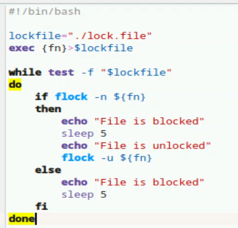
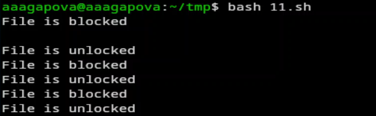
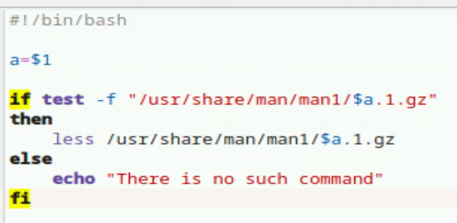
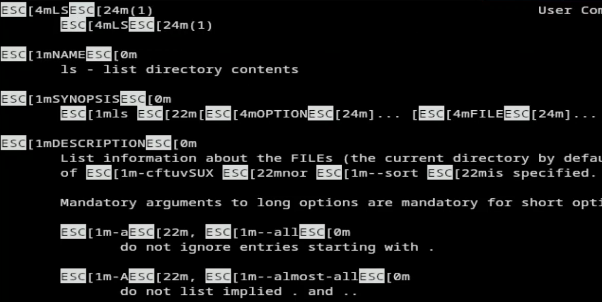

---
## Author
author:
  name: Агапова Анна Антоновна
  email: 1032251933@rudn.ru
  affiliation:
    - name: Российский университет дружбы народов
      country: Российская Федерация
      postal-code: 117198
      city: Москва
      address: ул. Миклухо-Маклая, д. 6

## Title
title: "Отчёт по лабораторной работе №14"
subtitle: "Архитектура компьютера"

---

# Цель работы
Изучить основы программирования в оболочке ОС UNIX. Научиться писать более сложные командные файлы с использованием логических управляющих конструкций и циклов.

# Задание
1. Написать командный файл, реализующий упрощённый механизм семафоров. Командный файл должен в течение некоторого времени t1 дожидаться освобождения ресурса, выдавая об этом сообщение, а дождавшись его освобождения, использовать его в течение некоторого времени t2<>t1, также выдавая информацию о том, что ресурс используется соответствующим командным файлом (процессом). Запустить командный файл в одном виртуальном терминале в фоновом режиме, перенаправив его вывод в другой (> /dev/tty#, где # — номер терминала куда перенаправляется
вывод), в котором также запущен этот файл, но не фоновом, а в привилегированном режиме. Доработать программу так, чтобы имелась возможность взаимодействия трёх и более процессов.
2. Реализовать команду man с помощью командного файла. Изучите содержимое каталога /usr/share/man/man1. В нем находятся архивы текстовых файлов, содержащих справку по большинству установленных в системе программ и команд. Каждый архив можно открыть командой less сразу же просмотрев содержимое справки. Командный файл должен получать в виде аргумента командной строки название команды и в виде результата выдавать справку об этой команде или сообщение об отсутствии справки, если соответствующего файла нет в каталоге man1.
3. Используя встроенную переменную $RANDOM, напишите командный файл, генерирующий случайную последовательность букв латинского алфавита. Учтите, что $RANDOM выдаёт псевдослучайные числа в диапазоне от 0 до 32767.

# Выполнение лабораторной работы
1.Создаю исполняемый файл для первого задания. (рис. [-@fig-001])

{#fig-001 width=60%}

2.Пишу программу.  (рис. [-@fig-002])

{#fig-002 width=60%}

3.Результат работы программы. (рис. [-@fig-003])

{#fig-003 width=60%}

4.Создаю исполняемый файл для второго задания. (рис. [-@fig-004])

{#fig-004 width=60%}

5.Пишу программу. (рис. [-@fig-005])

{#fig-005 width=60%}

6.Результат работы программы. (рис. [-@fig-006])

{#fig-006 width=60%}

7.Создаю исполняемый файл для третьего задания. (рис. [-@fig-007])

{#fig-007 width=60%}

8.Пишу программу. (рис. [-@fig-008])

{#fig-008 width=60%}

9.Результат работы программы. (рис. [-@fig-009])

{#fig-009 width=60%}

# Выводы
Я изучила основы программирования в оболочке ОС UNIX, научилась писать более сложные командные файлы с использованием логических управляющих инструкций и циклов.

# Ответы на контрольные вопросы
1. Ошибка в строке while [$1 != "exit"] — не хватает пробелов, правильно: while [ "$1" != "exit" ]
2. Конкатенация строк — через VAR3="$VAR1$VAR2" или VAR1+=" World"
3. Утилита seq — генерирует последовательности чисел. Через цикл for с фигурными скобками, команда printf, команда echo с раскрытием фигурных скобок.
4. Выражение $((10/3)) — результат 3 (целочисленное деление)
5. Отличия zsh от bash — автодополнение, калькулятор, числа с плавающей запятой и т.д.
6. Синтаксис for ((a=1; a <= LIMIT; a++)) — верен
7. Для сравнения возьмём язык Python.
Преимущества bash:
- Предустановлен по умолчанию в большинстве дистрибутивов Linux и macOS.
- Удобное перенаправление ввода/вывода и конвейеры (>, >>, <, |).
- Большое количество встроенных команд для работы с файловой системой.
- Прямой доступ к системным утилитам без дополнительных библиотек.
Недостатки bash:
- Не является языком общего назначения, не подходит для сложных приложений.
- Мало библиотек по сравнению с Python.
- Каждая внешняя утилита запускается в отдельном процессе, что замедляет работу скрипта.
- Скрипты сложно запустить на других ОС (например, Windows) без эмуляторов.
- Синтаксис менее удобочитаем для больших программ.
