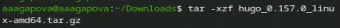
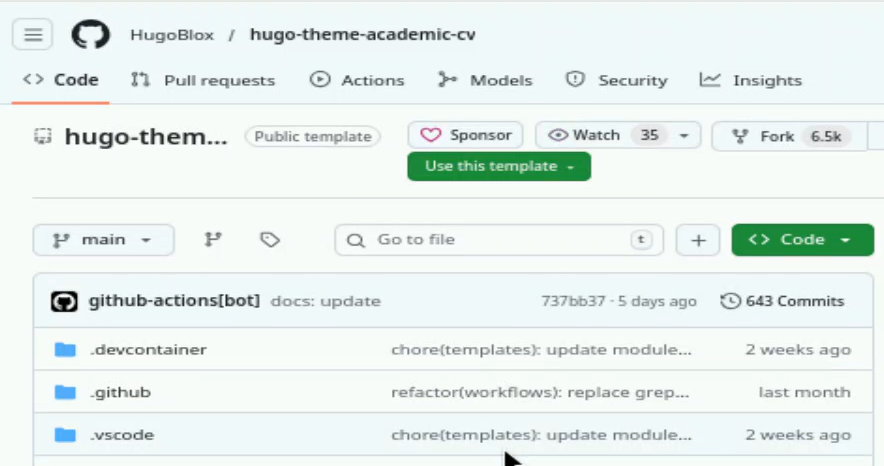
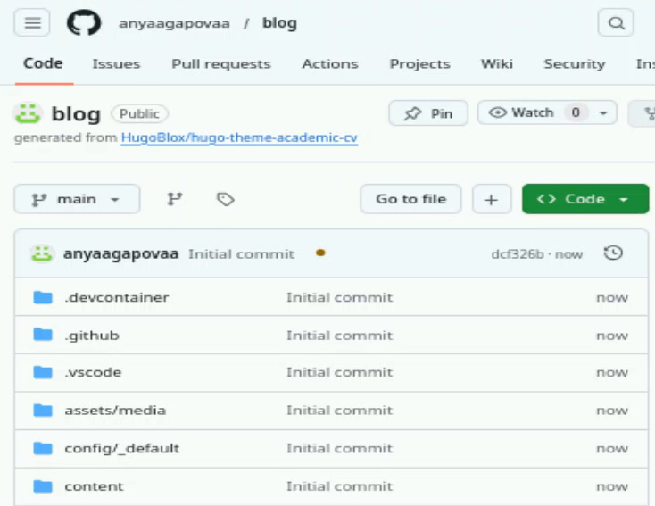
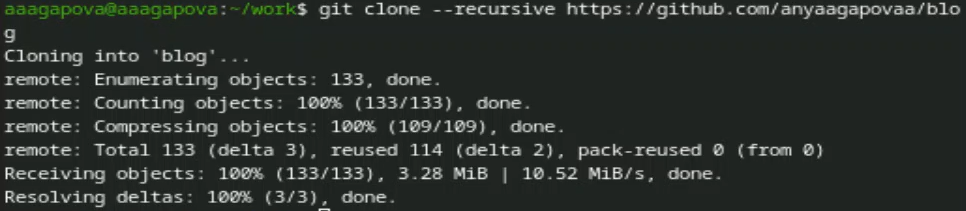
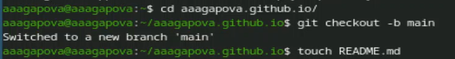
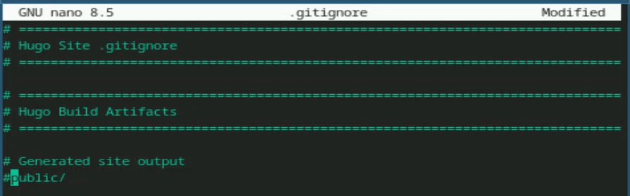
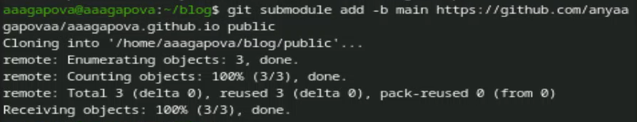

---
## Author
author:
  name: Агапова Анна Антоновна
  email: 1032251933@rudn.ru
  affiliation:
    - name: Российский университет дружбы народов
      country: Российская Федерация
      postal-code: 117198
      city: Москва
      address: ул. Миклухо-Маклая, д. 6

## Title
title: "Отчёт по этапу индивидуального проекта №1"
subtitle: "Архитектура компьютера"
license: CC BY
date: 2026-03-05
slide_level: 2
aspectratio: 169
section-titles: true
theme: metropolis
date-format: "YYYY-MM-DD" # Example: 2025-09-06
---

# Докладчик

:::::::::::::: {.columns align=center}
::: {.column width="70%"}

  * Агапова Анна Антоновна
  * Российский университет дружбы народов им. П. Лумумбы

:::
::: {.column width="30%"}

:::
::::::::::::::

---

# Цель работы
Научиться размещать сайт на GitHub pages. Выполнить первый этап индивидуального проекта.

---

# Задание
1. Установить необходимое программное обеспечение.
2. Скачать шаблон темы сайта.
3. Разместить его на хостинге git.
4. Установить параметр для URLs сайта.
5. Разместить заготовку сайта на Github pages.

---

# Выполнение этапа индивидуального проекта
1. Скачиваю последнюю версию исполняемого файла hugo.

---

2. Распаковываю архив с исполняемым файлом.

---

3. Открываю репозиторий с шаблоном темы сайта.

---

4. Создаю свой репозиторий blog на основе репозитория с шаблоном темы сайта.

{#fig-004 width=60%}

---

5. Проверяю, что репозиторий создался.

---

6. Клонирую свой репозиторий в локальный репозиторий.

---

7. Запускаю исполняемый файл.

---

8. Создаю новый пустой репозиторий чье имя будет адресом сайта.

---

9. Клонирую свой репозиторий в локальный репозиторий.

---

10. Создаю главную ветку с именем main и создаю пустой файл README.md.

---

11. В файле .gitignore закомментируем строчку public.

---

12. Отправляю изменения на GitHub.

---

13. Подключаю репозиторий к каталогу public.

---

14. Выполняю команду исполняемого файла.

---

15. Отправляю изменения на GitHub.

---

# Выводы
Я научилась размещать сайт на GitHub pages и выполнила первый этап индивидуального проекта.
