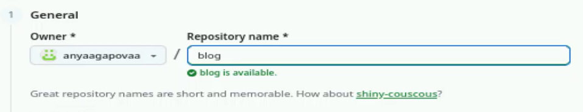
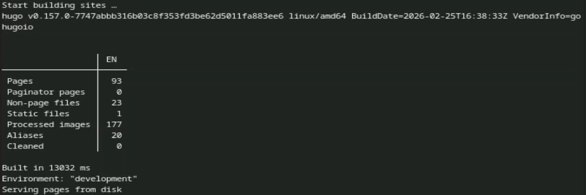
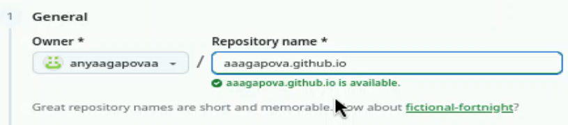
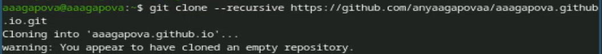
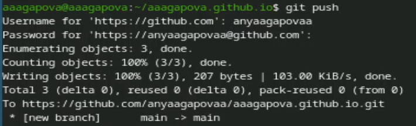
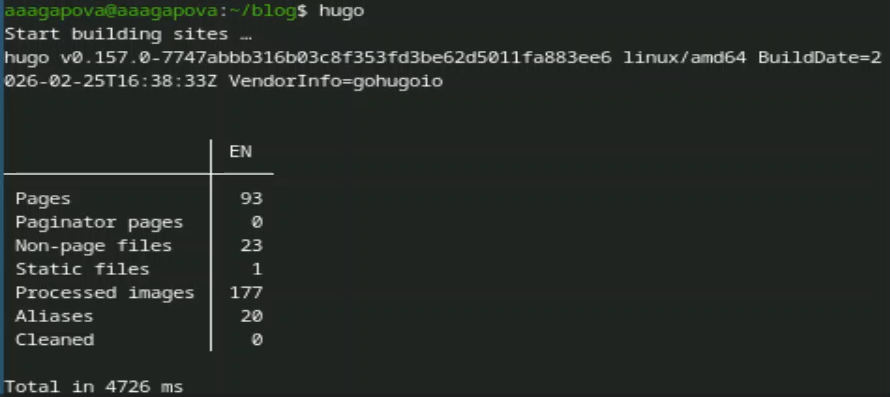
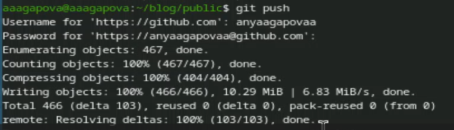

---
## Author
author:
  name: Агапова Анна Антоновна
  email: 1032251933@rudn.ru
  affiliation:
    - name: Российский университет дружбы народов
      country: Российская Федерация
      postal-code: 117198
      city: Москва
      address: ул. Миклухо-Маклая, д. 6

## Title
title: "Отчёт по этапу индивидуального проекта №1"
subtitle: "Архитектура компьютера"
license: "CC BY"
---

# Цель работы
Научиться размещать сайт на GitHub pages. Выполнить первый этап индивидуального проекта.

# Задание
1. Установить необходимое программное обеспечение.
2. Скачать шаблон темы сайта.
3. Разместить его на хостинге git.
4. Установить параметр для URLs сайта.
5. Разместить заготовку сайта на Github pages.

# Выполнение этапа индивидуального проекта
1.Скачиваю последнюю версию исполняемого файла hugo для моей операционной системы. (рис. [-@fig-001])

{#fig-001 width=60%}

2.Распаковываю архив с исполняемым файлом. (рис. [-@fig-002])

{#fig-002 width=60%}

3.Открываю репозиторий с шаблоном темы сайта. (рис. [-@fig-003])

{#fig-003 width=60%}

4.Создаю свой репозиторий blog на основе репозитория с шаблоном темы сайта. (рис. [-@fig-004])

{#fig-004 width=60%}

5.Проверяю, что репозиторий создался. (рис. [-@fig-005])

{#fig-005 width=60%}

6.Клонирую свой репозиторий в локальный репозиторий. (рис. [-@fig-006])

{#fig-006 width=60%}

7.Запускаю исполняемый файл. (рис. [-@fig-007])

{#fig-007 width=60%}

8.Создаю новый пустой репозиторий чье имя будет адресом сайта. (потом я изменила название репозитория на свой никнейм) (рис. [-@fig-008])

{#fig-008 width=60%}

9.Клонирую свой репозиторий в локальный репозиторий. (рис. [-@fig-009])

{#fig-009 width=60%}

10.Создаю главную ветку с именем main и создаю пустой файл README.md. (рис. [-@fig-0010])

{#fig-0010 width=60%}

11.В файле .gitignore закомментируем строчку public. (рис. [-@fig-0011])

{#fig-0011 width=60%}

12.Отправляю изменения на GitHub. (рис. [-@fig-0012])

{#fig-0012 width=60%}

13.Подключаю репозиторий к каталогу public. (рис. [-@fig-0013])

{#fig-0013 width=60%}

14.Выполняю команду исполняемого файла. (рис. [-@fig-0014])

{#fig-0014 width=60%}

15.Отправляю изменения на GitHub. (рис. [-@fig-0015])

{#fig-0015 width=60%}

# Выводы
Я научилась размещать сайт на GitHub pages и выполнила первый этап индивидуального проекта.
