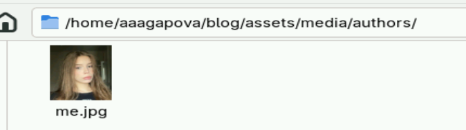
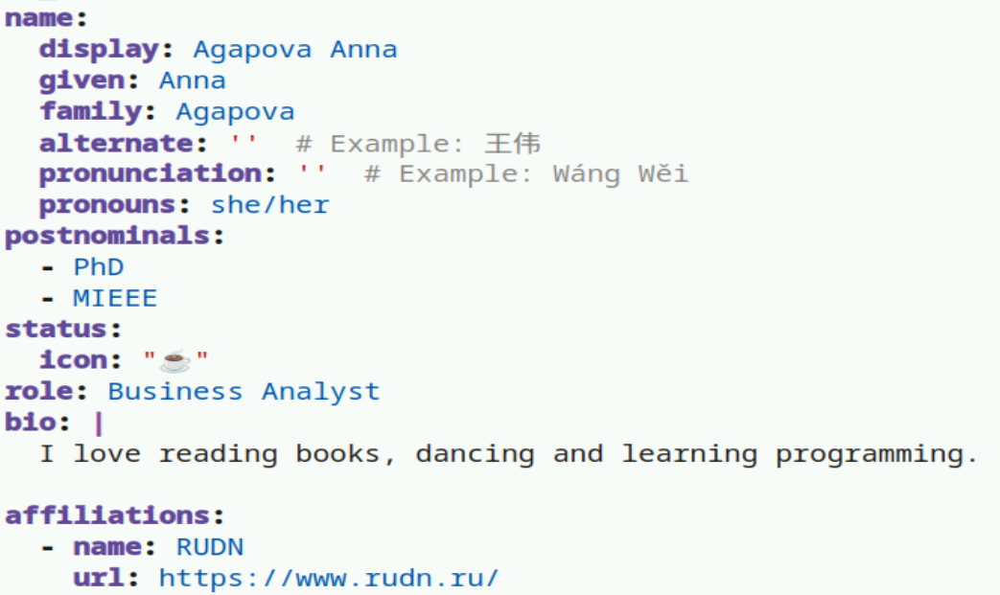
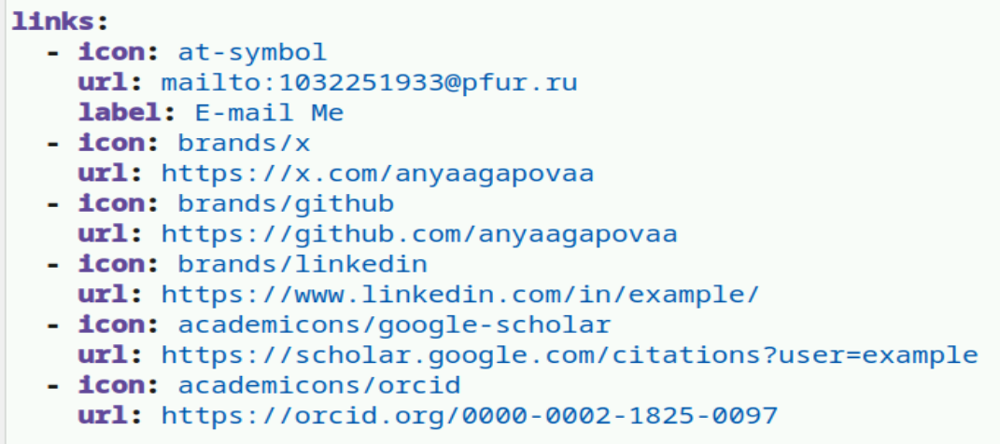
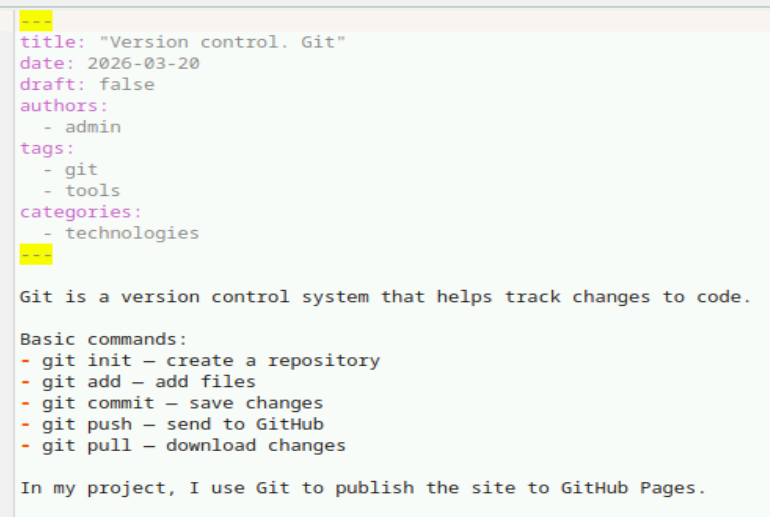
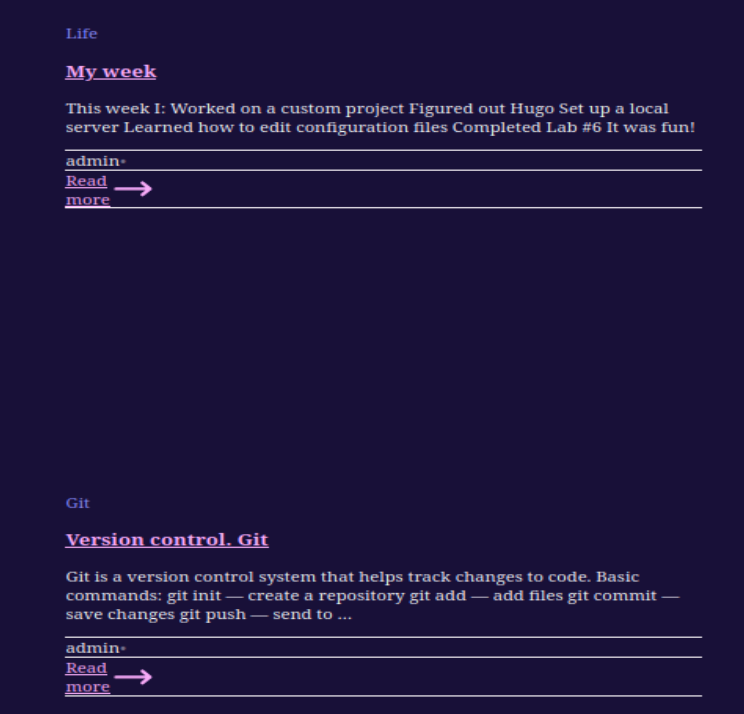

---
## Author
author:
  name: Агапова Анна Антоновна
  email: 1032251933@rudn.ru
  affiliation:
    - name: Российский университет дружбы народов
      country: Российская Федерация
      postal-code: 117198
      city: Москва
      address: ул. Миклухо-Маклая, д. 6

## Title
title: "Отчёт по этапу индивидуального проекта №2"
subtitle: "Архитектура компьютера"
license: CC BY
date: 2026-03-21
slide_level: 2
aspectratio: 169
section-titles: true
theme: metropolis
date-format: "YYYY-MM-DD" # Example: 2025-09-06
---

# Докладчик

:::::::::::::: {.columns align=center}
::: {.column width="70%"}

  * Агапова Анна Антоновна
  * Российский университет дружбы народов им. П. Лумумбы

:::
::: {.column width="30%"}

:::
::::::::::::::

---

# Цель работы
Отредактировать сайт в соответсвии с требованиями, добавить информацию о себе.

---

# Задание
1. Разместить фотографию владельца сайта.
2. Разместить краткое описание владельца сайта (Biography).
3. Добавить информацию об интересах (Interests).
4. Добавить информацию от образовании (Education).
5. Сделать пост по прошедшей неделе.
6. Добавить пост на тему управление версиями. Git.

---

# Выполнение этапа индивидуального проекта
1. Редактирую информацию о себе.

---

2. В папку добавляю своё фото.

---

3. Редактирую информацию о себе.

---

4. Добавляю информацию о своих интересах и образовании.

---

5. Добавляю ссылки на свои соцсети.

---

6. Создаю пост про прошедшую неделю.

---

7. Создаю пост про управление версиями git.

---

8. Опубликованные посты.

---

9. Вот что получилось.

---

# Выводы
Я научилась редактировать данные о себе, писать посты и добавлять их на сайт.
