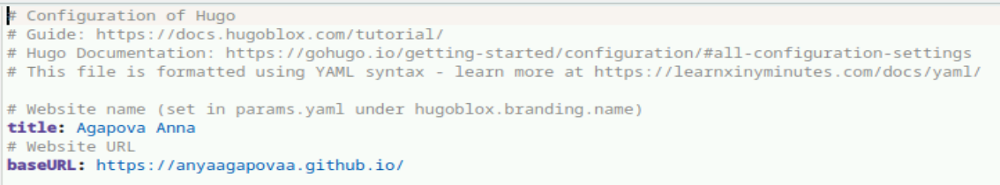
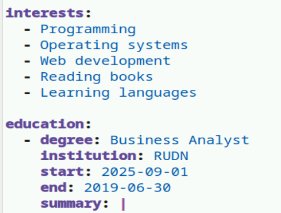
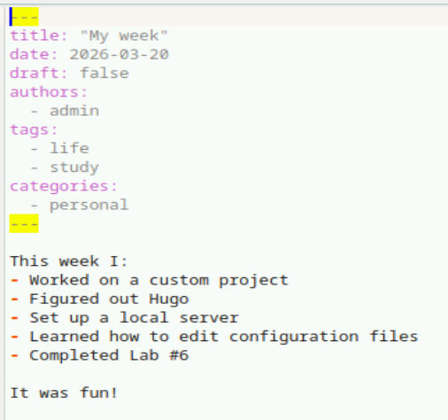

---
## Author
author:
  name: Агапова Анна Антоновна
  email: 1032251933@rudn.ru
  affiliation:
    - name: Российский университет дружбы народов
      country: Российская Федерация
      postal-code: 117198
      city: Москва
      address: ул. Миклухо-Маклая, д. 6

## Title
title: "Отчёт по этапу индивидуального проекта №2"
subtitle: "Архитектура компьютера"
license: "CC BY"
---

# Цель работы
Отредактировать сайт в соответсвии с требованиями, добавить информацию о себе.

# Задание
1. Разместить фотографию владельца сайта.
2. Разместить краткое описание владельца сайта (Biography).
3. Добавить информацию об интересах (Interests).
4. Добавить информацию от образовании (Education).
5. Сделать пост по прошедшей неделе.
6. Добавить пост на тему управление версиями. Git.

# Выполнение этапа индивидуального проекта
1.Редактирую информацию о себе. (рис. [-@fig-001])

{#fig-001 width=60%}

2.В папку добавляю своё фото. (рис. [-@fig-002])

{#fig-002 width=60%}

3.Редактирую информацию о себе. (рис. [-@fig-003])

{#fig-003 width=60%}

4.Добавляю информацию о своих интересах и образовании. (рис. [-@fig-004])

{#fig-004 width=60%}

5.Добавляю ссылки на свои соцсети. (рис. [-@fig-005])

{#fig-005 width=60%}

6.Создаю пост про прошедшую неделю. (рис. [-@fig-006])

{#fig-006 width=60%}

7.Создаю пост про управление версиями git. (рис. [-@fig-007])

{#fig-007 width=60%}

8.Опубликованные посты. (рис. [-@fig-008])

{#fig-008 width=60%}

9.Вот что получилось. (рис. [-@fig-009])

{#fig-009 width=60%}

# Выводы
Я научилась редактировать данные о себе, писать посты и добавлять их на сайт.
