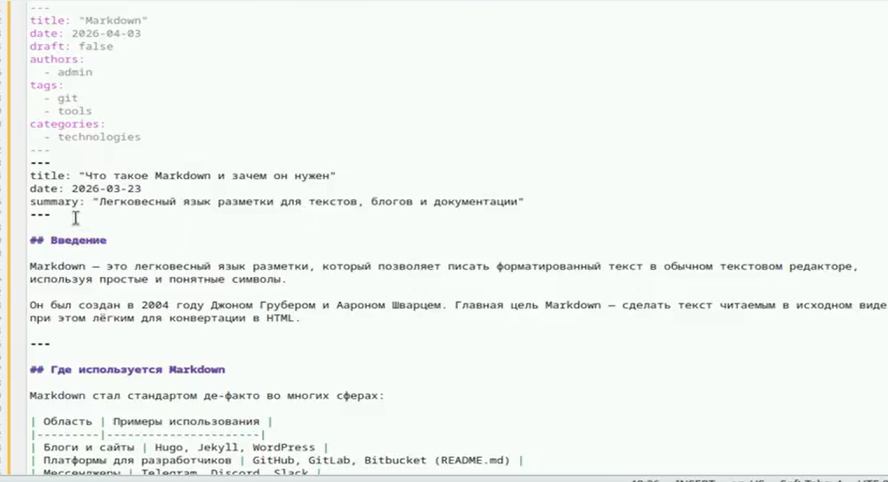

---
## Author
author:
  name: Агапова Анна Антоновна
  email: 1032251933@rudn.ru
  affiliation:
    - name: Российский университет дружбы народов
      country: Российская Федерация
      postal-code: 117198
      city: Москва
      address: ул. Миклухо-Маклая, д. 6

## Title
title: "Отчёт по этапу индивидуального проекта №3"
subtitle: "Архитектура компьютера"
license: "CC BY"
---

# Цель работы
Продолжить работу со своим сайтом. Отредактировать сайт в соответсвии с требованиями, добавить информацию о достижениях.

# Задание
1. Добавить информацию о навыках (Skills).
2. Добавить информацию об опыте (Experience).
3. Добавить информацию о достижениях (Accomplishments).
4. Сделать пост по прошедшей неделе.
5. Добавить пост на тему по выбору язык разметки Markdown.

# Выполнение этапа индивидуального проекта
1.Редактирую информацию о навыках, опыте и достижениях. (рис. [-@fig-001])

{#fig-001 width=60%}

2.Вот что получилось. (рис. [-@fig-002])

{#fig-002 width=60%}

3.Пишу пост по прошедшей неделе. (рис. [-@fig-003])

{#fig-003 width=60%}

4.Вот как выглядит на сайте. (рис. [-@fig-004])

{#fig-004 width=60%}

5.Пишу пост на тему по выбору язык разметки Markdown. (рис. [-@fig-005])

{#fig-005 width=60%}

6.Вот как выглядит на сайте. (рис. [-@fig-006])

{#fig-006 width=60%}

# Выводы
Я научилась редактировать данные о себе, писать посты и добавлять их на сайт.
