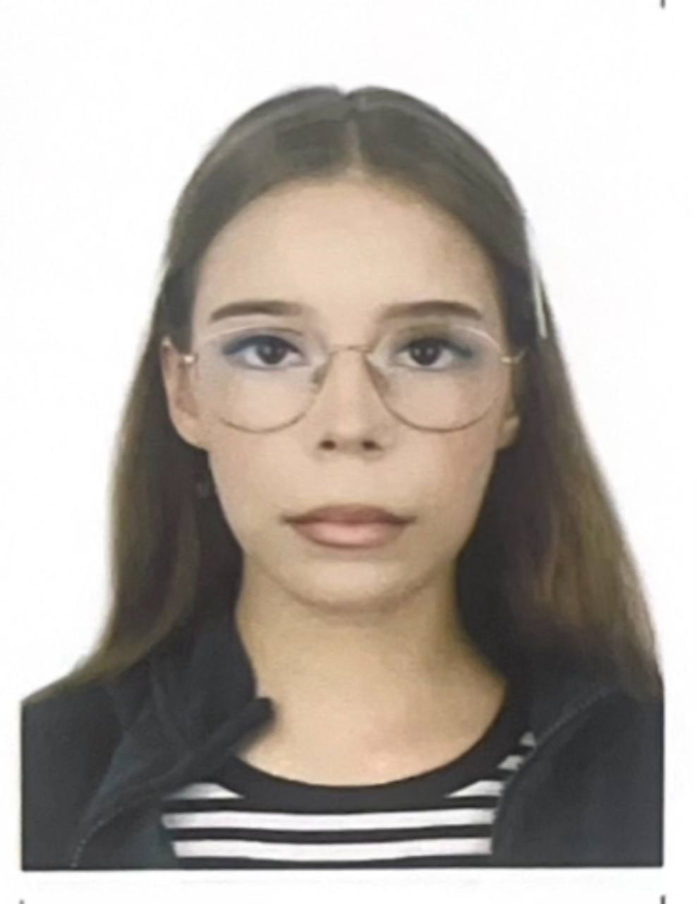
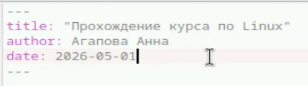
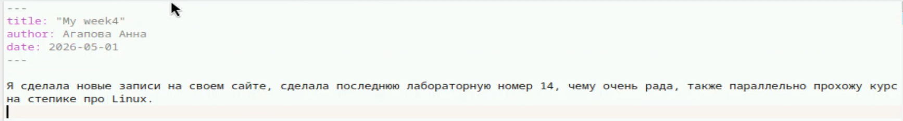
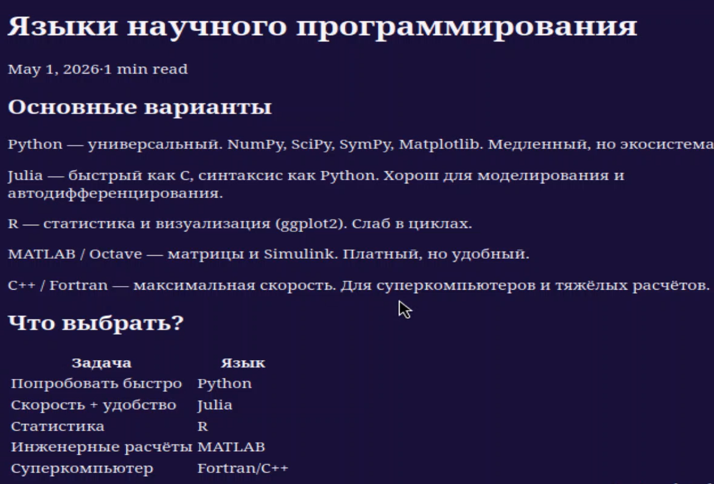

---
## Author
author:
  name: Агапова Анна Антоновна
  email: 1032251933@rudn.ru
  affiliation:
    - name: Российский университет дружбы народов
      country: Российская Федерация
      postal-code: 117198
      city: Москва
      address: ул. Миклухо-Маклая, д. 6

## Title
title: "Отчёт по этапу индивидуального проекта №5"
subtitle: "Архитектура компьютера"
license: CC BY
date: 2026-05-13
slide_level: 2
aspectratio: 169
section-titles: true
theme: metropolis
date-format: "YYYY-MM-DD" # Example: 2025-09-06
---

# Докладчик

:::::::::::::: {.columns align=center}
::: {.column width="70%"}

  * Агапова Анна Антоновна
  * Российский университет дружбы народов им. П. Лумумбы

:::
::: {.column width="30%"}

:::
::::::::::::::

---

# Цель работы
Продолжить работу со своим сайтом. Отредактировать его в соотвествии с требованиями, добавляя информацию о себе.

---

# Задание
1. Сделать записи для персональных проектов.
2. Сделать пост по прошедшей неделе.
3. Добавить пост на тему языки научного программирования.

---

# Выполнение этапа индивидуального проекта
1.Делаю записи для персонального проекта.

---

2.Вот как выглядит на сайте.

---

3.Пишу пост по прошедшей неделе.

---

4.Вот как выглядит на сайте.

---

5.Пишу пост на тему языки научного программирования.

---

6.Вот как выглядит на сайте.

---

# Выводы
Я научилась редактировать информацию о себе и писать посты, добавляя их на сайт.
