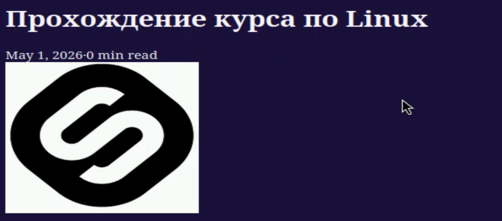
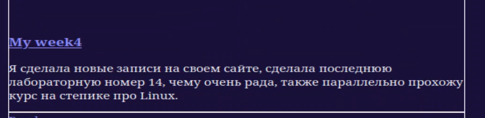
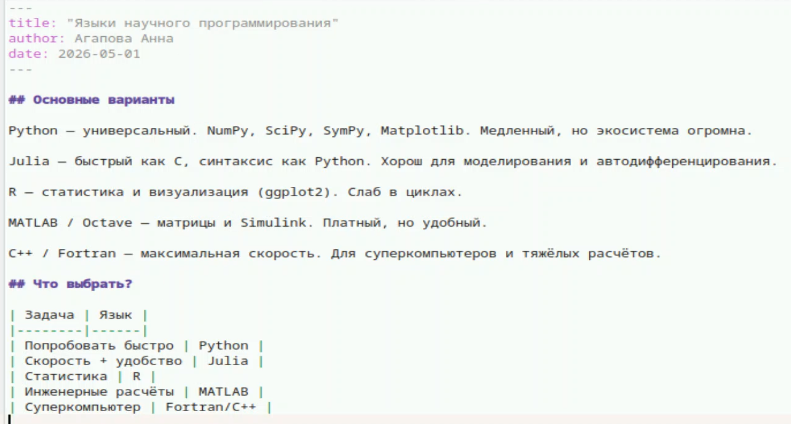

---
## Author
author:
  name: Агапова Анна Антоновна
  email: 1032251933@rudn.ru
  affiliation:
    - name: Российский университет дружбы народов
      country: Российская Федерация
      postal-code: 117198
      city: Москва
      address: ул. Миклухо-Маклая, д. 6

## Title
title: "Отчёт по этапу индивидуального проекта №5"
subtitle: "Архитектура компьютера"
license: "CC BY"
---

# Цель работы
Продолжить работу со своим сайтом. Отредактировать его в соотвествии с требованиями, добавляя информацию о себе.

# Задание
1. Сделать записи для персональных проектов.
2. Сделать пост по прошедшей неделе.
3. Добавить пост на тему языки научного программирования.

# Выполнение этапа индивидуального проекта
1.Делаю записи для персонального проекта. (рис. [-@fig-001])

{#fig-001 width=60%}

2.Вот как выглядит на сайте. (рис. [-@fig-002])

{#fig-002 width=60%}

3.Пишу пост по прошедшей неделе. (рис. [-@fig-003])

{#fig-003 width=60%}

4.Вот как выглядит на сайте. (рис. [-@fig-004])

{#fig-004 width=60%}

5.Пишу пост на тему языки научного программирования. (рис. [-@fig-005])

{#fig-005 width=60%}

6.Вот как выглядит на сайте. (рис. [-@fig-006])

{#fig-006 width=60%}

# Выводы
Я научилась редактировать информацию о себе и писать посты, добавляя их на сайт.
